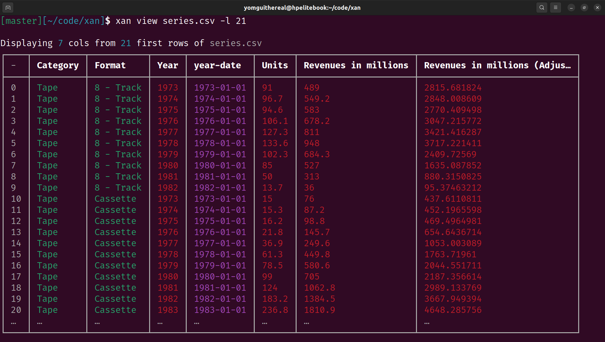
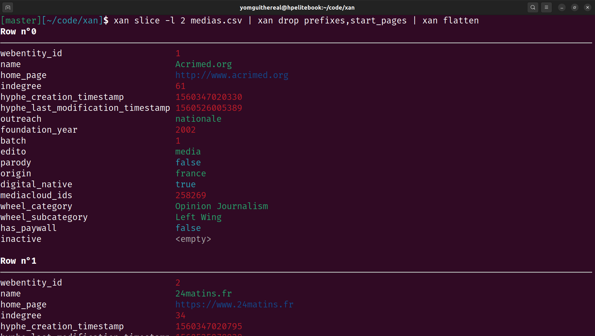
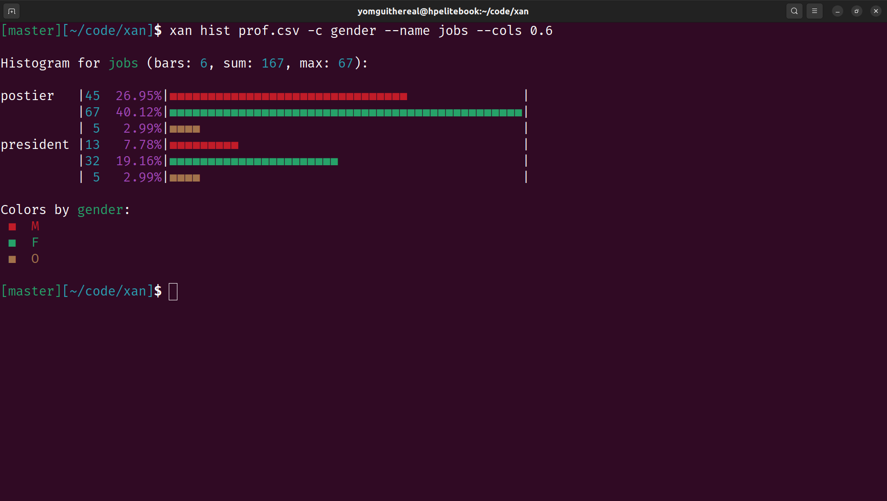
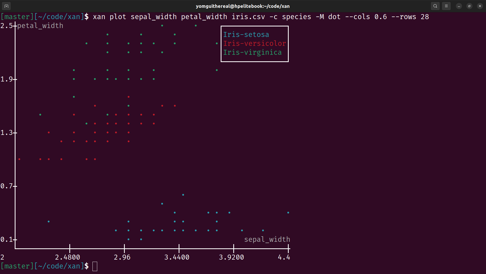
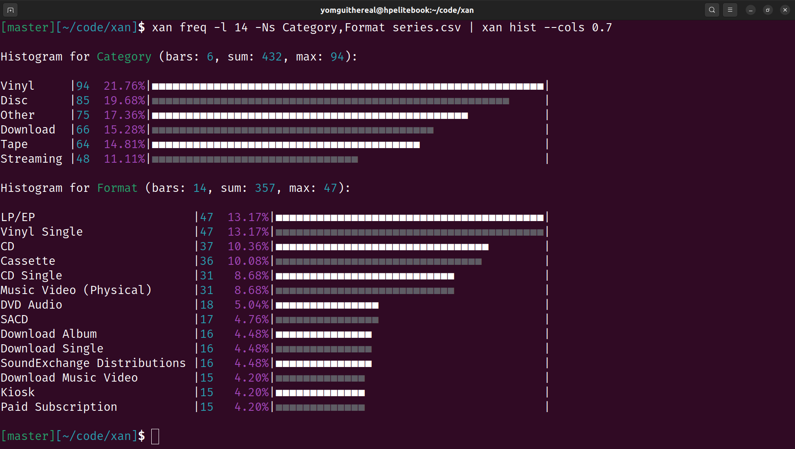
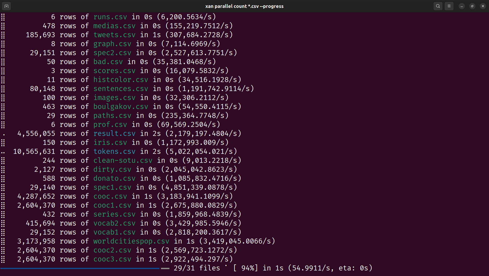
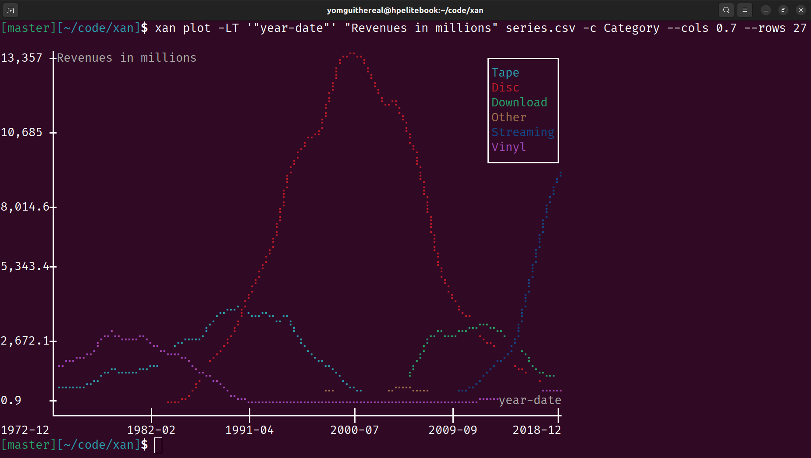
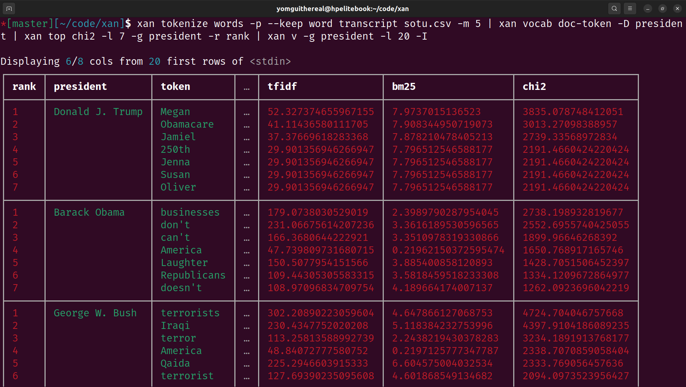
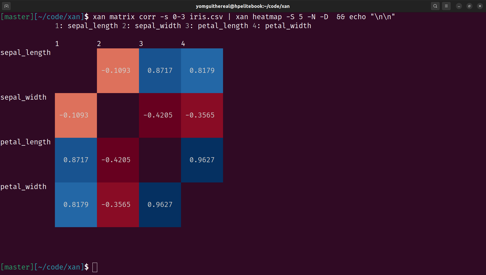
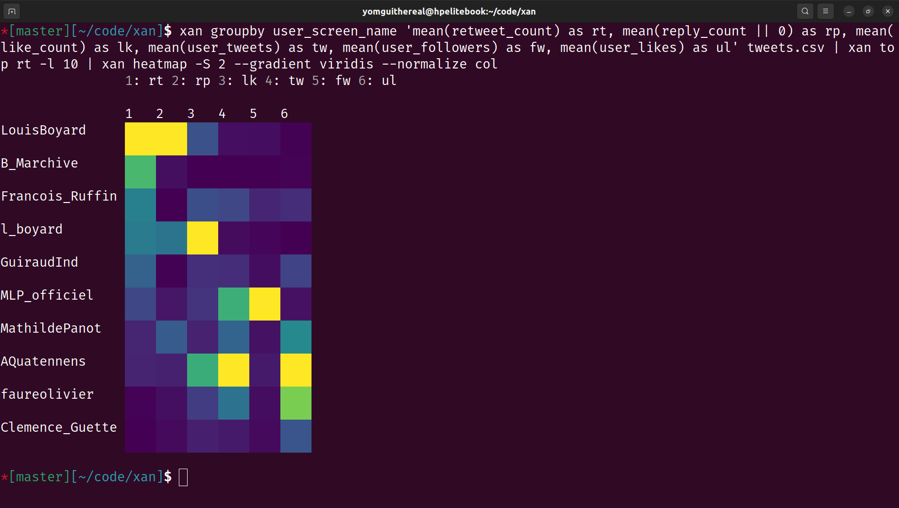

[](https://github.com/medialab/xan/actions) [](https://doi.org/10.5281/zenodo.15310200)

# `xan`, the CSV magician

`xan` is a command line tool that can be used to process CSV files directly from the shell.

It has been written in Rust to be as fast as possible, use as little memory as possible, and can very easily handle large CSV files (Gigabytes). It leverages a novel [SIMD](https://en.wikipedia.org/wiki/Single_instruction,_multiple_data) CSV [parser](https://docs.rs/simd-csv) and is also able to parallelize some computations (through multithreading) to make some tasks complete as fast as your computer can allow.

It can easily preview, filter, slice, aggregate, sort, join CSV files, and exposes a large collection of composable commands that can be chained together to perform a wide variety of typical tasks.

`xan` also offers its own expression language so you can perform complex tasks that cannot be done by relying on the simplest commands. This minimalistic language has been tailored for CSV data and is *way* faster than evaluating typical dynamically-typed languages such as Python, Lua, JavaScript etc.

Note that this tool is originally a fork of [BurntSushi](https://github.com/BurntSushi)'s [`xsv`](https://github.com/BurntSushi/xsv), but has been nearly entirely rewritten at that point, to fit [SciencesPo's médialab](https://github.com/medialab) use-cases, rooted in web data collection and analysis geared towards social sciences (you might think CSV is outdated by now, but read our [love letter](./docs/LOVE_LETTER.md) to the format before judging too quickly).

`xan` therefore goes beyond typical data manipulation and expose utilities related to lexicometry, graph theory and even scraping.

Beyond CSV data, `xan` is able to process a large variety of CSV-adjacent data formats from many different disciplines such as web archival (`.cdx`) or bioinformatics (`.vcf`, `.gtf`, `.sam` etc.). `xan` is also able to convert to & from many data formats such as json, excel files, numpy arrays etc. using [`xan to`](./docs/cmd/to.md) and [`xan from`](./docs/cmd/from.md). See [this](#supported-file-formats) section for more detail.

Finally, `xan` can be used to display CSV files in the terminal, for easy exploration, and can even be used to draw basic data visualisations:

|*view command*|*flatten command*|
|:---:|:---:|
|||
|__*categorical histogram*__|__*scatterplot*__|
|||
|__*categorical scatterplot*__|__*histograms*__|
|||
|__*parallel processing*__|__*time series*__|
|||
|__*small multiples (facet grid)*__|__*grouped view*__|
|||
|__*correlation matrix heatmap*__|__*heatmap*__|
|||

## Summary

* [How to install](#how-to-install)
  * [Cargo](#cargo)
  * [Scoop (Windows)](#scoop-windows)
  * [Homebrew (macOS)](#homebrew-macos)
  * [Arch Linux](#arch-linux)
  * [NetBSD](#netbsd)
  * [Nix](#nix)
  * [Pixi](#pixi-linux-macos-windows)
  * [Pre-built binaries](#pre-built-binaries)
  * [Installing completions](#installing-completions)
* [Quick tour](#quick-tour)
* [Available commands](#available-commands)
* [General flags and IO model](#general-flags-and-io-model)
  * [Getting help](#getting-help)
  * [Regarding input & output formats](#regarding-input--output-formats)
  * [Working with headless CSV file](#working-with-headless-csv-file)
  * [Regarding stdin](#regarding-stdin)
  * [Regarding stdout](#regarding-stdout)
  * [Supported file formats](#supported-file-formats)
  * [Compressed files](#compressed-files)
  * [Regarding color](#regarding-color)
* [Expression language reference](#expression-language-reference)
* [Cookbook](#cookbook)
* [News](#news)
* [How to cite?](#how-to-cite)
* [Frequently Asked Questions](#frequently-asked-questions)

## How to install

### Cargo

`xan` can be installed using cargo (it usually comes with [Rust](https://www.rust-lang.org/tools/install)):

```bash
cargo install xan --locked
```

You can also tweak the build flags to make sure the Rust compiler is able to leverage all your CPU's features:

```bash
CARGO_BUILD_RUSTFLAGS='-C target-cpu=native' cargo install xan --locked
```

You can also install the latest dev version thusly:

```bash
cargo install --git https://github.com/medialab/xan --locked
```

### Scoop (Windows)

`xan` can be installed using [Scoop](https://scoop.sh/) on Windows:

```powershell
scoop bucket add extras
scoop install xan
```

### Homebrew (macOS)

`xan` can be installed with [Homebrew](https://brew.sh/) on macOS thusly:

```bash
brew install xan
```

### Arch Linux

You can install `xan` from the [extra repository](https://archlinux.org/packages/extra/x86_64/xan/) using `pacman`:

```bash
sudo pacman -S xan
```

### NetBSD

A package is available from the official repositories. To install `xan` simply run:

```
pkgin install xan
```

### Nix

`xan` is packaged for Nix, and is available in Nixpkgs as of 25.05 release. To
install it, you may add it to your `environment.systemPackages` as `pkgs.xan` or
use `nix-shell` to enter an ephemeral shell.

```bash
nix-shell -p xan
```

### Pixi (Linux, macOS, Windows)

`xan` can be installed in Linux, macOS, and Windows using the [Pixi](https://pixi.sh/latest/) package manager:

```bash
pixi global install xan
```

### Pre-built binaries

Pre-built binaries can be found attached to every GitHub [releases](https://github.com/medialab/xan/releases/latest).

Currently supported targets include:

- `x86_64-apple-darwin`
- `x86_64-unknown-linux-gnu`
- `x86_64-unknown-linux-musl`
- `x86_64-pc-windows-msvc`

- `aarch64-apple-darwin`
- `aarch64-unknown-linux-gnu`

Feel free to open a PR to improve the CI by adding relevant targets.

### Installing completions

Note that `xan` also exposes handy automatic completions for command and header/column names that you can install through the `xan completions` command.

Run the following command to understand how to install those completions:

```bash
xan completions -h

# With zsh you might also need to add this to your initialization to make
# sure Bash compatibility is loaded:
autoload -Uz bashcompinit && bashcompinit
```

## Quick tour

Let's learn about the most commonly used `xan` commands by exploring a corpus of French medias:

### Downloading the corpus

```bash
curl -LO https://github.com/medialab/corpora/raw/master/polarisation/medias.csv
```

### Displaying the file's headers

```bash
xan headers medias.csv
```

```
0   webentity_id
1   name
2   prefixes
3   home_page
4   start_pages
5   indegree
6   hyphe_creation_timestamp
7   hyphe_last_modification_timestamp
8   outreach
9   foundation_year
10  batch
11  edito
12  parody
13  origin
14  digital_native
15  mediacloud_ids
16  wheel_category
17  wheel_subcategory
18  has_paywall
19  inactive
```

### Counting the number of rows

```bash
xan count medias.csv
```

```
478
```

### Previewing the file in the terminal

```bash
xan view medias.csv
```

```
Displaying 5/20 cols from 10 first rows of medias.csv
┌───┬───────────────┬───────────────┬────────────┬───┬─────────────┬──────────┐
│ - │ name          │ prefixes      │ home_page  │ … │ has_paywall │ inactive │
├───┼───────────────┼───────────────┼────────────┼───┼─────────────┼──────────┤
│ 0 │ Acrimed.org   │ http://acrim… │ http://ww… │ … │ false       │ <empty>  │
│ 1 │ 24matins.fr   │ http://24mat… │ https://w… │ … │ false       │ <empty>  │
│ 2 │ Actumag.info  │ http://actum… │ https://a… │ … │ false       │ <empty>  │
│ 3 │ 2012un-Nouve… │ http://2012u… │ http://ww… │ … │ false       │ <empty>  │
│ 4 │ 24heuresactu… │ http://24heu… │ http://24… │ … │ false       │ <empty>  │
│ 5 │ AgoraVox      │ http://agora… │ http://ww… │ … │ false       │ <empty>  │
│ 6 │ Al-Kanz.org   │ http://al-ka… │ https://w… │ … │ false       │ <empty>  │
│ 7 │ Alalumieredu… │ http://alalu… │ http://al… │ … │ false       │ <empty>  │
│ 8 │ Allodocteurs… │ http://allod… │ https://w… │ … │ false       │ <empty>  │
│ 9 │ Alterinfo.net │ http://alter… │ http://ww… │ … │ <empty>     │ true     │
│ … │ …             │ …             │ …          │ … │ …           │ …        │
└───┴───────────────┴───────────────┴────────────┴───┴─────────────┴──────────┘
```

On unix, don't hesitate to use the `-p` flag to automagically forward the full output to an appropriate pager and skim through all the columns.

### Reading a flattened representation of the first row

```bash
# NOTE: drop -c to avoid truncating the values
xan flatten -c medias.csv
```

```
Row n°0
───────────────────────────────────────────────────────────────────────────────
webentity_id                      1
name                              Acrimed.org
prefixes                          http://acrimed.org|http://acrimed69.blogspot…
home_page                         http://www.acrimed.org
start_pages                       http://acrimed.org|http://acrimed69.blogspot…
indegree                          61
hyphe_creation_timestamp          1560347020330
hyphe_last_modification_timestamp 1560526005389
outreach                          nationale
foundation_year                   2002
batch                             1
edito                             media
parody                            false
origin                            france
digital_native                    true
mediacloud_ids                    258269
wheel_category                    Opinion Journalism
wheel_subcategory                 Left Wing
has_paywall                       false
inactive                          <empty>

Row n°1
───────────────────────────────────────────────────────────────────────────────
webentity_id                      2
...
```

### Searching for rows

```bash
xan search -s outreach internationale medias.csv | xan view
```

```
Displaying 4/20 cols from 10 first rows of <stdin>
┌───┬──────────────┬────────────────────┬───┬─────────────┬──────────┐
│ - │ webentity_id │ name               │ … │ has_paywall │ inactive │
├───┼──────────────┼────────────────────┼───┼─────────────┼──────────┤
│ 0 │ 25           │ Businessinsider.fr │ … │ false       │ <empty>  │
│ 1 │ 59           │ Europe-Israel.org  │ … │ false       │ <empty>  │
│ 2 │ 66           │ France 24          │ … │ false       │ <empty>  │
│ 3 │ 220          │ RFI                │ … │ false       │ <empty>  │
│ 4 │ 231          │ fr.Sott.net        │ … │ false       │ <empty>  │
│ 5 │ 246          │ Voltairenet.org    │ … │ true        │ <empty>  │
│ 6 │ 254          │ Afp.com /fr        │ … │ false       │ <empty>  │
│ 7 │ 265          │ Euronews FR        │ … │ false       │ <empty>  │
│ 8 │ 333          │ Arte.tv            │ … │ false       │ <empty>  │
│ 9 │ 341          │ I24News.tv         │ … │ false       │ <empty>  │
│ … │ …            │ …                  │ … │ …           │ …        │
└───┴──────────────┴────────────────────┴───┴─────────────┴──────────┘
```

### Selecting some columns

```bash
xan select foundation_year,name medias.csv | xan view
```

```
Displaying 2 cols from 10 first rows of <stdin>
┌───┬─────────────────┬───────────────────────────────────────┐
│ - │ foundation_year │ name                                  │
├───┼─────────────────┼───────────────────────────────────────┤
│ 0 │ 2002            │ Acrimed.org                           │
│ 1 │ 2006            │ 24matins.fr                           │
│ 2 │ 2013            │ Actumag.info                          │
│ 3 │ 2012            │ 2012un-Nouveau-Paradigme.com          │
│ 4 │ 2010            │ 24heuresactu.com                      │
│ 5 │ 2005            │ AgoraVox                              │
│ 6 │ 2008            │ Al-Kanz.org                           │
│ 7 │ 2012            │ Alalumieredunouveaumonde.blogspot.com │
│ 8 │ 2005            │ Allodocteurs.fr                       │
│ 9 │ 2005            │ Alterinfo.net                         │
│ … │ …               │ …                                     │
└───┴─────────────────┴───────────────────────────────────────┘
```

### Sorting the file

```bash
xan sort -s foundation_year medias.csv | xan view -s name,foundation_year
```

```
Displaying 2 cols from 10 first rows of <stdin>
┌───┬────────────────────────────────────┬─────────────────┐
│ - │ name                               │ foundation_year │
├───┼────────────────────────────────────┼─────────────────┤
│ 0 │ Le Monde Numérique (Ouest France)  │ <empty>         │
│ 1 │ Le Figaro                          │ 1826            │
│ 2 │ Le journal de Saône-et-Loire       │ 1826            │
│ 3 │ L'Indépendant                      │ 1846            │
│ 4 │ Le Progrès                         │ 1859            │
│ 5 │ La Dépêche du Midi                 │ 1870            │
│ 6 │ Le Pélerin                         │ 1873            │
│ 7 │ Dernières Nouvelles d'Alsace (DNA) │ 1877            │
│ 8 │ La Croix                           │ 1883            │
│ 9 │ Le Chasseur Francais               │ 1885            │
│ … │ …                                  │ …               │
└───┴────────────────────────────────────┴─────────────────┘
```

### Deduplicating the file on some column

```bash
# Some medias of our corpus have the same ids on mediacloud.org
xan dedup -s mediacloud_ids medias.csv | xan count && xan count medias.csv
```

```
457
478
```

Deduplicating can also be done while sorting:

```bash
xan sort -s mediacloud_ids -u medias.csv
```

### Computing frequency tables

```bash
xan frequency -s edito medias.csv | xan view
```

```
Displaying 3 cols from 5 rows of <stdin>
┌───┬───────┬────────────┬───────┐
│ - │ field │ value      │ count │
├───┼───────┼────────────┼───────┤
│ 0 │ edito │ media      │ 423   │
│ 1 │ edito │ individu   │ 30    │
│ 2 │ edito │ plateforme │ 14    │
│ 3 │ edito │ agrégateur │ 10    │
│ 4 │ edito │ agence     │ 1     │
└───┴───────┴────────────┴───────┘
```

### Printing a histogram

```bash
xan frequency -s edito medias.csv | xan hist
```

```
Histogram for edito (bars: 5, sum: 478, max: 423):

media      |423  88.49%|━━━━━━━━━━━━━━━━━━━━━━━━━━━━━━━━━━━━━━━━━━━━━━━━━━━━━━|
individu   | 30   6.28%|━━━╸                                                  |
plateforme | 14   2.93%|━╸                                                    |
agrégateur | 10   2.09%|━╸                                                    |
agence     |  1   0.21%|╸                                                     |
```

### Computing descriptive statistics

```bash
xan stats -s indegree,edito medias.csv | xan transpose | xan view -I
```

```
Displaying 2 cols from 14 rows of <stdin>
┌─────────────┬───────────────────┬────────────┐
│ field       │ indegree          │ edito      │
├─────────────┼───────────────────┼────────────┤
│ count       │ 463               │ 478        │
│ count_empty │ 15                │ 0          │
│ type        │ int               │ string     │
│ types       │ int|empty         │ string     │
│ sum         │ 25987             │ <empty>    │
│ mean        │ 56.12742980561554 │ <empty>    │
│ variance    │ 4234.530197929737 │ <empty>    │
│ stddev      │ 65.07326792108829 │ <empty>    │
│ min         │ 0                 │ <empty>    │
│ max         │ 424               │ <empty>    │
│ lex_first   │ 0                 │ agence     │
│ lex_last    │ 99                │ plateforme │
│ min_length  │ 0                 │ 5          │
│ max_length  │ 3                 │ 11         │
└─────────────┴───────────────────┴────────────┘
```

### Evaluating an expression to filter a file

```bash
xan filter 'batch > 1' medias.csv | xan count
```

```
130
```

To access the expression language's [cheatsheet](./docs/moonblade/cheatsheet.md), run `xan help cheatsheet`. To display the full list of available [functions](./docs/moonblade/functions.md), run `xan help functions`.

### Evaluating an expression to create a new column based on other ones

```bash
xan map 'fmt("{} ({})", name, foundation_year) as key' medias.csv | xan select key | xan slice -l 10
```

```
key
Acrimed.org (2002)
24matins.fr (2006)
Actumag.info (2013)
2012un-Nouveau-Paradigme.com (2012)
24heuresactu.com (2010)
AgoraVox (2005)
Al-Kanz.org (2008)
Alalumieredunouveaumonde.blogspot.com (2012)
Allodocteurs.fr (2005)
Alterinfo.net (2005)
```

To access the expression language's [cheatsheet](./docs/moonblade/cheatsheet.md), run `xan help cheatsheet`. To display the full list of available [functions](./docs/moonblade/functions.md), run `xan help functions`.

### Transform a column by evaluating an expression

```bash
xan transform name 'split(name, ".") | first | upper' medias.csv | xan select name | xan slice -l 10
```

```
name
ACRIMED
24MATINS
ACTUMAG
2012UN-NOUVEAU-PARADIGME
24HEURESACTU
AGORAVOX
AL-KANZ
ALALUMIEREDUNOUVEAUMONDE
ALLODOCTEURS
ALTERINFO
```

To access the expression language's [cheatsheet](./docs/moonblade/cheatsheet.md), run `xan help cheatsheet`. To display the full list of available [functions](./docs/moonblade/functions.md), run `xan help functions`.

### Performing custom aggregation

```bash
xan agg 'sum(indegree) as total_indegree, mean(indegree) as mean_indegree' medias.csv | xan view -I
```

```
Displaying 1 col from 1 rows of <stdin>
┌────────────────┬───────────────────┐
│ total_indegree │ mean_indegree     │
├────────────────┼───────────────────┤
│ 25987          │ 56.12742980561554 │
└────────────────┴───────────────────┘
```

To access the expression language's [cheatsheet](./docs/moonblade/cheatsheet.md), run `xan help cheatsheet`. To display the full list of available [functions](./docs/moonblade/functions.md), run `xan help functions`. Finally, to display the list of available [aggregation functions](./docs/moonblade/aggs.md), run `xan help aggs`.

### Grouping rows and performing per-group aggregation

```bash
xan groupby edito 'sum(indegree) as indegree' medias.csv | xan view -I
```

```
Displaying 1 col from 5 rows of <stdin>
┌────────────┬──────────┐
│ edito      │ indegree │
├────────────┼──────────┤
│ agence     │ 50       │
│ agrégateur │ 459      │
│ plateforme │ 658      │
│ media      │ 24161    │
│ individu   │ 659      │
└────────────┴──────────┘
```

To access the expression language's [cheatsheet](./docs/moonblade/cheatsheet.md), run `xan help cheatsheet`. To display the full list of available [functions](./docs/moonblade/functions.md), run `xan help functions`. Finally, to display the list of available [aggregation functions](./docs/moonblade/aggs.md), run `xan help aggs`.

## Available commands

- [**help**](./docs/cmd/help.md): Get help regarding the expression language

*Explore & visualize*

- [**count (c)**](./docs/cmd/count.md): Count rows in file
- [**headers (h)**](./docs/cmd/headers.md): Show header names
- [**view (v)**](./docs/cmd/view.md): Preview a CSV file in a human-friendly way
- [**flatten**](./docs/cmd/flatten.md): Display a flattened version of each row of a file
- [**hist**](./docs/cmd/hist.md): Print a histogram with rows of CSV file as bars
- [**plot**](./docs/cmd/plot.md): Draw a scatter plot or line chart
- [**heatmap**](./docs/cmd/heatmap.md): Draw a heatmap of a CSV matrix
- [**progress**](./docs/cmd/progress.md): Display a progress bar while reading CSV data

*Search & filter*

- [**search**](./docs/cmd/search.md): Search for (or replace) patterns in CSV data
- [**grep**](./docs/cmd/grep.md): Coarse but fast filtering of CSV data
- [**filter**](./docs/cmd/filter.md): Only keep some CSV rows based on an evaluated expression
- [**head**](./docs/cmd/head.md): First rows of CSV file
- [**tail**](./docs/cmd/tail.md): Last rows of CSV file
- [**slice**](./docs/cmd/slice.md): Slice rows of CSV file
- [**top**](./docs/cmd/top.md): Find top rows of a CSV file according to some column
- [**sample**](./docs/cmd/sample.md): Randomly sample CSV data

*Sort & deduplicate*

- [**sort**](./docs/cmd/sort.md): Sort CSV data
- [**dedup**](./docs/cmd/dedup.md): Deduplicate a CSV file
- [**shuffle**](./docs/cmd/shuffle.md): Shuffle CSV data

*Aggregate*

- [**frequency (freq)**](./docs/cmd/frequency.md): Show frequency tables
- [**groupby**](./docs/cmd/groupby.md): Aggregate data by groups of a CSV file
- [**stats**](./docs/cmd/stats.md): Compute basic statistics
- [**agg**](./docs/cmd/agg.md): Aggregate data from CSV file
- [**bins**](./docs/cmd/bins.md): Dispatch numeric columns into bins
- [**window**](./docs/cmd/window.md): Compute window aggregations (cumsum, rolling mean, lag etc.)

*Combine multiple CSV files*

- [**cat**](./docs/cmd/cat.md): Concatenate by row or column
- [**join**](./docs/cmd/join.md): Join CSV files
- [**fuzzy-join**](./docs/cmd/fuzzy-join.md): Join a CSV file with another containing patterns (e.g. regexes)
- [**merge**](./docs/cmd/merge.md): Merge multiple similar already sorted CSV files

*Add, transform, drop and move columns*

- [**select**](./docs/cmd/select.md): Select columns from a CSV file
- [**drop**](./docs/cmd/drop.md): Drop columns from a CSV file
- [**map**](./docs/cmd/map.md): Create a new column by evaluating an expression on each CSV row
- [**transform**](./docs/cmd/transform.md): Transform a column by evaluating an expression on each CSV row
- [**enum**](./docs/cmd/enum.md): Enumerate CSV file by preprending an index column
- [**flatmap**](./docs/cmd/flatmap.md): Emit one row per value yielded by an expression evaluated for each CSV row
- [**fill**](./docs/cmd/fill.md): Fill empty cells
- [**blank**](./docs/cmd/blank.md): Blank down contiguous identical cell values

*Format, convert & recombobulate*

- [**behead**](./docs/cmd/behead.md): Drop header from CSV file
- [**rename**](./docs/cmd/rename.md): Rename columns of a CSV file
- [**input**](./docs/cmd/input.md): Read unusually formatted CSV data
- [**fixlengths**](./docs/cmd/fixlengths.md): Makes all rows have same length
- [**fmt**](./docs/cmd/fmt.md): Format CSV output (change field delimiter)
- [**explode**](./docs/cmd/explode.md): Explode rows based on some column separator
- [**implode**](./docs/cmd/implode.md): Collapse consecutive identical rows based on a diverging column
- [**from**](./docs/cmd/from.md): Convert a variety of formats to CSV
- [**to**](./docs/cmd/to.md): Convert a CSV file to a variety of data formats
- [**scrape**](./docs/cmd/scrape.md): Scrape HTML into CSV data
- [**reverse**](./docs/cmd/reverse.md): Reverse rows of CSV data
- [**transpose (t)**](./docs/cmd/transpose.md): Transpose CSV file
- [**pivot**](./docs/cmd/pivot.md): Stack multiple columns into fewer columns
- [**unpivot**](./docs/cmd/unpivot.md): Split distinct values of a column into their own columns

*Split a CSV file into multiple*

- [**split**](./docs/cmd/split.md): Split CSV data into chunks
- [**partition**](./docs/cmd/partition.md): Partition CSV data based on a column value

*Parallelization*

- [**parallel (p)**](./docs/cmd/parallel.md): Map-reduce-like parallel computation

*Generate CSV files*

- [**range**](./docs/cmd/range.md): Create a CSV file from a numerical range

*Lexicometry & fuzzy matching*

- [**tokenize**](./docs/cmd/tokenize.md): Tokenize a text column
- [**vocab**](./docs/cmd/vocab.md): Build a vocabulary over tokenized documents
- [**cluster**](./docs/cmd/cluster.md): Cluster CSV data to find near-duplicates

*Matrix & network-related commands*

- [**matrix**](./docs/cmd/matrix.md): Convert CSV data to matrix data
- [**network**](./docs/cmd/network.md): Convert CSV data to network data

*Debug*

- [**eval**](./docs/cmd/eval.md): Evaluate/debug a single expression

## General flags and IO model

### Getting help

If you ever feel lost, each command has a `-h/--help` flag that will print the related documentation.

If you need help about the expression language, check out the `help` command itself:

```bash
# Help about help ;)
xan help --help
```

### Regarding input & output formats

All `xan` commands expect a "standard" CSV file, e.g. comma-delimited, with proper double-quote escaping. This said, `xan` is also perfectly able to infer the delimiter from typical file extensions such as `.tsv`, `.tab`, `.psv`, `.ssv` or `.scsv`.

If you need to process a file with a custom delimiter, you can either use the `xan input` command or use the `-d/--delimiter` flag available with all commands.

If you need to output a custom CSV dialect (e.g. using `;` delimiters), feel free to use the `xan fmt` command.

Finally, even if most `xan` commands won't even need to decode the file's bytes, some might still need to. In this case, `xan` will expect correctly formatted UTF-8 text. Please use `iconv` or other utils if you need to process other encodings such as `latin1` ahead of `xan`.

### Working with headless CSV file

Even if this is good practice to name your columns, some CSV file simply don't have headers. Most commands are able to deal with those file if you give the `-n/--no-headers` flag.

Note that this flag always relates to the input, not the output. If for some reason you want to drop a CSV output's header row, use the `xan behead` command.

### Regarding stdin

By default, all commands will try to read from stdin when the file path is not specified. This makes piping easy and comfortable as it respects typical unix standards. Some commands may have multiple inputs (`xan join`, for instance), in which case stdin is usually specifiable using the `-` character:

```bash
# First file given to join will be read from stdin
cat file1.csv | xan join col1 - col2 file2.csv
```

Note that the command will also warn you when stdin cannot be read, in case you forgot to indicate the file's path.

### Regarding stdout

By default, all commands will print their output to stdout (note that this output is usually buffered for performance reasons).

In addition, all commands expose a `-o/--output` flag that can be use to specify where to write the output. This can be useful if you do not want to or cannot use `>` (typically in some Windows shells). In which case, `-` as a output path will mean forwarding to stdout also. This can be useful when scripting sometimes.

### Supported file formats

`xan` is able to process a large variety of CSV-adjacent data formats out-of-the box:

- `.csv` files will be understood as comma-separated
- `.tsv` & `.tab` files will be understood as tab-separated
- `.scsv` & `.ssv` files will be understood as semicolon-separated
- `.psv` files will be understood as pipe-separated
- `.cdx` files (an index file [format](https://iipc.github.io/warc-specifications/specifications/cdx-format/cdx-2015/) related to web archive) will be understood as space-separated and will have its magic bytes dropped
- `.ndjson` & `.jsonl` files will be understood as tab-separated, headless, null-byte-quoted, so you can easily use them with `xan` commands (e.g. parsing or wrangling JSON data using the expression language to aggregate, even in parallel). If you need a more thorough conversion of newline-delimited JSON data, check out the `xan from -f ndjson` command instead.
- `.vcf` files ([Variant Call Format](https://en.wikipedia.org/wiki/Variant_Call_Format)) from bioinformatics are supported out of the box. They will be stripped of their header data and considered as tab-delimited.
- `.gtf` & `.gff2` files ([Gene Transfert Format](https://en.wikipedia.org/wiki/Gene_transfer_format)) from bioinformatics are supported out of the box. They will be stripped of their header data and considered as headless & tab-delimited.
- `.sam` files ([Sequence Alignment Map](https://en.wikipedia.org/wiki/SAM_(file_format))) from bioinformatics are supported out of the box. They will be stripped of their header data and considered as tab-delimited.

Note that more exotic delimiters can always be handled using the ubiquitous `-d, --delimiter` flag.

Some additional formats (e.g. `.gff`, `.gff3`) are also supported but must first be normalized using the `xan input` command because their cells must be trimmed or because they have comment lines to be skipped.

Note also that UTF-8 BOMs ara always stripped from the data when processed.

### Compressed files

`xan` is able to read gzipped files (having a `.gz` extension) out of the box. It is also able to leverage `.gzi` indices (usually created through [`bgzip`](https://www.htslib.org/doc/bgzip.html)) when seeking is necessary (constant time reversing, parallelization chunking etc.).

`xan` is also able to read files compressed with [`Zstdandard`](https://github.com/facebook/zstd) (having a `.zst` extension) out of the box.

### Regarding color

Some `xan` commands print ANSI colors in the terminal by default, typically `view`, `flatten`, etc.

All those commands have a standard `--color=(auto|always|never)` flag to tweak the colouring behavior if you need it (note that colors are not printed when commands are piped, by default).

They also respect typical environment variables related to ANSI colouring, such as `NO_COLOR`, `CLICOLOR` & `CLICOLOR_FORCE`, as documented [here](https://bixense.com/clicolors/).

## Expression language reference

- [Cheatsheet](./docs/moonblade/cheatsheet.md)
- [Comprehensive list of functions & operators](./docs/moonblade/functions.md)
- [Comprehensive list of aggregation functions](./docs/moonblade/aggs.md)
- [Comprehensive list of window aggregation functions](./docs/moonblade/window.md)
- [Scraping DSL](./docs/moonblade/scraping.md)

## Cookbook

* [Merging frequency tables, three ways](./docs/cookbook/frequency_tables.md)
* [Parsing and visualizing dates with xan](./docs/cookbook/dates.md)
* [Joining files by URL prefixes](./docs/cookbook/urls.md)
* [Miscellaneous](./docs/cookbook/misc.md)

## News

For news about the tool's evolutions feel free to read:

1. the [changelog](CHANGELOG.md)
2. the [xan zines](./docs/XANZINE.md)

## How to cite?

`xan` is published on [Zenodo](https://zenodo.org/) as [10.5281/zenodo.15310200](https://doi.org/10.5281/zenodo.15310200).

You can cite it thusly:

> Guillaume Plique, Béatrice Mazoyer, Laura Miguel, César Pichon, Anna Charles, & Julien Pontoire. (2025). xan, the CSV magician. (0.50.0). Zenodo. https://doi.org/10.5281/zenodo.15310200

## Frequently Asked Questions

### How to display a vertical bar chart?

Rotate your screen ;\)
