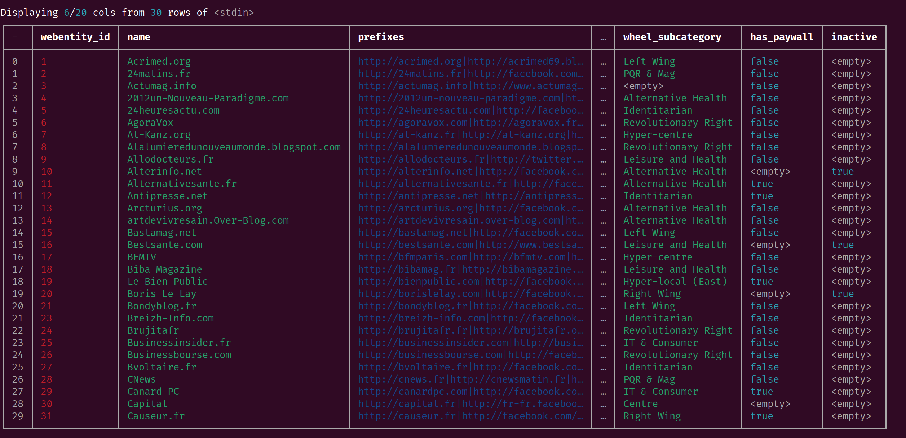
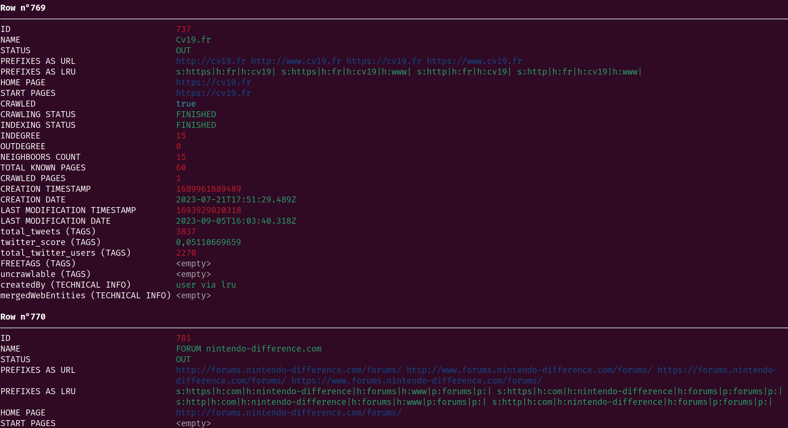
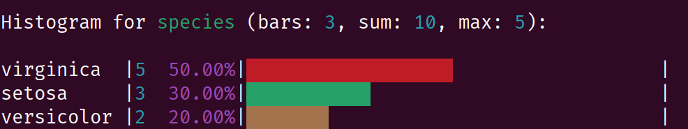
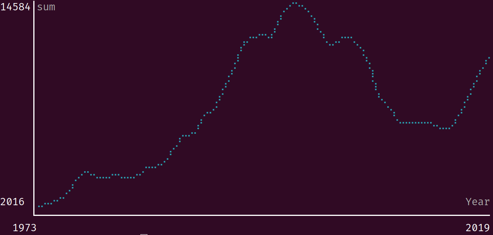

# `xan`, the CSV magician

`xan` is a command line tool that can be used to process CSV files directly from the shell.

It has been written in Rust to be as performant as possible and can easily handle very large CSV files (Gigabytes). It is also able to leverage parallelism (through multithreading) to make some tasks complete as fast as your computer can allow.

It can easily preview, filter, slice, aggregate, sort, join CSV files, and exposes a large collection of composable commands that can be chained together to perform a wide variety of typical tasks.

`xan` also leverages its own expression language so you can perform complex tasks that cannot be done by relying on the simplest commands. This minimalistic language has been tailored for CSV data and is faster than evaluating typical dynamically-typed languages such as Python, Lua, JavaScript etc.

Note that this tool is originally a fork of [BurntSushi](https://github.com/BurntSushi)'s [`xsv`](https://github.com/BurntSushi/xsv), but has been nearly entirely rewritten at that point, to fit [SciencesPo's médialab](https://github.com/medialab) use-cases, rooted in web data collection and analysis geared towards social sciences (you might think CSV is outdated by now, but read our [love letter](./docs/LOVE_LETTER.md) to the format before judging too quickly).

Finally, `xan` can be used to display CSV files in the terminal, for easy exploration, and can even be used to draw basic data visualisations.

*Displaying a CSV file in the terminal using `xan view`*



*Showing a flattened view of CSV records using `xan flatten`*



*Drawing a histogram of values using `xan hist`*

<p align="center">
  
</p>

*Drawing a scatterplot using `xan plot`*

<p align="center">
  
</p>

*Drawing a time series using `xan plot`*

<p align="center">
  
</p>

*Displaying a progress bar using `xan progress`*

<p align="center">
  
</p>

## Summary

* [How to install](#how-to-install)
* [Quick tour](#quick-tour)
* [Available commands](#available-commands)
* [General flags and IO model](#general-flags-and-io-model)
* [Expression language reference](#expression-language-reference)
  * [Syntax](#syntax)
  * [Functions & Operators](#functions--operators)
  * [Aggregation functions](#aggregation-functions)
* [Advanced use-cases](#advanced-use-cases)
* [Frequently Asked Questions](#frequently-asked-questions)

## How to install

`xan` can be installed using cargo (it usually comes with [Rust](https://www.rust-lang.org/tools/install)):

```
cargo install xan
```

You can also install the latest dev version thusly:

```
cargo install --git https://github.com/medialab/xan
```

## Quick tour

Let's learn about the most commonly used `xan` commands by exploring a corpus of French medias:

### Downloading the corpus

```bash
curl -LO https://github.com/medialab/corpora/raw/master/polarisation/medias.csv
```

### Displaying the file's headers

```bash
xan headers medias.csv
```

```
0   webentity_id
1   name
2   prefixes
3   home_page
4   start_pages
5   indegree
6   hyphe_creation_timestamp
7   hyphe_last_modification_timestamp
8   outreach
9   foundation_year
10  batch
11  edito
12  parody
13  origin
14  digital_native
15  mediacloud_ids
16  wheel_category
17  wheel_subcategory
18  has_paywall
19  inactive
```

### Counting the number of rows

```bash
xan count medias.csv
```

```
478
```

### Previewing the file in the terminal

```bash
xan view medias.csv
```

```
Displaying 5/20 cols from 10 first rows of medias.csv
┌───┬───────────────┬───────────────┬────────────┬───┬─────────────┬──────────┐
│ - │ name          │ prefixes      │ home_page  │ … │ has_paywall │ inactive │
├───┼───────────────┼───────────────┼────────────┼───┼─────────────┼──────────┤
│ 0 │ Acrimed.org   │ http://acrim… │ http://ww… │ … │ false       │ <empty>  │
│ 1 │ 24matins.fr   │ http://24mat… │ https://w… │ … │ false       │ <empty>  │
│ 2 │ Actumag.info  │ http://actum… │ https://a… │ … │ false       │ <empty>  │
│ 3 │ 2012un-Nouve… │ http://2012u… │ http://ww… │ … │ false       │ <empty>  │
│ 4 │ 24heuresactu… │ http://24heu… │ http://24… │ … │ false       │ <empty>  │
│ 5 │ AgoraVox      │ http://agora… │ http://ww… │ … │ false       │ <empty>  │
│ 6 │ Al-Kanz.org   │ http://al-ka… │ https://w… │ … │ false       │ <empty>  │
│ 7 │ Alalumieredu… │ http://alalu… │ http://al… │ … │ false       │ <empty>  │
│ 8 │ Allodocteurs… │ http://allod… │ https://w… │ … │ false       │ <empty>  │
│ 9 │ Alterinfo.net │ http://alter… │ http://ww… │ … │ <empty>     │ true     │
│ … │ …             │ …             │ …          │ … │ …           │ …        │
└───┴───────────────┴───────────────┴────────────┴───┴─────────────┴──────────┘
```

On unix, don't hesitate to use the `-p` flag to automagically forward the full output to an appropriate pager and skim through all the columns.

### Reading a flattened representation of the first row

```bash
# NOTE: drop -c to avoid truncating the values
xan slice -l 1 medias.csv | xan flatten -c
```

```
Row n°0
───────────────────────────────────────────────────────────────────────────────
webentity_id                      1
name                              Acrimed.org
prefixes                          http://acrimed.org|http://acrimed69.blogspot…
home_page                         http://www.acrimed.org
start_pages                       http://acrimed.org|http://acrimed69.blogspot…
indegree                          61
hyphe_creation_timestamp          1560347020330
hyphe_last_modification_timestamp 1560526005389
outreach                          nationale
foundation_year                   2002
batch                             1
edito                             media
parody                            false
origin                            france
digital_native                    true
mediacloud_ids                    258269
wheel_category                    Opinion Journalism
wheel_subcategory                 Left Wing
has_paywall                       false
inactive                          <empty>
```

### Searching for rows

```bash
xan search -s outreach internationale medias.csv | xan view
```

```
Displaying 4/20 cols from 10 first rows of <stdin>
┌───┬──────────────┬────────────────────┬───┬─────────────┬──────────┐
│ - │ webentity_id │ name               │ … │ has_paywall │ inactive │
├───┼──────────────┼────────────────────┼───┼─────────────┼──────────┤
│ 0 │ 25           │ Businessinsider.fr │ … │ false       │ <empty>  │
│ 1 │ 59           │ Europe-Israel.org  │ … │ false       │ <empty>  │
│ 2 │ 66           │ France 24          │ … │ false       │ <empty>  │
│ 3 │ 220          │ RFI                │ … │ false       │ <empty>  │
│ 4 │ 231          │ fr.Sott.net        │ … │ false       │ <empty>  │
│ 5 │ 246          │ Voltairenet.org    │ … │ true        │ <empty>  │
│ 6 │ 254          │ Afp.com /fr        │ … │ false       │ <empty>  │
│ 7 │ 265          │ Euronews FR        │ … │ false       │ <empty>  │
│ 8 │ 333          │ Arte.tv            │ … │ false       │ <empty>  │
│ 9 │ 341          │ I24News.tv         │ … │ false       │ <empty>  │
│ … │ …            │ …                  │ … │ …           │ …        │
└───┴──────────────┴────────────────────┴───┴─────────────┴──────────┘
```

### Selecting some columns

```bash
xan select foundation_year,name medias.csv | xan view
```

```
Displaying 2 cols from 10 first rows of <stdin>
┌───┬─────────────────┬───────────────────────────────────────┐
│ - │ foundation_year │ name                                  │
├───┼─────────────────┼───────────────────────────────────────┤
│ 0 │ 2002            │ Acrimed.org                           │
│ 1 │ 2006            │ 24matins.fr                           │
│ 2 │ 2013            │ Actumag.info                          │
│ 3 │ 2012            │ 2012un-Nouveau-Paradigme.com          │
│ 4 │ 2010            │ 24heuresactu.com                      │
│ 5 │ 2005            │ AgoraVox                              │
│ 6 │ 2008            │ Al-Kanz.org                           │
│ 7 │ 2012            │ Alalumieredunouveaumonde.blogspot.com │
│ 8 │ 2005            │ Allodocteurs.fr                       │
│ 9 │ 2005            │ Alterinfo.net                         │
│ … │ …               │ …                                     │
└───┴─────────────────┴───────────────────────────────────────┘
```

### Sorting the file

```bash
xan sort -s foundation_year medias.csv | xan select name,foundation_year | xan view -l 10
```

```
Displaying 2 cols from 10 first rows of <stdin>
┌───┬────────────────────────────────────┬─────────────────┐
│ - │ name                               │ foundation_year │
├───┼────────────────────────────────────┼─────────────────┤
│ 0 │ Le Monde Numérique (Ouest France)  │ <empty>         │
│ 1 │ Le Figaro                          │ 1826            │
│ 2 │ Le journal de Saône-et-Loire       │ 1826            │
│ 3 │ L'Indépendant                      │ 1846            │
│ 4 │ Le Progrès                         │ 1859            │
│ 5 │ La Dépêche du Midi                 │ 1870            │
│ 6 │ Le Pélerin                         │ 1873            │
│ 7 │ Dernières Nouvelles d'Alsace (DNA) │ 1877            │
│ 8 │ La Croix                           │ 1883            │
│ 9 │ Le Chasseur Francais               │ 1885            │
│ … │ …                                  │ …               │
└───┴────────────────────────────────────┴─────────────────┘
```

### Deduplicating the file on some column

```bash
# Some medias of our corpus have the same ids on mediacloud.org
xan dedup -s mediacloud_ids medias.csv | xan count && xan count medias.csv
```

```
457
478
```

Deduplicating can also be done while sorting:

```bash
xan sort -s mediacloud_ids -u medias.csv
```

### Computing frequency tables

```bash
xan frequency -s edito medias.csv | xan view
```

```
Displaying 3 cols from 5 rows of <stdin>
┌───┬───────┬────────────┬───────┐
│ - │ field │ value      │ count │
├───┼───────┼────────────┼───────┤
│ 0 │ edito │ media      │ 423   │
│ 1 │ edito │ individu   │ 30    │
│ 2 │ edito │ plateforme │ 14    │
│ 3 │ edito │ agrégateur │ 10    │
│ 4 │ edito │ agence     │ 1     │
└───┴───────┴────────────┴───────┘
```

### Printing a histogram

```bash
xan frequency -s edito medias.csv | xan hist
```

```
Histogram for edito (bars: 5, sum: 478, max: 423):

media      |423  88.49%|━━━━━━━━━━━━━━━━━━━━━━━━━━━━━━━━━━━━━━━━━━━━━━━━━━━━━━|
individu   | 30   6.28%|━━━╸                                                  |
plateforme | 14   2.93%|━╸                                                    |
agrégateur | 10   2.09%|━╸                                                    |
agence     |  1   0.21%|╸                                                     |
```

### Computing descriptive statistics

```bash
xan stats -s indegree,edito medias.csv | xan transpose | xan view -I
```

```
Displaying 2 cols from 14 rows of <stdin>
┌─────────────┬───────────────────┬────────────┐
│ field       │ indegree          │ edito      │
├─────────────┼───────────────────┼────────────┤
│ count       │ 463               │ 478        │
│ count_empty │ 15                │ 0          │
│ type        │ int               │ string     │
│ types       │ int|empty         │ string     │
│ sum         │ 25987             │ <empty>    │
│ mean        │ 56.12742980561554 │ <empty>    │
│ variance    │ 4234.530197929737 │ <empty>    │
│ stddev      │ 65.07326792108829 │ <empty>    │
│ min         │ 0                 │ <empty>    │
│ max         │ 424               │ <empty>    │
│ lex_first   │ 0                 │ agence     │
│ lex_last    │ 99                │ plateforme │
│ min_length  │ 0                 │ 5          │
│ max_length  │ 3                 │ 11         │
└─────────────┴───────────────────┴────────────┘
```

### Evaluating an expression to filter a file

```bash
xan filter 'batch > 1' medias.csv | xan count
```

```
130
```

To access the expression language's [cheatsheet](#syntax), run `xan filter --cheatsheet`. To display the full list of available [functions](#functions--operators), run `xan filter --functions`.

### Evaluating an expression to create a new column based on other ones

```bash
xan map 'fmt("{} ({})", name, foundation_year)' key medias.csv | xan select key | xan slice -l 10
```

```
key
Acrimed.org (2002)
24matins.fr (2006)
Actumag.info (2013)
2012un-Nouveau-Paradigme.com (2012)
24heuresactu.com (2010)
AgoraVox (2005)
Al-Kanz.org (2008)
Alalumieredunouveaumonde.blogspot.com (2012)
Allodocteurs.fr (2005)
Alterinfo.net (2005)
```

To access the expression language's [cheatsheet](#syntax), run `xan map --cheatsheet`. To display the full list of available [functions](#functions--operators), run `xan map --functions`.

### Transform a column by evaluating an expression

```bash
xan transform name 'split(name, ".") | first | upper' medias.csv | xan select name | xan slice -l 10
```

```
name
ACRIMED
24MATINS
ACTUMAG
2012UN-NOUVEAU-PARADIGME
24HEURESACTU
AGORAVOX
AL-KANZ
ALALUMIEREDUNOUVEAUMONDE
ALLODOCTEURS
ALTERINFO
```

To access the expression language's [cheatsheet](#syntax), run `xan transform --cheatsheet`. To display the full list of available [functions](#functions--operators), run `xan transform --functions`.

### Performing custom aggregation

```bash
xan agg 'sum(indegree) as total_indegree, mean(indegree) as mean_indegree' medias.csv | xan view -I
```

```
Displaying 1 col from 1 rows of <stdin>
┌────────────────┬───────────────────┐
│ total_indegree │ mean_indegree     │
├────────────────┼───────────────────┤
│ 25987          │ 56.12742980561554 │
└────────────────┴───────────────────┘
```

To access the expression language's [cheatsheet](#syntax), run `xan agg --cheatsheet`. To display the full list of available [functions](#functions--operators), run `xan agg --functions`. Finally, to display the list of available [aggregation functions](#aggregation-functions), run `xan agg --aggs`.

### Grouping rows and performing per-group aggregation

```bash
xan groupby edito 'sum(indegree) as indegree' medias.csv | xan view -I
```

```
Displaying 1 col from 5 rows of <stdin>
┌────────────┬──────────┐
│ edito      │ indegree │
├────────────┼──────────┤
│ agence     │ 50       │
│ agrégateur │ 459      │
│ plateforme │ 658      │
│ media      │ 24161    │
│ individu   │ 659      │
└────────────┴──────────┘
```

To access the expression language's [cheatsheet](#syntax), run `xan groupby --cheatsheet`. To display the full list of available [functions](#functions--operators), run `xan groupby --functions`. Finally, to display the list of available [aggregation functions](#aggregation-functions), run `xan groupby --aggs`.

## Available commands

*All commands are not fully documented on this README yet, but all the necessary information can be found directly from the command line. Just run `xan command -h` for help*

*Explore & visualize*

- [**count (c)**](./docs/cmd/count.md): Count rows in file
- [**headers (h)**](./docs/cmd/headers.md): Show header names
- **view (v)**: Preview a CSV file in a human-friendly way
- **flatten**: Display a flattened version of each row of a file
- **hist**: Print a histogram with rows of CSV file as bars
- **plot**: Draw a scatter plot or line chart
- **progress**: Display a progress bar while reading CSV data

*Search & filter*

- **search**: Search CSV data with regexes
- **filter**: Only keep some CSV rows based on an evaluated expression
- **slice**: Slice rows of CSV file
- **top**: Find top rows of a CSV file according to some column
- **sample**: Randomly sample CSV data

*Sort & deduplicate*

- **sort**: Sort CSV data
- **dedup**: Deduplicate a CSV file
- **shuffle**: Shuffle CSV data

*Aggregate*

- **frequency (freq)**: Show frequency tables
- **groupby**: Aggregate data by groups of a CSV file
- **stats**: Compute basic statistics
- **agg**: Aggregate data from CSV file
- **bins**: Dispatch numeric columns into bins

*Combine multiple CSV files*

- **cat**: Concatenate by row or column
- **join**: Join CSV files
- **merge**: Merge multiple similar already sorted CSV files

*Format, convert & recombobulate*

- **select**: Select columns from CSV
- [**behead**](./docs/cmd/behead.md): Drop header from CSV file
- **rename**: Rename columns of a CSV file
- **input**: Read CSV data with special quoting rules
- **fixlengths**: Makes all rows have same length
- **fmt**: Format CSV output (change field delimiter)
- **explode**: Explode rows based on some column separator
- **implode**: Collapse consecutive identical rows based on a diverging column
- **from**: Convert a variety of formats to CSV
- **reverse**: Reverse rows of CSV data
- **transpose**: Transpose CSV file

*Add & transform columns*

- **map**: Create a new column by evaluating an expression on each CSV row
- **transform**: Transform a column by evaluating an expression on each CSV row
- **enum**: Enumerate CSV file by preprending an index column
- **flatmap**: Emit one row per value yielded by an expression evaluated for each CSV row

*Split a CSV file into multiple*

- **split**: Split CSV data into chunks
- **partition**: Partition CSV data based on a column value

*Parallel operation over multiple CSV files*

- **parallel (p)**: Map-reduce-like parallel computation

*Generate CSV files*

- **glob**: Create a CSV file with paths matching a glob pattern
- **range**: Create a CSV file from a numerical range

*Perform side-effects*

- **foreach**: Loop over a CSV file to perform side effects

*Lexicometry & fuzzy matching*

- **tokenize**: Tokenize a text column
- **vocab**: Build a vocabulary over tokenized documents
- **cluster**: Cluster CSV data to find near-duplicates

*Graph algorithms*

- **union-find**: Apply the union-find algorithm on a CSV edge list

## General flags and IO model

### Getting help

If you ever feel lost, each command has a `-h/--help` flag that will print the related documentation.

### Regarding input & output formats

All `xan` commands expect a "standard" CSV file, e.g. comma-delimited, with proper double-quote escaping. This said, `xan` is also perfectly able to infer the delimiter from typical file extensions such as `.tsv` or `.tab`.

If you need to process a file with a custom delimiter, you can either use the `xan input` command or use the `-d/--delimiter` flag available with all commands.

If you need to output a custom CSV dialect (e.g. using `;` delimiters), feel free to use the `xan fmt` command.

Finally, even if most `xan` commands won't even need to decode the file's bytes, some might still need to. In this case, `xan` will expect correctly formatted UTF-8 text. Please use `iconv` or other utils if you need to process other encodings such as `latin1` ahead of `xan`.

### Working with headless CSV file

Even if this is good practice to name your columns, some CSV file simply don't have headers. Most commands are able to deal with those file if you give the `-n/--no-headers` flag.

Note that this flag always relates to the input, not the output. If for some reason you want to drop a CSV output's header row, use the `xan behead` command.

### Regarding stdin

By default, all commands will try to read from stdin when the file path is not specified. This makes piping easy and comfortable as it respects typical unix standards. Some commands may have multiple inputs (`xan join`, for instance), in which case stdin is usually specifiable using the `-` character:

```bash
# First file given to join will be read from stdin
cat file1.csv | xan join col1 - col2 file2.csv
```

Note that the command will also warn you when stdin cannot be read, in case you forgot to indicate the file's path.

### Regarding stdout

By default, all commands will print their output to stdout (note that this output is usually buffered for performance reasons).

In addition, all commands expose a `-o/--output` flag that can be use to specify where to write the output. This can be useful if you do not want to or cannot use `>` (typically in some Windows shells). In which case, `-` as a output path will mean forwarding to stdout also. This can be useful when scripting sometimes.

### Gzipped files

`xan` is able to read gzipped files (having a `.gz` extension) out of the box.

## Expression language reference

### Syntax

This help can be found in the terminal by executing `xan map --cheatsheet`.

```
$XAN_MOONBLADE_CHEATSHEET
```

### Functions & Operators

This help can be found in the terminal by executing `xan map --functions`.

```
$XAN_MOONBLADE_FUNCTIONS
```

### Aggregation functions

This help can be found in the terminal by executing `xan agg --aggs`.

```
$XAN_MOONBLADE_AGGS
```

## Advanced use-cases

### Reading files in parallel

Let's say one column of your CSV file is containing paths to files, relative to some `downloaded` folder, and you want to make sure all of them contain some string (maybe you crawled some website and want to make sure you were correctly logged in by searching for some occurrence of your username):

```bash
xan progress files.csv | \
xan filter -p 'pathjoin("downloaded", path) | read | !contains(_, /yomguithereal/i)' > not-logged.csv
```

### Generating a CSV of paginated urls to download

Let's say you want to download the latest 50 pages from [Hacker News](https://news.ycombinator.com) using another of our tools named [minet](https://github.com/medialab/minet).

You can pipe `xan range` into `xan select -e` into `minet fetch`:

```bash
xan range -s 1 50 -i | \
xan select -e '"https://news.ycombinator.com/?p=".n as url' | \
minet fetch url -i -
```

### Piping to `xargs`

Let's say you want to delete all files whose path can be found in a column of CSV file. You can select said column and format it with `xan` before piping to `xargs`:

```bash
xan select path files.csv | \
xan behead | \
xan fmt --quote-never | \
xargs -I {} rm {};
```

## Frequently Asked Questions

### How to display a vertical bar chart?

Rotate your screen ;\)
