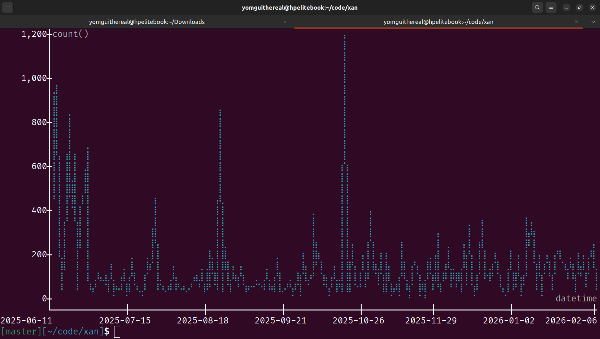
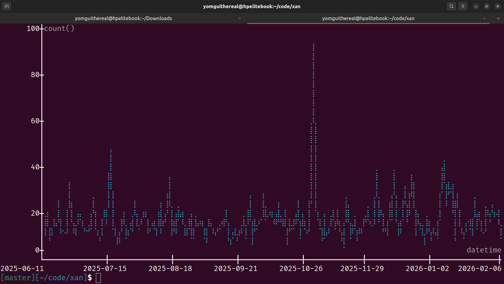
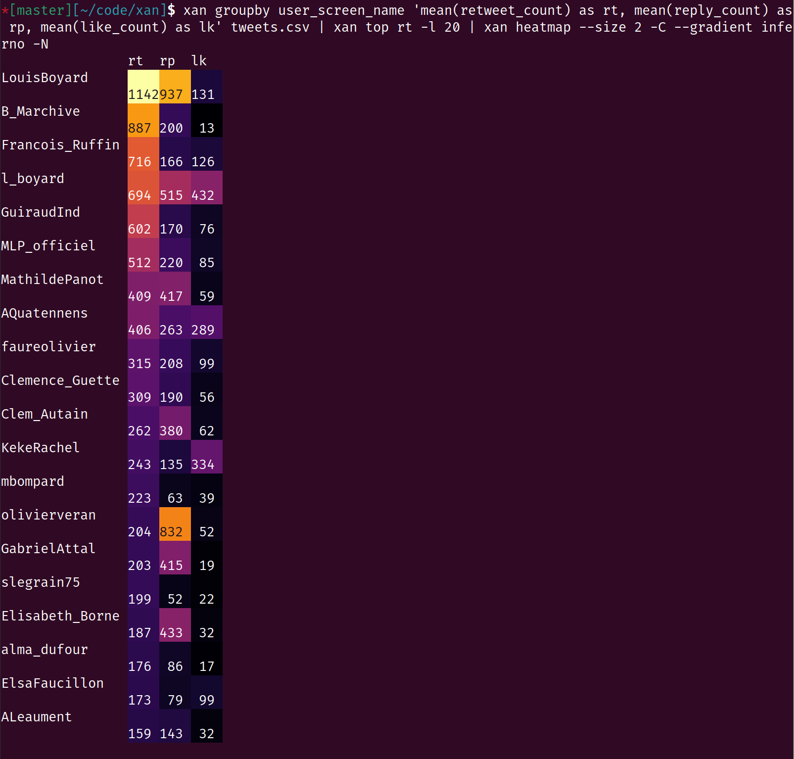

# `xan` pipelines

Curated collection of unhinged `xan` pipelines.

## Summary

* [Paginating urls to download](#paginating-urls-to-download)
* [Making sure a crawler was logged in by reading files in parallel](#making-sure-a-crawler-was-logged-in-by-reading-files-in-parallel)
* [Parsing logs using `xan separate`](#parsing-logs-using-xan-separate)
* [Running subprocesses to extract raw text from PDF files](#running-subprocesses-to-extract-raw-text-from-pdf-files)
* [Matching multiple queries in a press articles corpus, in parallel](#matching-multiple-queries-in-a-press-articles-corpus-in-parallel)
* [Producing a heatmap of popularity profiles of top Twitter accounts](#producing-a-heatmap-of-popularity-profiles-of-top-twitter-accounts)

## Paginating urls to download

Let's say you want to download the latest 50 pages from [Hacker News](https://news.ycombinator.com). Fortunately our [`minet`](https://github.com/medialab/minet) tool knows how to efficiently download a bunch of urls fed through a CSV file.

The idea here is to generate CSV data out of thin air and to transform it into an url list to be fed to the `minet fetch` command:

```bash
xan range --start 1 50 --inclusive | \
xan select --evaluate '"https://news.ycombinator.com/?p=" ++ n as url' | \
minet fetch url --input -
```

The `xan range` command produces a CSV looking like this:

| n   |
| --- |
| 1   |
| 2   |
| 3   |
| 4   |
| 5   |
| ... |

Then the `xan select --evaluate` part uses the following expression to transform the file on the fly:

```python
# We append the content of the "n" column to the given url
"https://news.ycombinator.com/?p=" ++ n as url
```

This gives us:

| url                               |
| --------------------------------- |
| https://news.ycombinator.com/?p=1 |
| https://news.ycombinator.com/?p=2 |
| https://news.ycombinator.com/?p=3 |
| https://news.ycombinator.com/?p=4 |
| https://news.ycombinator.com/?p=5 |
| ...                               |

That is fit to be fed into `minet fetch`.

## Making sure a crawler was logged in by reading files in parallel

Let's say you crawled some media website and 1. wrote all the downloaded files into a directory (aptly named `downloaded`) and 2. produced a CSV report listing the downloaded files and their relative paths on disk.

Now you had to be logged in to retrieve the full text of crawled articles. Because you are a dilligent individual, you did not forget to use a proper authenticated cookie while crawling. But what if you messed up? Let's double check pages were crawled correctly.

Fortunately, the crawled media website shows your username on the top right section of each page when you are logged in, so you could easily check whether everything went smoothly by searching for an occurrence of your very specific username (`yomguithereal`) in every HTML file downloaded.

Let's do so with `xan`, in parallel, with a progress bar for flair (indeed, reading millions of HTML files tends to take some time):

```bash
xan progress crawl.csv | \
xan filter --parallel '"downloaded".pathjoin(path).read() | !contains(_, /yomguithereal/i)' | \
> not-crawled-correctly.csv
```

Here the `xan filter` command will know, thanks to the `--parallel` flag, how to use a suitable amount of threads to read and test files as fast as possible.

Now the following moonblade expression:

```perl
"downloaded".pathjoin(path).read() | !contains(_, /yomguithereal/i)
```

means: "join `downloaded` to each row's `path` column value, then read the content at the created full relative path, then check whether it does not contain an occurrence of the `/yomguithereal/i` case-insenstive regex".

## Parsing logs using `xan separate`

`xan separate` is a command able to "separate" a single CSV column into multiple ones through a variety of different methods. It boasts both a `-r/--regex` and `-c/--capture-groups` flags that let you give a regex pattern and create new columns based on its matched groups. It is therefore suitable to use it to parse logs.

See an example here of using a command to parse k8s access logs to structure them better and produce some quick time series:

```bash
xan from --from txt ~/Downloads/access.log.gz --column log | \
xan separate log -rc '- - \[([^\]]+)\] "([^"]+)" (\d+) \d+ "[^"]*" "([^"]+)"' \
  --keep \
  --into datetime,http_call,http_status,user_agent \ |
xan map --overwrite 'datetime.datetime("%d/%b/%Y:%H:%M:%S %z") as datetime, http_call.split(" ")[1] as url' \
> logs.csv
```

First we use the `xan from` command to convert our log lines into proper CSV data (log lines can countain commas or quotes for instance and those must be dealt with properly).

Then we apply our unwieldy regex to create some new columns given to the `--into` flag. The `--keep` flag is here because we want to keep the original log line in the result, so we can add further processing later on if needed.

Now, time in the logs is indicated using this atrocious format: `11/Jun/2025:05:48:49 +0000`, so we apply a `xan map` command to the result to convert it to something more appealing like ISO and we also extract the url from HTTP call at the same time. The `--overwrite` flag of the `map` command means we can replace any column from input having the same name in the output. Here it means we will replace the `datetime` column altogether and add a new one named `url`. This saves us a `xan transform` in addition to the `xan map`.

Now here is what a time series of all the logs look like:

```bash
# We use --ignore because some records don't have a time
# The --count flag means we don't have value for the y axis, we just
# want to count number of rows for each time slot
xan plot --line --time datetime --count logs.csv --ignore
```



But as with any access log, there is noise related to bots and people accessing stylesheets, scripts & images so let's focus on our website's homepage thusly:

```bash
# Searching exact matches for url "/", that is to say the homepage
xan search -s url --exact / logs.csv | xan plot -LT datetime --count
```



## Running subprocesses to extract raw text from PDF files

Ok, let's go wild: we have downloaded a long list of PDF reports from some UN subcommittee. We will attempt to use the `pdftotext` command on them to extract their raw text so we can do proper NLP down the line. But there is an issue: we are very bad at using the `xargs` or `parallel` commands and never remember how to write a proper bash loop.

Don't worry, `xan` is here for us:

```bash
xan filter 'http_status == 200 && col("path", 1).endswith(".pdf")' report-files.csv | \
xan map --parallel 'col("path", 1) | pjoin("files", _) | fmt("pdftotext {} -", _) | shell(_).trim() as text' | \
xan select ndoc,uid,title,lastModified,link,text | \
xan rename -s lastModified last_modified > report-files-with-raw-text.csv
```

Here `xan` was able to manage `pdftotext` subprocesses (using the `shell` moonblade function), in parallel, for each row of our CSV file listing the reports on disk, so we can add the extracted text in a new column. Pretty rad, no?

We need to use `col("path", 1)` in our expressions because of course there are two distinct columns with same name in our input CSV file.

We also use the `xan rename` command in the end because mixing camelCase and snake_case is an unforgivable fashion *faux-pas*.

## Matching multiple queries in a press articles corpus, in parallel

We have a corpus of several GBs of CSV files containing press articles from various French media outlets.

We need to match a bunch of regex patterns in each article to plot time series of the relevance of climate change-related concepts across time.

Here is our `queries.csv` file:

| name                 | pattern                                                      |
| -------------------- | ------------------------------------------------------------ |
| query_climatique     | \bclimatique                                                 |
| query_effet_de_serre | effet\s+de\s+serre\|couche\s+d[’']ozone                      |
| query_biodiversite   | \bbiodiversit[ée]                                            |
| query_transition     | transitions?\s+(?:[ée]cologique\|[ée]n[ée]rg[ée]tique)       |
| query_durable        | d[ée]veloppement\s+durable\|[ée]n[ée]rgies?\s+renouvelables? |

Here is our parallel `xan` pipeline:

```bash
xan parallel cat \
  --progress \
  --source-column media \
  --buffer-size -1 \
  --preprocess '
    map "date_published.ym().try() || `N/A` as month" |
    search --breakdown --regex --ignore-case -s headline,description,text
      --patterns queries.csv
      --pattern-column pattern
      --name-column name |
    groupby month --along-columns "query_*" "sum(_)" |
    sort -s month' \
  */articles.csv.gz | \
xan transform media '_.split("/")[0]' > $BASE_DIR/matches.csv
```

*Regarding `parallel cat`*

`xan parallel cat` consumes a bunch of CSV files (here everything matching `*/articles.csv.gz`), applies some sort of preprocessing on each file (as given to the `--preprocess` flag here) and redirect everything to the standard output.

<p align="center">
  
</p>

The`--progress` flag means we want to display a progress bar, `--source-column` means we want to add a new column to the output tracking which file a row came from (here each CSV file is in fact the collection of all articles from one media, so it is important to remember from which file each row came from).

When running a `xan parallel cat` command, output rows are flushed regularly to stdout to avoid overflowing memory. This means however that the command must lock an access to stdout to serialize the result and avoid race conditions between threads. This ultimately means that output rows might be in some arbitrary order. Here, because we are using `xan search --breakdown`, we know beforehand that each media will only get one row per month in the output. We can therefore afford holding all breakdown rows per media before flushing them, in order to ensure that output order remains consistent (meaning that resulting rows per media are not interleaved in the output). To do so we use the `--buffer-size -1` flag.

*Regarding preprocessing*

Here is our preprocessing (the `xan` part can be omitted in a command fed to `--preprocess`):

```bash
map "date_published.ym().try() || `N/A` as month" |
search --breakdown --regex --ignore-case -s headline,description,text
  --patterns queries.csv
  --pattern-column pattern
  --name-column name |
groupby month --along-columns "query_*" "sum(_)" |
sort -s month
```

First we create a column by extracting the month from an article date, because we are going to use it for aggregating search results. For instance `2023-01-01T02:45:07+01:00` would become `2023-01`.

Then we apply the `search` command, feeding patterns from `queries.csv` using the `--patterns` flag. `--pattern-column` lets us tell which column of `queries.csv` contain the actual regex pattern, while `--name-column` indicates an associated name that will be used by the `--breakdown` flag to produce output columns.

Now let's consider the following file:

| group | text                   |
| ----- | ---------------------- |
| one   | the cat eats the mouse |
| one   | the sun is shining     |
| two   | a cat is nice          |

Using `search --breakdown` on it with patterns `the` and `cat` will produce the following result:

| group | text                   | the | cat |
| ----- | ---------------------- | --- | --- |
| one   | the cat eats the mouse | 2   | 1   |
| one   | the sun is shining     | 1   | 0   |
| two   | a cat is nice          | 0   | 1   |

We add one column per query and tally the number of their occurrences.

Now the `groupby --along-columns` part lets us run a same aggregation over a selection of columns. So the following command on our previous example:

```bash
groupby group --along-columns the,cat 'sum(_)'
```

Would produce the following result:

| group | the | cat |
| ----- | --- | --- |
| one   | 3   | 1   |
| two   | 0   | 1   |

Finally we use the `sort` command to make sure rows are sorted by month, and that's it (lol).

*Regarding the final transformation*

The last `xan transform` invocation is here to transform a file path into a proper media name. For instance `lemonde/articles.csv.gz` will become `lemonde`.

## Producing a heatmap of popularity profiles of top Twitter accounts

We have a CSV file of 3M tweets. We want to see a top 20 of most retweeted accounts and compare their popularity profiles in terms of number or retweets, replies and likes respectively.

Here is how to do that:

```bash
xan groupby user_screen_name 'mean(retweet_count) as rt, mean(reply_count) as rp, mean(like_count) as lk' tweets.csv | \
xan top rt --limit 20 | \
xan heatmap --size 2 --cram --gradient inferno --show-numbers
```

Here is the result:



We first use `xan groupby` to aggregate the data per Twitter user. We use short names for output columns such as `rt` or `lk` because it will fit easier in the legend of the resulting heatmap.

Then we rank Twitter users and keep the top 20 using `xan top`.

Finally we pipe everything into `xan heatmap` using the following flags:

* `--size 2` means we want our heatmap squares to be 2 characters tall
* `--cram` means we want to cram ou x-axis labels on top of the heatmap squares (they are short enough to fit, else they would get truncated)
* `--gradient inferno` means we want a stylish gradient for the colors because we are hipsters
* `--show-numbers` means we want to display numbers within the heatmap squares
