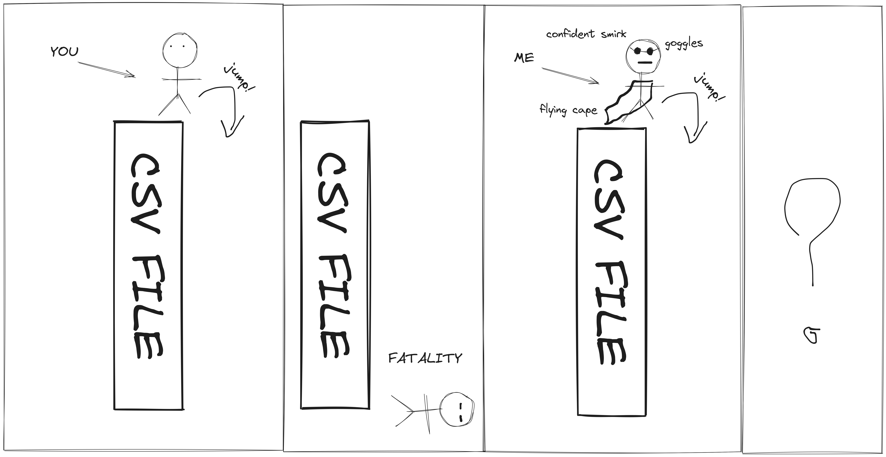

# Cursed engineering: jumping randomly through CSV files without hurting yourself

<p align="center">
  
</p>

## TL;DR

The [simd-csv](https://docs.rs/simd-csv) crate implements a somewhat novel [`Seeker`](https://docs.rs/simd-csv/latest/simd_csv/struct.Seeker.html) able to safely jump through CSV files.

This enables the [`xan`](https://github.com/medialab/xan/) command line tool to perform wild stuff such as single-pass map-reduce parallelization over CSV files, fast sampling or even binary search in sorted CSV data.

## Summary

- [Is that even dangerous?](#is-that-even-dangerous)
- [Our lord and savior: statistics](#our-lord-and-savior-statistics)
- [Donning the wingsuit](#donning-the-wingsuit)
- [Why though?](#why-though)
  - [Constant time CSV file segmentation](#constant-time-csv-file-segmentation)
  - [Single-pass map-reduce parallelization over CSV files](#single-pass-map-reduce-parallelization-over-csv-files)
  - [Cursed sampling](#cursed-sampling)
  - [Binary search](#binary-search)
- [Caveat emptor](#caveat-emptor)

## Is that even dangerous?

Let's say you have a big CSV file and you jump to a random byte within it, would you be able to find where the next row will start?

At first glance you might think this is an easy problem, just read bytes until you find a line break and you are done, right?

Before we go further, let's consider this short excerpt from Hamlet:

```txt
If thou art privy to thy country's fate,
Which, happily, foreknowing may avoid, O, speak!
Or if thou hast uphoarded in thy life
Extorted treasure in the womb of earth,
For which, they say, you spirits oft walk in death,
Speak of it: stay, and speak! Stop it, Marcellus.
```

I am unfortunately happy to report that those verses are perfectly valid CSV data in themselves:

| 0                                       | 1                  | 2                             | 3   | 4      |
| --------------------------------------- | ------------------ | ----------------------------- | --- | ------ |
| If thou art privy to thy country's fate |                    |                               |     |        |
| Which                                   | happily            | foreknowing may avoid         | O   | speak! |
| Or if thou hast uphoarded in thy life   |                    |                               |     |        |
| Extorted treasure in the womb of earth  |                    |                               |     |        |
| For which                               | they say           | you spirits oft walk in death |     |        |
| Speak of it: stay                       | and speak! Stop it | Marcellus.                    |     |        |

Now let's consider a more realistic scenario where we have a CSV file with a column containing raw text. The CSV format obviously knows how to accomodate this without becoming structurally unsound. This is done through "quoting": any cell containing either commas, double quotes or newline characters will be quoted using double quotes, and any double quote within will be doubled (`"` would become `""`). For instance, the following CSV data:

```txt
verse_group,text,quality
1,"If thou art privy to thy country's fate,
Which, happily, foreknowing may avoid, O, speak!",10
2,"Or if thou hast uphoarded in thy life
Extorted treasure in the womb of earth,",5
3,"For which, they say, you spirits oft walk in death,
Speak of it: stay, and speak! Stop it, Marcellus.",50
```

Would translate to the following table:

| verse_group | text                                                                                                   | quality |
| ----------- | ------------------------------------------------------------------------------------------------------ | ------- |
| 1           | If thou art privy to thy country's fate,\nWhich, happily, foreknowing may avoid, O, speak!             | 10      |
| 2           | Or if thou hast uphoarded in thy life\nExtorted treasure in the womb of earth,                         | 5       |
| 3           | For which, they say, you spirits oft walk in death,\nSpeak of it: stay, and speak! Stop it, Marcellus. | 50      |

Finally, to add insult to injury, notice how a CSV cell is perfectly able to encase perfectly valid CSV data through quoting. As an example, behold this shameful recursive beast of a CSV file:

```txt
table,data,name
1,"name,surname
john,landis
lucy,gregor",people
2,"id,color,score
1,blue,56
2,red,67
3,yellow,6",colors
```

| table | data                                            | name   |
| ----- | ----------------------------------------------- | ------ |
| 1     | name,surname\njohn,landis\nlucy,gregor          | people |
| 2     | id,color,score\n1,blue,56\n2,red,67\n3,yellow,6 | colors |

Now let's come back to our jumping thought experiment: the issue here is that, if you jump to a random byte of a CSV file, you cannot know whether you landed in a quoted cell or not. So, if you read ahead and find a line break, is it delineating a CSV row, or is just allowed here because we stand in a quoted cell? And if you find a double quote? Are you opening a quoted cell or are you closing one?

For instance, here we jumped into a quoted section:

```html
table,data,name
1,"name,surname
john,la<there>ndis
lucy,gregor",people
2,"id,color,score
1,blue,56
2,red,67
3,yellow,6",colors
```

But here we jumped into an unquoted section:

```html
table,data,name
1,"name,surname
john,landis
lucy,gregor",pe<there>ople
2,"id,color,score
1,blue,56
2,red,67
3,yellow,6",colors
```

This seems helpless. But I would not be writing about this issue if I had no solution to offer, albeit a slightly unhinged one.

## Our lord and savior: statistics

Real-life CSV data is *usually* consistent. What I mean is that tabular data often has a fixed number of columns. Indeed, rows suddenly demonstrating an inconsistent number of columns are typically frowned upon. What's more, columns often hold homogeneous data types: integers, floating point numbers, raw text, dates etc. Finally, rows tend to have a comparable size in number of bytes. We would be fools not to leverage this consistency.

So now, before doing any reckless jumping, let's start by analyzing the beginning of our CSV file to record some statistics that will be useful down the line.

We need to sample a fixed but sufficient number of rows (`128` is a good place to start, to adhere to computer science's justified fetichism regarding base 2), in order to record the following information:

* the number of columns of the file
* the maximum size, in bytes, of all sampled rows
* a profile of the columns, that is to say a vector of the average size in bytes of all sampled cells for each column

Here is an example of what you might get:

```txt
Sample {
    columns: 17,
    max_record_size: 19131,
    fields_mean_sizes: [
        150.265625,
        0.28125,
        87.171875,
        208.1640625,
        22.515625,
        53.3203125,
        24.21875,
        24.21875,
        17.7734375,
        4.84375,
        15.5625,
        6.875,
        103.7265625,
        4.03125,
        4908.6875,
        342.390625,
        246.8046875,
    ]
}
```

Notice how some columns seem typically larger than others?

Anyway, we now have what we need to be able to jump safely.

## Donning the wingsuit

Armed with our sample, we can now jump to some random byte of our CSV file and assess the situation.

The first thing that we need to do is to multiply the maximum byte size of our sampled rows by some constant (I recommend `32` to abide by the beforementioned fetichism). Using the above example, we would need to multiply `19131` by `32`, yielding `612192`.

We will then proceed to read that many bytes following our landing point. But we will do so twice: one time reading from the stream as-is and one time pretending a double quote exists just before our landing point.

The goal here is to test the only two hypothesis we have: either we landed in an unquoted section or we landed in a quoted one.

We then parse both series of bytes using a regular CSV parser (this parser must be able to report at which byte a row started, though) and observe what happened. The idea here is always to skip the first parsed row because we don't know where we landed within it (it is also useful to skip it to forego issues related to `CRLF` lines) and the last row (because it will most certainly be clamped) and to count the number of columns of all subsequent rows. We do so because we can of course reject any series of bytes yielding rows having an inconsistent or unexpected number of columns.

The reason why we only read a fixed amount of bytes, instead of just reading the stream until we parse a certain amount of rows, is because reading an unquoted file as if we currently are in a quoted section will make us read until the end of the file, which is of course not ideal for performance.

Now that we have parsed both byte series, we have 3 cases to handle:

1. both byte series are rejected: this can happen when you are reaching the end of the stream because there is not enough data to make an informed decision.
2. only one of the byte series is rejected: this means we know whether we are in the unquoted or quoted scenario and we can correctly return the byte offset of the next row.
3. none of the byte series are rejected: this is improbable, but still happens in real-life, albeit rarely. This typically occurs when cells contain raw text and the sequence of commas and line breaks in this text matches the structure of your CSV file. In this case, we need a better tie-breaker.

Here we will need the column profile from our sample and some similarity function (I recommend [cosine similarity](https://en.wikipedia.org/wiki/Cosine_similarity) here) to find the correct hypothesis. Just compute said similarity between the column profile (a vector of the average cell sizes in bytes from the sample) and a byte series' rows column profile.

The result is usually clear-cut with some hypothesis over `0.9` and the other below `0.2`, but your mileage may vary.

And this is it. This technique is reasonably robust and will let you jump safely.

See the [simd-csv](https://docs.rs/simd-csv) crate implementation of this technique in its [`Seeker`](https://docs.rs/simd-csv/latest/simd_csv/struct.Seeker.html) struct, notably the [`find_record_after`](https://docs.rs/simd-csv/latest/simd_csv/struct.Seeker.html#method.find_record_after) method ([source](https://docs.rs/simd-csv/latest/src/simd_csv/seeker.rs.html#369-438)). It is currently being used in production already.

## Why though?

Sure, we now understand how to safely jump through a CSV file. Great. But is this even useful?

With some creativity, you will surely find a way to leverage this novel knowledge.

Here are four ways [`xan`](https://github.com/medialab/xan/) uses a wingsuit to perform over-engineered CSV-adjacent prowesses:

### Constant time CSV file segmentation

Being able to jump randomly through a CSV file means you are also able to segment it into chunks of comparable size. You can even do so very fast because you won't need to scan the whole file to find safe splitting points and won't cut rows haphazardly.

For instance, given a CSV file of `11307311996` bytes (~11GB), you can create 4 evenly-sized file segments with simple arithmetic, giving us those 4 `[start, end)` byte ranges:

```txt
0          to 2826828123
2826828123 to 5653656081
5653656081 to 8480484038
8480484038 to 11307311996
```

Now, using the technique introduced in this article, you can "realign" those segments to make sure they fall on row boundaries like so:

```txt
0          to 2826828697
2826828697 to 5653661242
5653661242 to 8480485897
8480485897 to 11307311996
```

All this in constant time, by finding the offset of the next rows found after bytes `2826828123`, `5653656081` & `8480484038` respectively.

This is implemented by the [`xan split`](https://github.com/medialab/xan/blob/master/docs/cmd/split.md) command, using the `-c/--chunks <n>` flag:

```bash
xan split --chunks 4 --segments articles.csv
```

| from       | to          |
| ---------- | ----------- |
| 0          | 2826828697  |
| 2826828697 | 5653661242  |
| 5653661242 | 8480485897  |
| 8480485897 | 11307311996 |

### Single-pass map-reduce parallelization over CSV files

Now that we are able to safely split CSV files in the blink of an eye, we can spawn one thread per segment in order to read & process the file in parallel, in typical map-reduce fashion.

Traditionally, this was done by first precomputing an index or scanning the file to find safe splitting points, but this of course requires two passes over the data. Splitting a file, using the technique shown before, enables us to do so in a single pass over the file.

What's more, CSV data processing is often more an IO-bound task than a CPU-bound one and being able to parallelize over chunks of a file like this is a boon for performance. Indeed, reading a CSV file linearly while broadcasting computations to multiple threads is usually counterproductive since the work performed by CPUs is not expensive enough to justify the cost of the communication between threads.

As a consequence, the [`xan parallel`](https://github.com/medialab/xan/blob/master/docs/cmd/parallel.md) command is now able to parallelize computation over a single file. The same capability has been added to some other typical `xan` commands through the `-p/--parallel` or `-t/--threads <n>` flags. This includes `xan count`, `xan freq`, `xan stats`, `xan agg`, `xan groupby` etc.

```bash
# Computing the frequency table of the category column in parallel
xan parallel freq -s category articles.csv

# Same as:
xan freq --parallel -s category articles.csv

# Couting number of rows in parallel
xan count --parallel articles.csv

# Performing custom aggregation in parallel using 16 threads
xan agg --threads 16 'sum(retweets) as retweet_sum' articles.csv
```

Leveraging parallelization thusly is of course able to increase performance:

```bash
# `articles.csv` is a ~3M rows ~11GB CSV file stored on SSD

# Computing the frequency table of the "section" column:
time xan freq -s section articles.csv
2.326s

# Doing the same using 4 threads:
time xan freq -t 4 -s section articles.csv
0.643s
```

Note however that the specifics of the used hardware and filesystem must be taken into account since they don't have the same scheduling and concurrency capabilities (SSD is of course at an advantage here).

Finding the optimal number of threads can also be a balancing act since using too many of them might put too much pressure on IO, counter-intuitively. Inter-thread communication and synchronization might also become a problem with too many threads.

*Regarding grep*

Funnily enough, this logic (fast segmentation + parallelization) can easily be ported to `grep`-like tools. Finding the next line in a stream is way easier than finding the next CSV row (unless you jumped right in the middle of a `CRLF` pair, but I don't think this is such an issue). In fact you don't even need to collect a sample at the beginning of the file since you don't need to mind thorny CSV quotation rules. This could provide a nice boost also to process to newline-delimited JSON files etc.

I don't know of a tool implementing this logic yet, but I am sure it must exist somewhere already.

### Cursed sampling

So this one is a bit of a joke admittedly, but it remains useful nonetheless.

```bash
# Sampling 100 rows from a cursed distribution
xan sample --cursed 100 articles.csv > sample.csv
```

See this new flag, added to the [`xan sample`](https://github.com/medialab/xan/blob/master/docs/cmd/sample.md) command:

```txt
    -§, --cursed           Return a c̵̱̝͆̓ṳ̷̔r̶̡͇͓̍̇š̷̠̎e̶̜̝̿́d̸͔̈́̀ sample from a Lovecraftian kinda-uniform
                           distribution (source: trust me), without requiring to read
                           the whole file. Instead, we will randomly jump through it
                           like a dark wizard. This means the sampled file must
                           be large enough and seekable, so no stdin nor gzipped files.
                           Rows at the very end of the file might be discriminated against
                           because they are not cool enough. If desired sample size is
                           deemed too large for the estimated total number of rows, the
                           c̵̱̝͆̓ṳ̷̔r̶̡͇͓̍̇š̷̠̎e̶̜̝̿́d̸͔̈́̀  routine will fallback to normal reservoir sampling to
                           sidestep the pain of learning O(∞) is actually a thing.
                           Does not work with -w/--weight nor -g/--groupby.
```

The gist of it is that if you know how to find the start of a row after a given byte in a CSV file, retrieving a sample of `k` rows can roughly be done by sampling `k` byte offsets within said file. This can be done very fast, in `O(k)` time instead of the usual `O(n)` time for reservoir sampling, `n` being the total number of rows in the file.

Of course we are sampling from an untractable distribution that is far from uniform here, but it is good enough for some purposes such as debugging or when you don't care much about the quality of the sample. This is because the chance of a row to be picked in the sample is dependent on its size in bytes. So larger rows will be chosen more often than smaller ones.

### Binary search

Being able to safely jump through a CSV file means we can support approximate random access. We cannot jump exactly to the nth row of the file, but we can jump approximately near it.

This ultimately means we can perform [binary search](https://en.wikipedia.org/wiki/Binary_search) on sorted CSV data in quasi-logarithmic time. Indeed, binary search is able to suffer approximate jumps in the data if you are careful enough about what you are doing to uphold the search's invariants.

Sorted CSV data can therefore be seen as a read-only database index, in a sense.

This is still experimental and will only be released in the near future but this is what the upcoming `xan bisect` command promises to do:

```bash
# Could be used thusly: xan bisect <column> <value> file.csv
xan bisect id 4534 sorted-by-id.csv
```

## Caveat emptor

The technique demonstrated by this article is far from a silver bullet and suffers from some drawbacks. Here is unabdridged list of those drawbacks:

*Cannot work on streams & compressed data*

You need to be able to seek through target CSV stream to be able to apply the technique. This ultimately means it cannot work on streams such as what is passed as `sdtin`, for instance. Your file must therefore exist on disk or in memory. It is also not able to work on compressed CSV data, since it is usually not possible to seek within a compressed file.

This said, regarding compression there are some workarounds:

* for `gzip`, the wonderful [`bgzip`](https://www.htslib.org/doc/bgzip.html) tool from bioinformatics knows how to produce seekable `.gz` archives using an auxiliary `.gzi` index that can be created when compressing your file. `xan` knows how to leverage `.gzi` indices for you.
* `zst` compression has a seekable variant (documented [here](https://github.com/facebook/zstd/blob/dev/contrib/seekable_format/zstd_seekable_compression_format.md)), but is rarely supported yet and is not considered stable. `xan` does not know how to deal with it yet, but it might do so in the future.

*Does not work if data is not consistent enough*

The technique cannot work if the number of columns is dynamic and changes from row to row. It is somewhat seen as a bad practice to do so, but the CSV format certainly does not forbid it and files like this exist in the wild. It is sometimes used as a "compression" strategy when the file has a lot of distinct columns but the data is very sparse. In this case, data producer sometimes avoid writing commas to symbolize empty trailing columns.

Also, the technique will not work if the distribution of row size in bytes is very skewed or multimodal in the file. For instance, a file where row size monotonically increases along the way (in the shape of a tabular pyramid, if you will) will defeat the technique. A file where a significant part of the beginning rows are sparse and the following ones are dense will also defeat the technique. Those cases are not *typical* of structured tabular data but they exist nonetheless. The technique can sometimes still work by increasing the size of the initial sample, but not always. This said, in those cases, a seeker will not hallucinate the wrong answer for next row byte offset and will be able to admit it cannot find it (we would end in the case where none of the consumed byte series are deemed plausible).

*Does not work with the first row beyond headers nor final ones*

Since we usually don't know where we landed in a row, we skip it to find the position of the next row. This means we can't use the technique to get the first row.

Since we also need to consume a certain amount of bytes from the stream to make an informed decision, it is sometimes impossible to return next row's byte offset when landing at the very end of the stream.

In practice, this is not an issue because: 1. the first row was sampled anyway and 2. we can jump further back for final rows and fallback to linear scanning.

Note that the technique can work in reverse, that is to say to find
the byte offset of the record just before the one we landed in. This works because it is possible to read a seekable stream in reverse (with a little bit of creativity regarding buffering) and because of point 8 of our [love letter](https://github.com/medialab/xan/blob/master/docs/LOVE_LETTER.md#8-reverse-csv-is-still-valid-csv) to the CSV format (namely that CSV data is palindromic).

*Does not work on tiny files*

This technique does not work on tiny files, since you don't have enough bytes nor rows to make informed decision.

Once again, this is a non-issue: if the file is tiny, just read it linearly, alright?
