# Data visualization from the comfort of your terminal

<p align="center">
    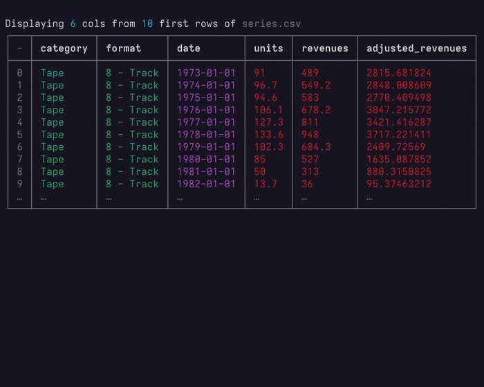
</p>

This document is a showcase & guide to data visualization in the terminal using the [`xan`](https://github.com/medialab/xan) command line tool.

This aspect of the tool is often overlooked because `xan` is first and foremost a very performant tabular data processing utility, but it can also render a large variety of typical data visualizations directly in your terminal. This ultimately means you never have to leave the terminal to explore the data you mangle.

I say "comfort" and I mean it ;). `xan` will have processed and rendered your data in the terminal long before you are able to spin up your Jupyter instance and import `pandas` & `matplotlib`. No cruft. No distraction. Just raw insights, like it's still 1970 and all you have is ASCII art, now with (true) ✨colors✨ and Unicode support ([braille](https://en.wikipedia.org/wiki/Braille_ASCII) characters are a godsend).

## Fancy Table of Contents

<table>
    <tbody>
        <tr>
            <td>
                <a href="#xan-view-to-display-tables">tables (xan view)</a>
            </td>
            <td>
                <a href="#xan-flatten-for-close-reading">records (xan flatten)</a>
            </td>
        </tr>
        <tr>
            <td>
                <p align="center">
                    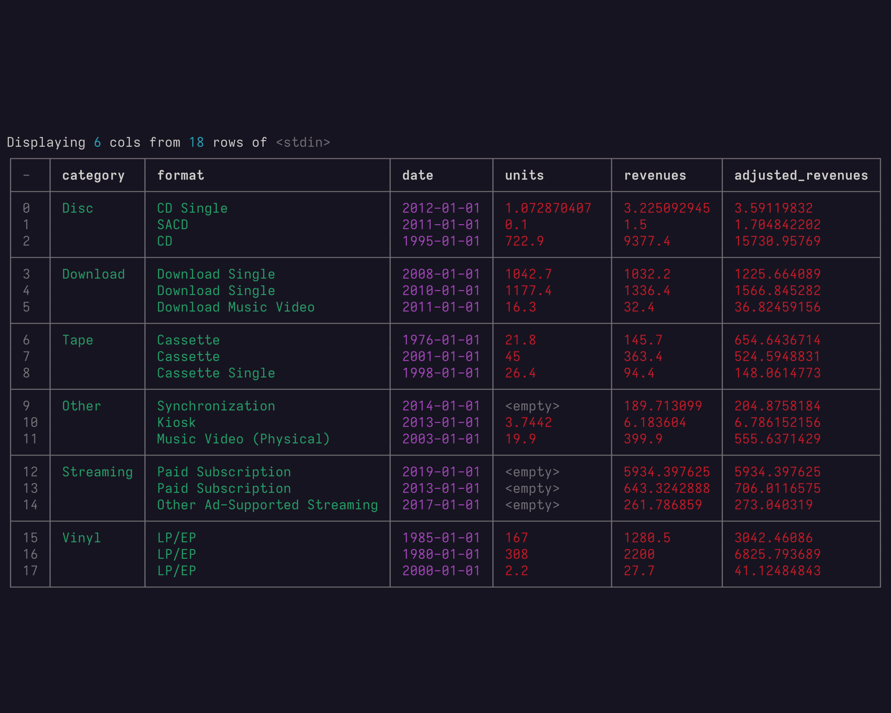
                </p>
            </td>
            <td>
                <p align="center">
                    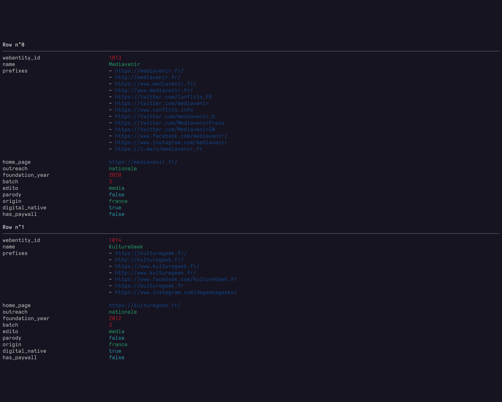
                </p>
            </td>
        </tr>
        <tr>
            <td>
                <a href="#xan-stats--r--report-for-automatic-statistical-reports">reports (xan stats -R/--report)</a>
            </td>
            <td>
                <a href="#xan-hist-for-detailed-bar-plots">horizontal bar plots (xan hist)</a>
            </td>
        </tr>
        <tr>
            <td>
                <p align="center">
                    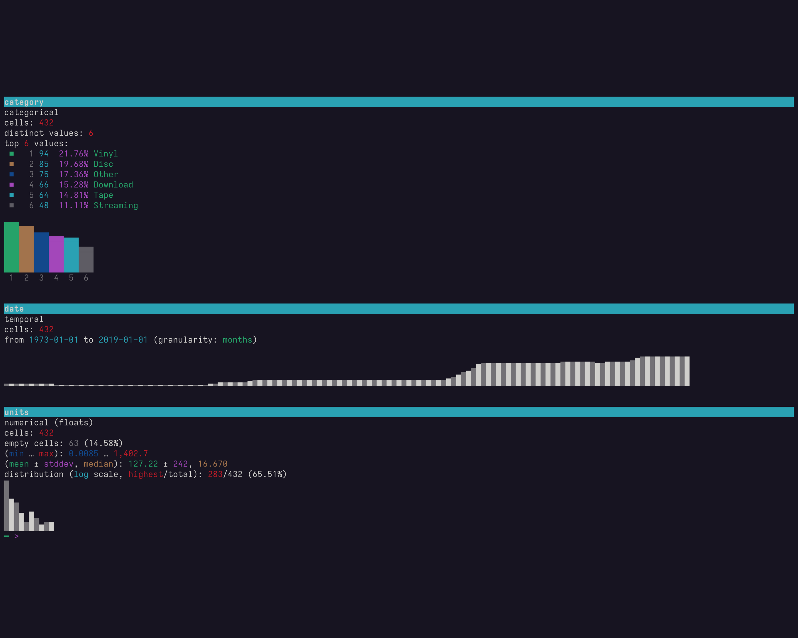
                </p>
            </td>
            <td>
                <p align="center">
                    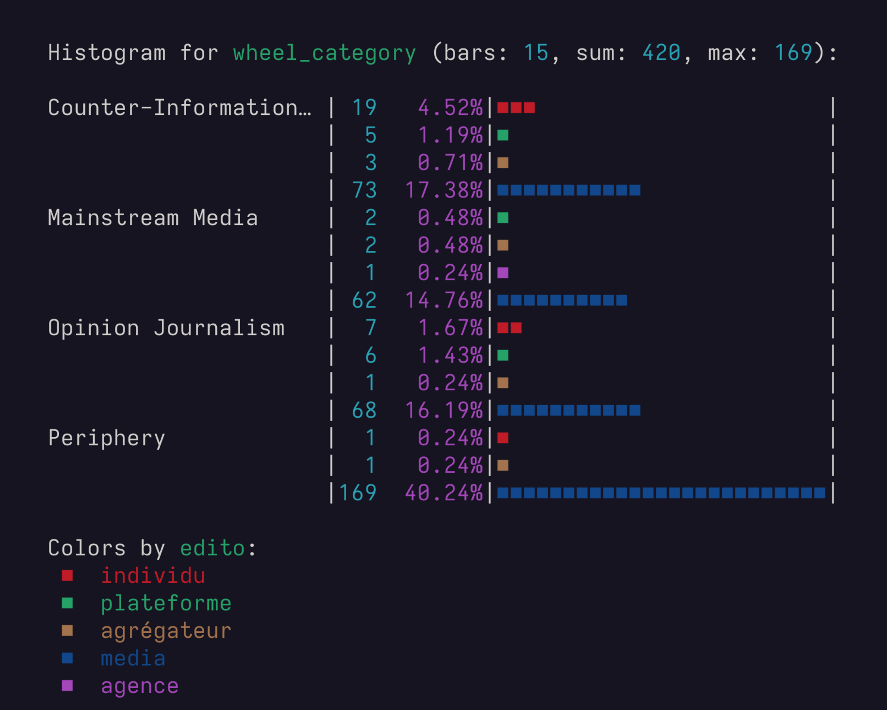
                </p>
            </td>
        </tr>
        <tr>
            <td>
                <a href="#xan-plot-for-scatter-plots-line-plots-and-time-series">scatter plots (xan plot)</a>
            </td>
            <td>
                <a href="#line-plots--time-series">line plots & time series (xan plot)</a>
            </td>
        </tr>
        <tr>
            <td>
                <p align="center">
                    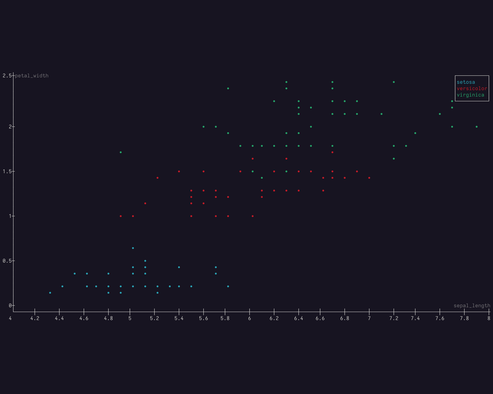
                </p>
            </td>
            <td>
                <p align="center">
                    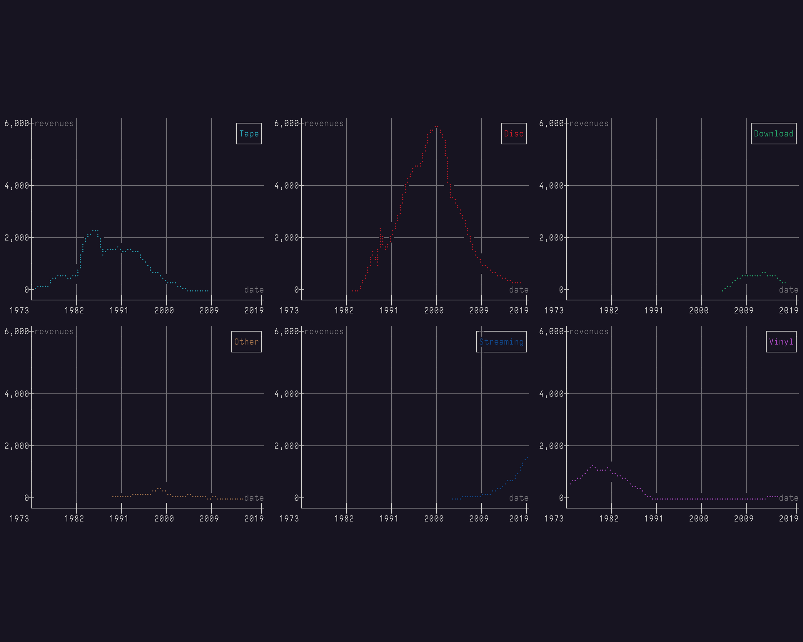
                </p>
            </td>
        </tr>
        <tr>
            <td>
                <a href="#xan-heatmap-for-heatmaps-and-conditional-formatting">heatmaps (xan heatmap)</a>
            </td>
            <td>
                <a href="#conditional-formatting">conditional formatting (xan heatmap)</a>
            </td>
        </tr>
        <tr>
            <td>
                <p align="center">
                    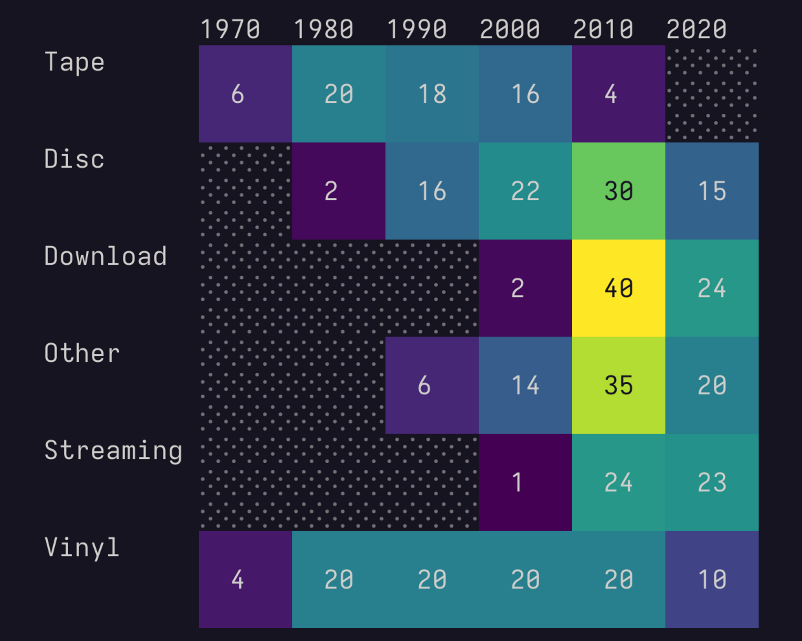
                </p>
            </td>
            <td>
                <p align="center">
                    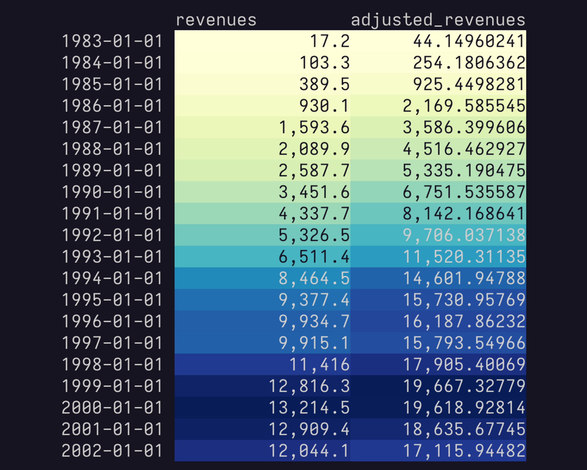
                </p>
            </td>
        </tr>
        <tr>
            <td>
                <a href="#xan-spark-for-sparklines-and-aggregated-bar-plots">vertical bar plots (xan spark)</a>
            </td>
            <td>
                <a href="#xan-progress-for-progress-bars">progress bars (xan progress)</a>
            </td>
        </tr>
        <tr>
            <td>
                <p align="center">
                    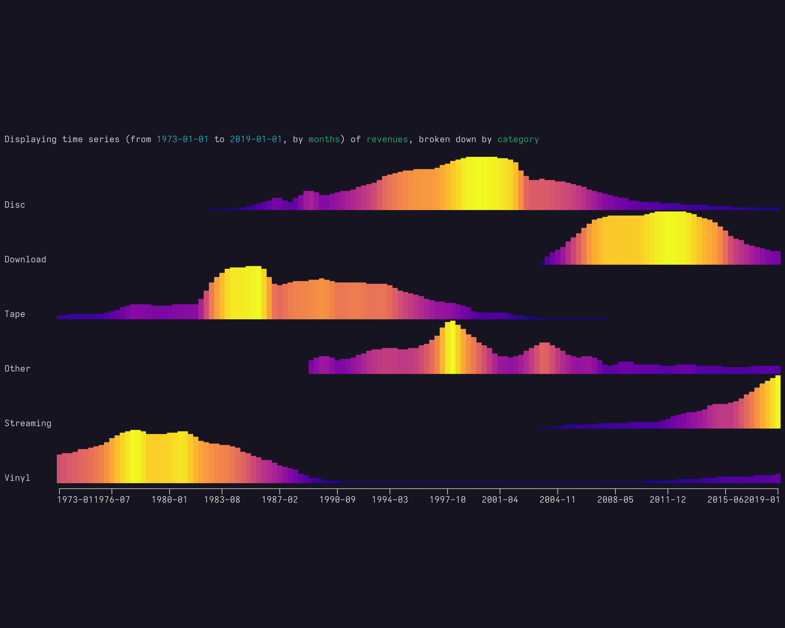
                </p>
            </td>
            <td>
                <p align="center">
                    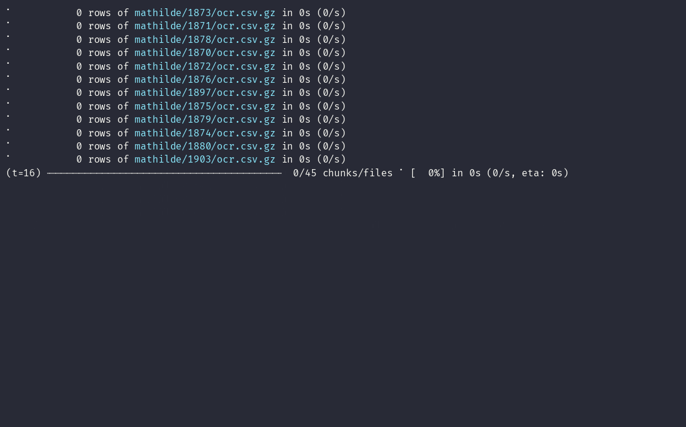
                </p>
            </td>
        </tr>
    </tbody>
</table>

## Boring Table of Contents

- [Downloading the datasets used in this guide](#downloading-the-datasets-used-in-this-guide)
- [`xan view` to display tables](#xan-view-to-display-tables)
    - [Fitting the screen](#fitting-the-screen)
    - [Dealing with emojis](#dealing-with-emojis)
    - [Grouping rows](#grouping-rows)
    - [Customizing the view](#customizing-the-view)
- [`xan flatten` for close reading](#xan-flatten-for-close-reading)
    - [Customizing the flattening](#customizing-the-flattening)
    - [Highlighting](#highlighting)
    - [Splitting multivalued cells](#splitting-multivalued-cells)
- [`xan stats -R/--report` for automatic statistical reports](#xan-stats--r--report-for-automatic-statistical-reports)
- [`xan hist` for detailed bar plots](#xan-hist-for-detailed-bar-plots)
    - [Frequency tables](#frequency-tables)
    - [Distributions](#distributions)
    - [Categorical bar plots](#categorical-bar-plots)
    - [Working with arbitrary inputs](#working-with-arbitrary-inputs)
    - [Working with dates](#working-with-dates)
- [`xan plot` for scatter plots, line plots and time series](#xan-plot-for-scatter-plots-line-plots-and-time-series)
    - [Scatter plots](#scatter-plots)
    - [Line plots & time series](#line-plots--time-series)
    - [Scales](#scales)
    - [Regression line](#regression-line)
    - [Custom 2D plots & density gradients](#custom-2d-plots--density-gradients)
- [`xan heatmap` for heatmaps and conditional formatting](#xan-heatmap-for-heatmaps-and-conditional-formatting)
    - [Correlation matrices](#correlation-matrices)
    - [Count & adjacency matrices](#count--adjacency-matrices)
    - [Arbitrary matrices](#arbitrary-matrices)
    - [Conditional formatting](#conditional-formatting)
- [`xan spark` for sparklines and aggregated bar plots](#xan-spark-for-sparklines-and-aggregated-bar-plots)
    - [Column-wise minimaps](#column-wise-minimaps)
    - [Time series](#time-series)
    - [Distributions](#distributions-1)
    - [Vertical bar plots](#vertical-bar-plots)
    - [Syntwave plots](#synthwave-plots)
    - [Joy division plots](#joy-division-plots)
- [`xan progress` for progress bars](#xan-progress-for-progress-bars)
- [Troubleshooting](#troubleshooting)
    - [Color gradients are not rendered properly](#color-gradients-are-not-rendered-properly)
- [How to save the visualizations](#how-to-save-the-visualizations)

## Downloading the datasets used in this guide

You can  download all datasets used throughout this guide as a single tarball:

```bash
curl -LO https://github.com/medialab/xan/raw/refs/heads/master/docs/cookbook/resources/dataviz.tar.gz
tar -xvzf dataviz.tar.gz
```

Here is the list of files you will find inside the tarball (~10MB):

- `clusters.csv`: x and y positions of nodes in a graph containing 5 well-defined clusters, as inferred by the ForceAtlas2 layout algorithm
- `iris.csv`: the famous "Iris" dataset, used in a lot of machine learning examples
- `layout.csv`: x and y positions of a sample of accounts from a French defunct social network, as inferred by the ForceAltas2 layout algorithm
- `les-miserables.csv`: edges from a graph of characters from the novel "Les Misérables" by Victor Hugo
- `medias.csv`: a curated corpus of French medias online
- `pulsar.csv`: data from the pulsar plot from the article *"Radio Observations of the Pulse Profiles and Dispersion Measures of Twelve Pulsars by Harold D. Carft, Jr. 1970"* ([original data](https://gist.githubusercontent.com/borgar/31c1e476b8e92a11d7e9/raw/0fae97dab6830ecee185a63c1cee0008f6778ff6/pulsar.csv))
- `series.csv`: time series related from RIAA about music distribution formats in time and their associated gross revenues
- `sotu.csv`: retranscription of U.S. state of the union speeches across time (1790 to 2018) ([original data](https://github.com/BrianWeinstein/state-of-the-union/raw/refs/heads/master/transcripts.csv))

## `xan view` to display tables

[`xan view`](../cmd/view.md) is usually one of the first learned and most used commands of `xan` since it lets you take a glance at your CSV files directly in the terminal, using a very familiar tabular representation. You can forego using `LibreOffice` or (god forbids!) `Excel` and never ever have to leave the terminal again!

Here is how to use it:

```bash
xan view series.csv
```

<p align="center">
    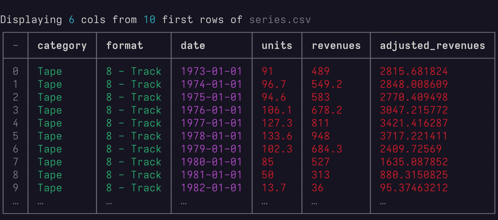
</p>

See how different data types are colored differently, like in a code editor, to help you figure things out? `xan view` knows how to recognize numbers, strings, time-related information, urls, null values and booleans.

If you fancy rainbows and are not much of a data type kind of person you can also use the `-R/--rainbow` flag to use alternating color per column instead:

```bash
xan view --rainbow series.csv
```

<p align="center">
    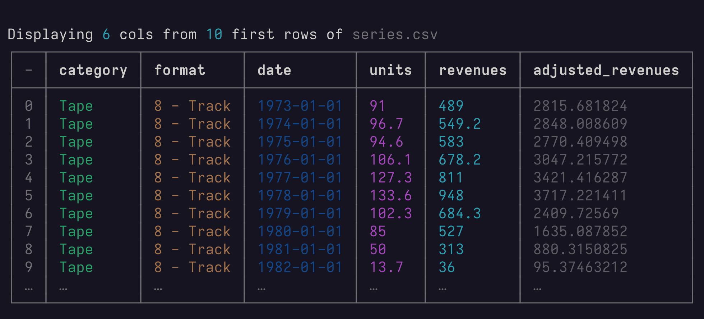
</p>

### Fitting the screen

In `series.csv`, the data is quite concise, so it is easy to print all columns losslessly in the terminal. But see what happens when we use the command, in a small terminal, on `sotu.csv`, containing urls and the full text of whole speeches:

```bash
xan view sotu.csv
```

<p align="center">
    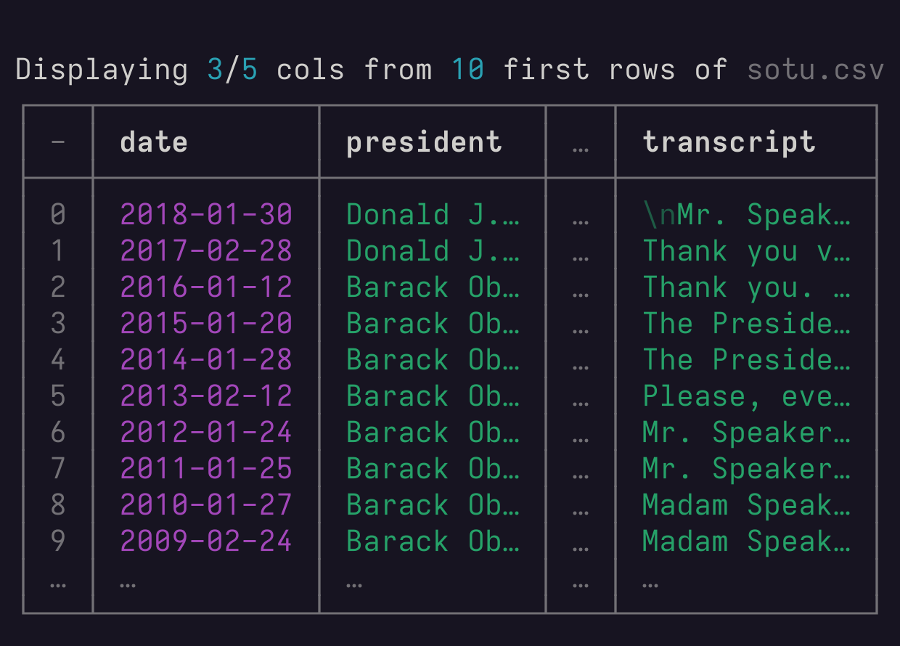
</p>

First, see how some values get truncated to fit on screen?

Then the command tells you we could only display 3 out of 5 columns, which is why there is a dummy column in the middle full of ellipsis `…` characters, lest we forget it. When space is tight, the `view` command will always try to print a mix of columns from the beginning and from the end.

Then, see how the first cell of the `transcript` column contains a highlighted leading newline character? The `view` command will highlight a lot of those patterns to easily spot irregularities about your data, such as empty cells (displayed as a greyed out `<empty>`), leading/trailing whitespace etc.

Finally, see how last row is also a dummy one full of ellipsis `…` characters? That's because `xan view`, like most `xan` commands, follow a streaming approach and only displays the first rows of your data by default (my screenshots shows only 10, but the command's default is 100).

The command works thusly because you usually don't need to consume all rows of a file to be able to preview it efficiently and because, as a human, you won't be able to read more than some hundreds of rows by yourself anyway ;).

What's more `xan view` is usually the last step of a complex `xan pipeline` yielding a stream. You should not need to consume it entirely to make sure it spits out the required data, which is the reason why you used `xan view` in the first place instead of piping the result to a file.

*Printing more rows*

If you want more or less rows on screen, you can always use the `-l/--limit` flag. Or you can also use the `-A/--all` flag to print everything if you feel like you can take it.

*Printing more columns*

However this only takes care of the rows not being printed, not the columns. For this particular problem, people usually rely on pagers such as `less` or `more`:

```bash
xan view --expand --color=always file.csv | less -SR
```

But the above command is quite a mouthful and (if you are not on legacy Windows shell) you can also use the `-p/--pager` flag that will do the same:

```bash
xan view -p file.csv
```

### Dealing with emojis

Funnily enough, there is no way to predict, even when using a monospace font (which is customary in a terminal), the width an emoji will take on screen once rendered.

This is unfortunate because terminal rendering is character-based and layout computations work by knowing what width a character will have on screen (yes some characters can span 2 columns or sometimes do not appear on screen at all).

So if you spot this kind of artifacts when using `xan view`:

<p align="center">
    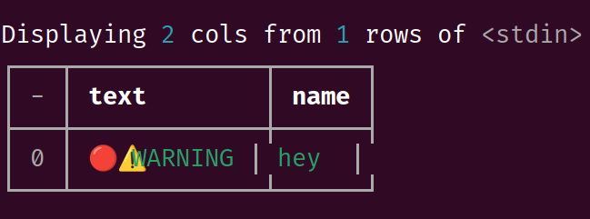
</p>

Just use the `-E/--sanitize-emojis` flag to print their shortcodes instead:

```bash
xan view -E data-with-emojis.csv
```

<p align="center">
    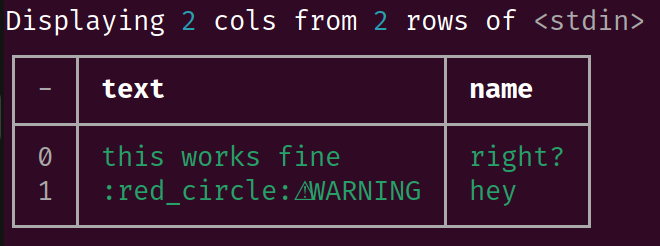
</p>

### Grouping rows

Sometimes, you might want to group rows visually based on the value of some of their columns. You can do so with `xan v -g/--groupby` thusly:

```bash
xan sample 3 -g category series.csv | \
xan view -A -g category
```

<p align="center">
    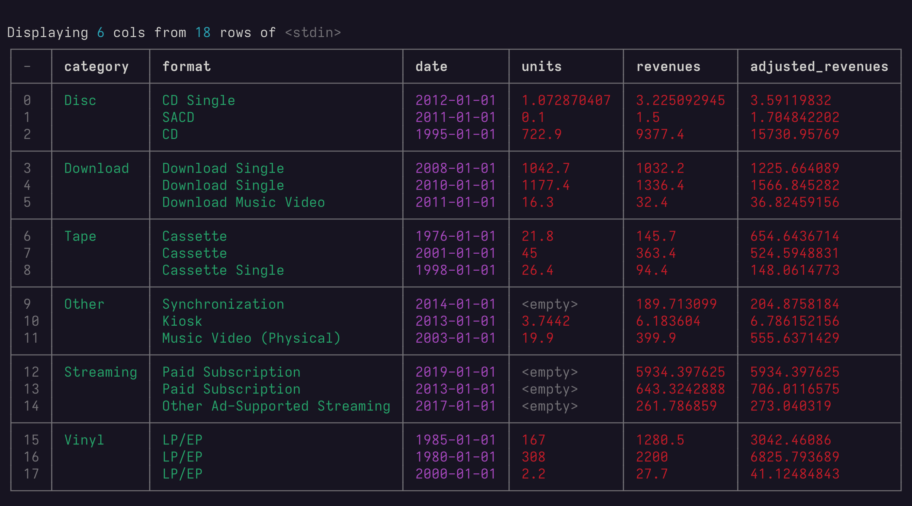
</p>

### Customizing the view

If you call `xan view --help` you will see that the command offers a lot of customization options (some of which you can set as default through the `XAN_VIEW_ARGS` env variable).

For instance, let's hide headers, the index colum, the info text, and force numbers to be formatted using a maximum of 5 significant numbers:

```bash
xan view -S 5 --hide-index --hide-headers --hide-info series.csv
```

<p align="center">
    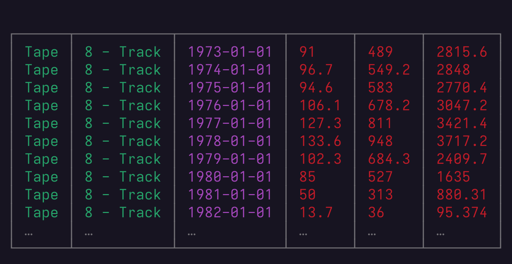
</p>

The command even offers a variety of different "themes" that can be used to stylize the table:

```bash
# -M stands for --hide-info & -I for --hide-index
xan view -MI --theme borderless series.csv
```

<p align="center">
    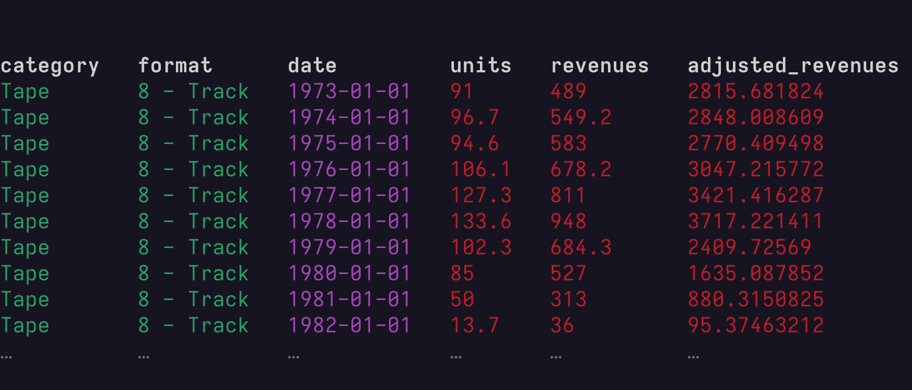
</p>

Or even:

```bash
xan view -MI --theme striped series.csv
```

<p align="center">
    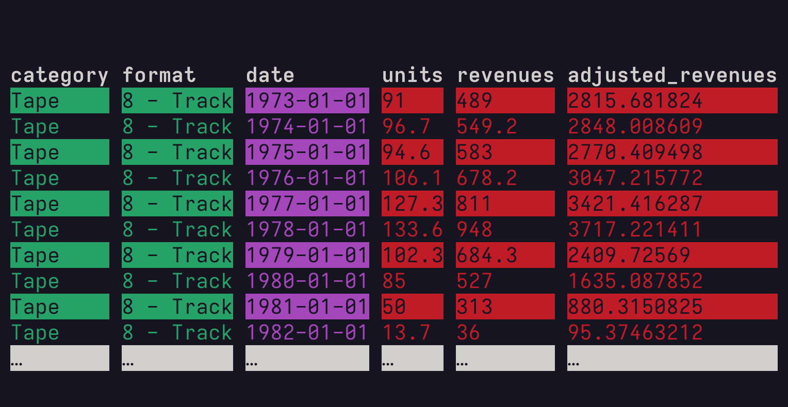
</p>

Now, the tabular view is a staple for a reason, but it becomes somewhat limited when your file has many columns or if cell values are very long, for instance if they contain full text.

Fortunately `xan` has another command catering to those use-cases, so you can easily read the full contents of a CSV row: `flatten`.

## `xan flatten` for close reading

`xan flatten` is a command that lets you read full row data more comfortably than `xan view` by "flattening" the representation. That is to say we will let each column take at least one line so the full content of their cells can be read:

```
xan flatten series.csv
```

<p align="center">
    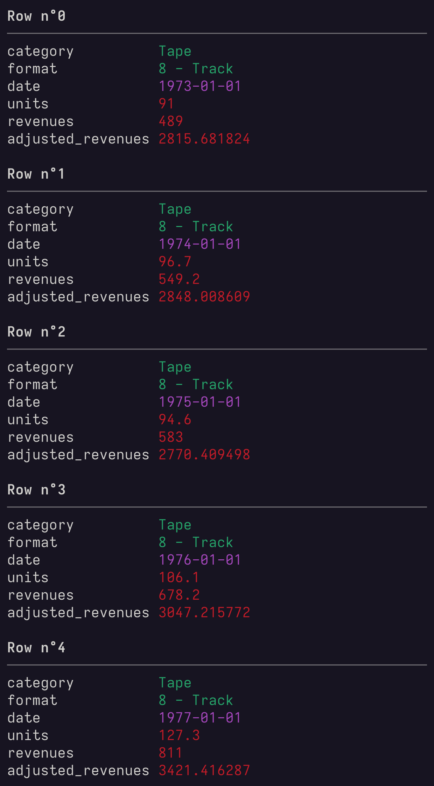
</p>

Notice how values are colored by type like when using `xan view`.

You can also pick one color per column instead, using the `-R/--rainbow` flag. This can make it easier to scan values of a same columns across rows sometimes.

```
xan flatten -R series.csv
```

<p align="center">
    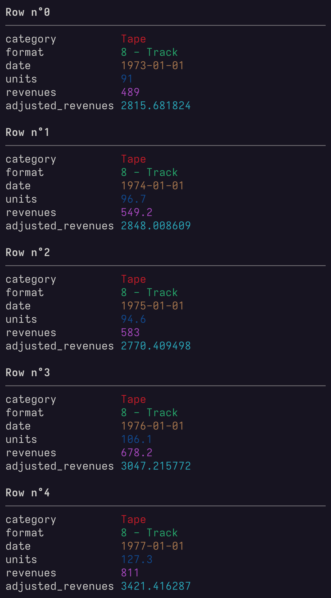
</p>

### Customizing the flattening

Now this is fine when your cell don't contain too much information, but sometimes they might contain long texts.

Consider this example where we attempt to display sentences from president Obama speeches contained in `sotu.csv` (we are going to use `xan tokenize` to break the speeches into sentences):

```bash
xan search -s president Obama sotu.csv | \
xan tokenize sentences transcript | \
xan flatten
```

<p align="center">
    
</p>

This is fine, but you might want to tidy the way long texts are printed.

The first thing you can do is to truncate any text longer than what your terminal can fit in a single line, using the `-c/--condense` flag:

```bash
xan search -s president Obama sotu.csv | \
xan tokenize sentences transcript | \
xan flatten -c
```

<p align="center">
    
</p>

Another thing you can do is to wrap long lines so that they keep to the right of the column nice harmoniously using the `-w/--wrap` flag:

```bash
xan search -s president Obama sotu.csv | \
xan tokenize sentences transcript | \
xan flatten -w
```

<p align="center">
    
</p>

Note that you will lose the ability to easily copy text such as long urls etc. when using the `-w/--wrap` flag, though.

Finally, you can flatten the representation even more and have the column name take one line and the value subsquent lines after it with the `-F/--flatter` flag:

```bash
xan search -s president Obama sotu.csv | \
xan tokenize sentences transcript | \
xan flatten -F
```

<p align="center">
    
</p>

### Splitting multivalued cells

If you check the `medias.csv` file, you will quickly notice that some columns contain multiple values, separated by a pipe (`|`) character, like `prefixes` or `start_pages`. This is a very common thing to do, and here is an example of what you might find in the `prefixes` column:

```txt
https://kulturegeek.fr/|http://kulturegeek.fr/|https://www.kulturegeek.fr/|http://www.kulturegeek.fr/|https://www.facebook.com/KultureGeek.fr|https://kulturegeek.fr|https://www.instagram.com/degeekageeks/
```

Now you might want to read a list of those values more comfortably and `xan flatten` offers a `-S/--split` flag taking a selection of columns to "split" further:

```bash
# I use `xan flatten -N/--non-empty` to avoid displaying empty columns
xan flatten -N --split prefixes medias.csv
```

<p align="center">
    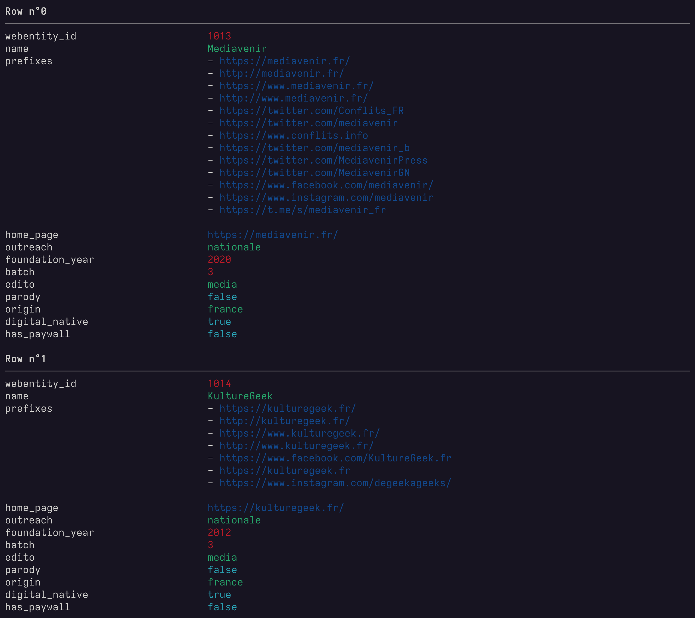
</p>

By default, the command will split multivalued cells by `|` but you can always provide a custom separator to the `--sep` flag instead.

### Highlighting

Sometimes, it can be nice to highlight substrings matching some pattern. `xan flatten` lets you do so through a regex given to the `-H/--highlight` flag. Matches can also be case-insensitive if you give the `-i/--ignore-case` flag.

Let's search for sentences containing the "conspicuous" word in our speeches:

```bash
xan tokenize sentences transcript sotu.csv | \
xan search -s sentence -i conspicuous | \
xan flatten -F -iH conspicuous
```

<p align="center">
    
</p>

## `xan stats -R/--report` for automatic statistical reports

`xan` has a `stats` command that can easily compute descriptive statistics about all or a selection of columns of your CSV file.

The result of the command is another CSV file, so people would usually feed to `xan flatten` for better readability:

```bash
# Some columns in the output correspond to numerical vs. text columns
# so people use the -N/--non-empty flag of flatten to hide irrelevant information
xan stats -s 0,2,3 series.csv | xan flatten -N --row-separator " "
```

<p align="center">
    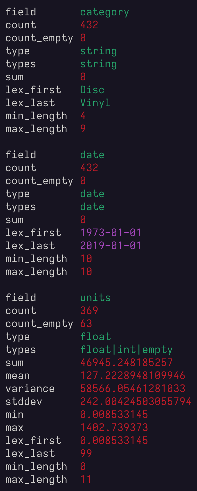
</p>

But since this was a prominent use-case and since it would be nice to have inline dataviz such as bar charts, time series and distributions, the command gained a `-R/--report` flag to do just that:

```bash
xan stats -s 1:4 -R series.csv
```

<p align="center">
    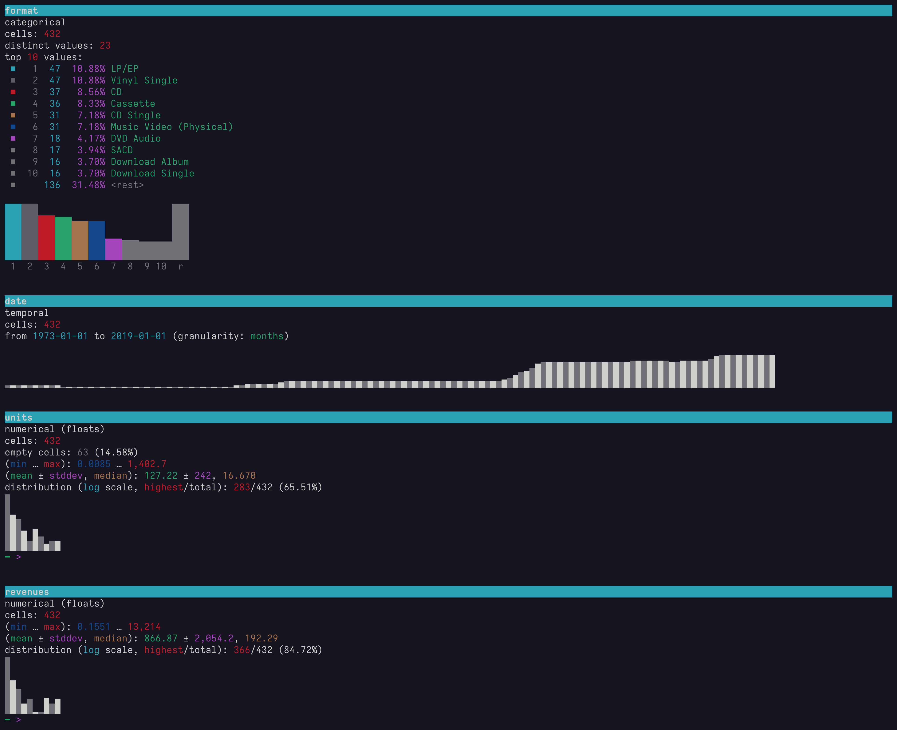
</p>

## `xan hist` for detailed bar plots

`xan hist` is a command able to print "detailed" bar plots. I say "detailed" as opposed to [`xan spark`](#xan-spark-for-sparklines-and-aggregated-bar-plots), that can print less detailed bar plots, but more suitable for facet grids & small multiples.

One other difference is that `xan hist` prints horizontal bar plots while `xan spark` prints vertical ones.

### Frequency tables

The first use-case of `xan hist` people usually learn is to pretty-print the result of a `xan freq` call.

Indeed, being a CSV table itself, the output of `xan freq` is not very readable as-is:

```bash
xan freq -s category series.csv
```

```txt
field,value,count
category,Vinyl,94
category,Disc,85
category,Other,75
category,Download,66
category,Tape,64
category,Streaming,48
```

You can always pipe it to `xan view` to read it, but there is a better way:

```bash
xan freq -s category series.csv | xan hist
```

<p align="center">
    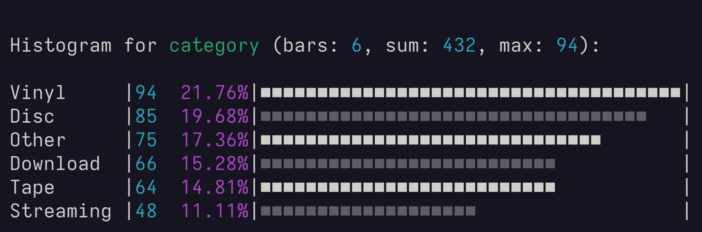
</p>

You can choose to have larger and more precise bars using the `-B/--bar-size` flag, but they will be less readable without color support (when copy pasting, for instance):

```bash
xan freq -s category series.csv | xan hist -B large
```

<p align="center">
    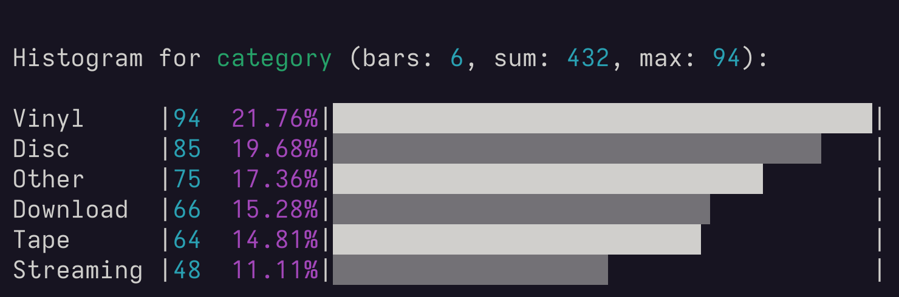
</p>

And as always, you can use the `-R/--rainbow` flag to add some welcome color to your bars:

```bash
xan freq -s category series.csv | xan hist -R
```

<p align="center">
    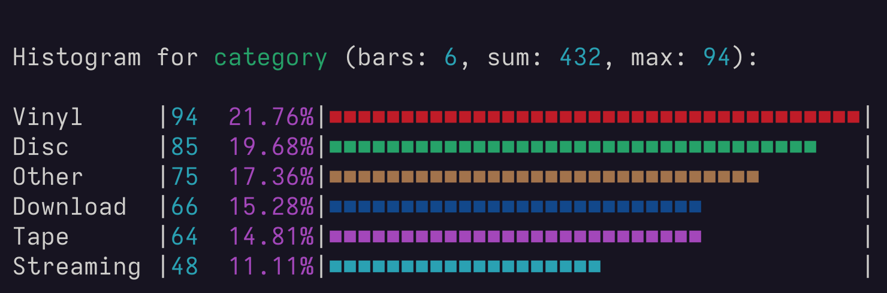
</p>

Finally, `xan hist` is perfectly able to print multiple bar plots at once. This is fortunate because `xan freq` can output multiple frequency tables in one pass like so:

```bash
xan freq -s category,format series.csv | xan hist
```

<p align="center">
    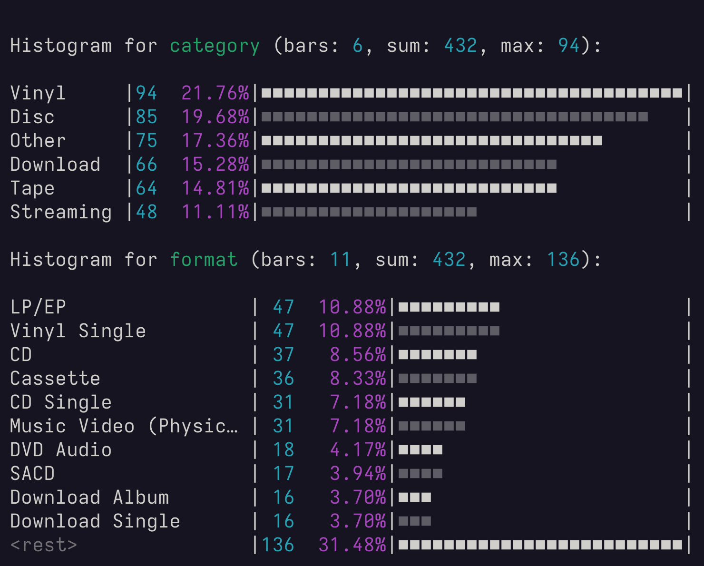
</p>

### Distributions

`xan hist` can also be used with `xan bins` to display detailed distribution plots:

```bash
xan bins -s revenues series.csv | xan hist
```

<p align="center">
    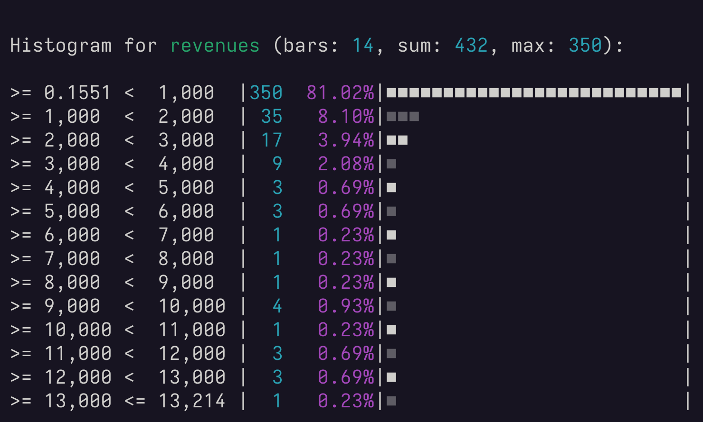
</p>

Now of course you should probably prefer a log scale in this case. `xan hist` can do so with the `--log` flag or the `--scale` flag if you want to use a specific scale instead:

```bash
xan bins -s revenues series.csv | xan hist --log
```

<p align="center">
    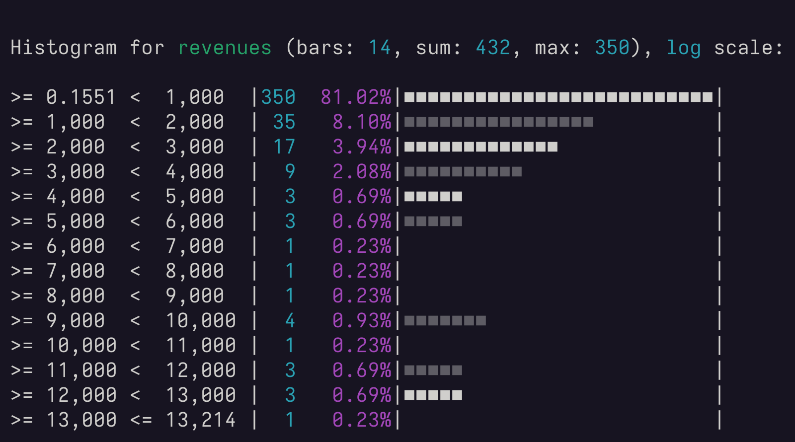
</p>

This said, [`xan spark -D/--distribution`](#distributions-1) or [`xan stats -R/--report`](#xan-stats--r--report-for-automatic-statistical-reports) are sometimes better suited to the particular use-case of printing distribution histograms.

### Categorical bar plots

`xan hist` is also able to print "categorical" bar plots using the `-c/--category` flag. Here is an example where I print a bar plot of the frequency of values found in the "wheel_category" column of the `medias.csv` file, broken down by the values of the "edito" column:

```bash
xan freq -N -g edito -s wheel_category medias.csv | \
xan hist -c edito
```

<p align="center">
    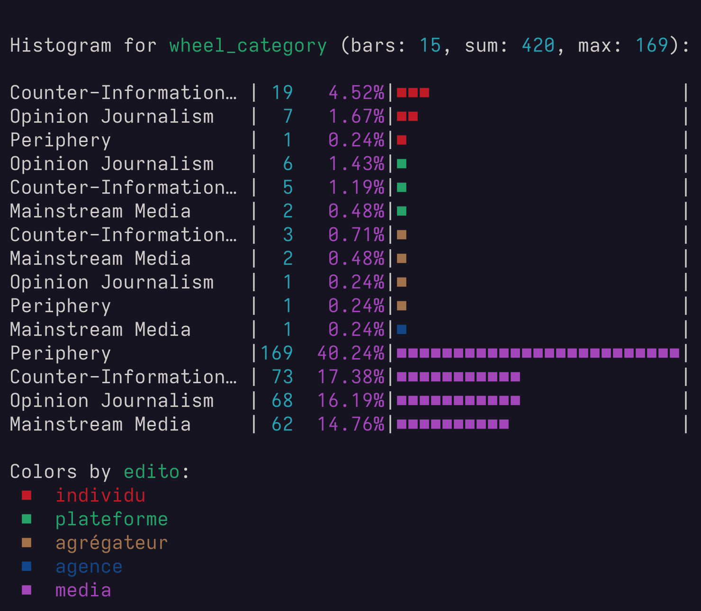
</p>

A color was picked for each value of the "edito" column so we can color the related bars accordingly.

You can also sort the output of `xan freq` differently to reorder the bars on screen:

```bash
xan freq -N -g edito -s wheel_category medias.csv | \
xan sort -s value | \
xan hist -c edito
```

<p align="center">
    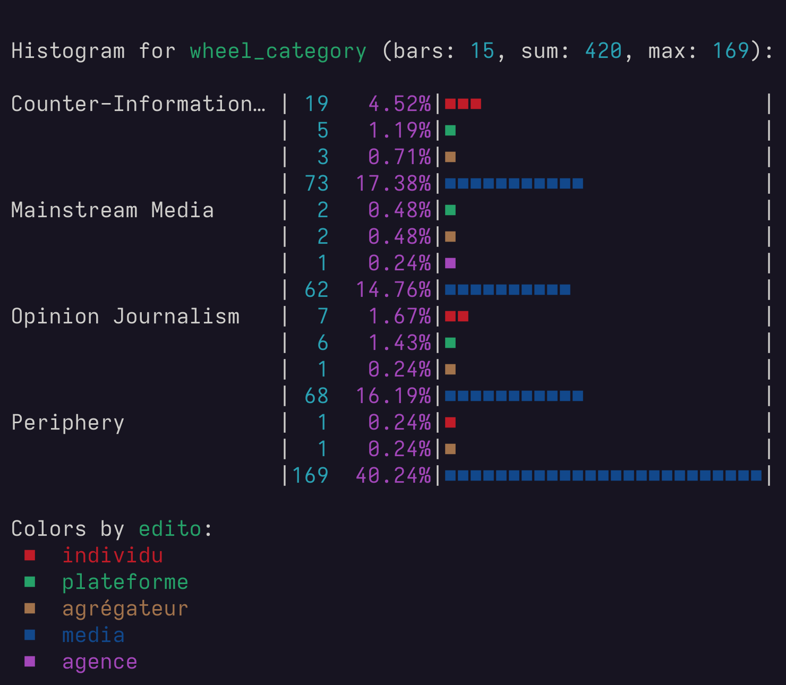
</p>

See how consecutive bars with a same label were reduced to a single label for better readability.

### Working with arbitrary inputs

`xan hist` has been tailored to work easily with `xan freq` & `xan hist`. But it does not mean you cannot use it with custom inputs.

`xan hist` needs to be given a CSV file with one column representing a bar's label and another one representing a bar's value. You can pass them using the `-l/--label` & `-v/--value` flags respectively.

`xan hist` can also optionally take a column representing a group of bars or a "field" if you will, that can be given to the `-f/--field` flag, to print multiple plots at once.

A `--name` flag also lets you give an arbitrary name to your plot.

```bash
xan groupby category 'sum(revenues) as total' series.csv | \
xan hist --name 'total revenues by category' --label category --value total
```

<p align="center">
    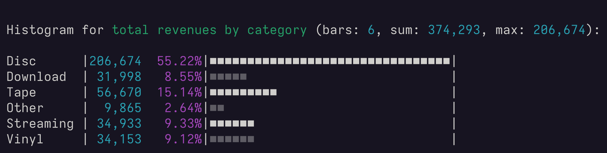
</p>

The mental model of one row of the CSV input becomes one bar in the plot is very useful to envision what to achieve in this context.

This naturally means that if you want to sort the bars differently in the plot, you just need to sort the CSV input given to `xan hist` beforehand:

```bash
# Bar sorted by ascending value & rainbow colors
xan groupby category 'sum(revenues) as total' series.csv | \
xan sort -s total -N | \
xan hist -R --name 'total revenues by category' --label category --value total
```

<p align="center">
    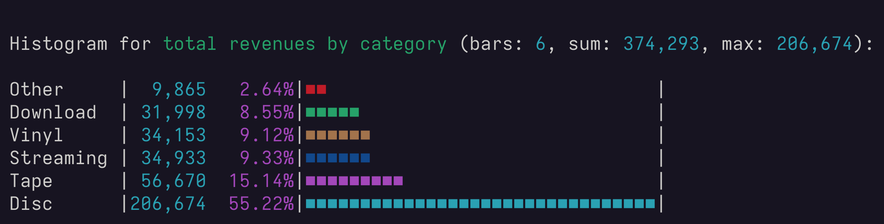
</p>

### Working with dates

Sometimes you might want to print a temporal bar plot, aligned on dates. For instance, given the `medias.csv` file that has a `foundation_year` column, you could use the `-D/--dates` flag so that the command automatically sort the values chronologically and completes the data by adding missing years:

```bash
# -A to output all values, not just top 10, and -N to avoid counting empty cells
xan freq -AN -s foundation_year medias.csv | \
# I filter the data so I can get my point across
xan filter 'value > 1980' | \
xan hist -D
```

<p align="center">
    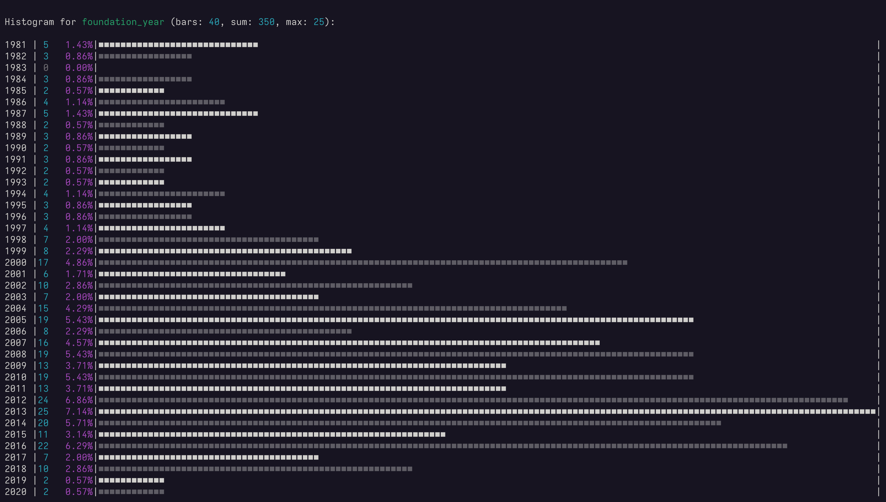
</p>

See here how the 1983 year was added even so it is never found in the original data?

Also, note that the fact that the `-D/--dates` flag will complete missing values for you might introduce a number of large gaps in the representation. If you want to avoid scrolling too much, you can also ask the command to compress gaps as soon as they span a number of bars given to the `-G/--compress-gaps` flag:

```bash
xan freq -AN -s foundation_year medias.csv | \
# I filter the data so I can get my point across
xan filter 'value >= 1910 && value <= 1960' | \
xan hist -D -G 2
```

<p align="center">
    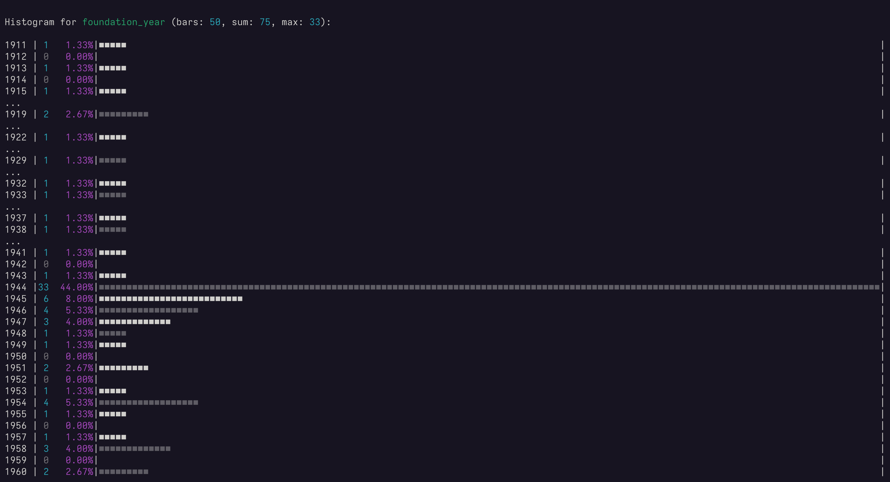
</p>

This is it for `xan hist`. Now if you want to have vertical bar plots, you have 2 solutions:

1. rotate your screen ;)
2. check out the section about [`xan spark`](#xan-spark-for-sparklines-and-aggregated-bar-plots)

## `xan plot` for scatter plots, line plots and time series

`xan plot` can be used for detailed 2 dimensional plotting: scatter plots, line plots & time series.

### Scatter plots

To display a scatter plot, you just need to pass two numerical columns as `<x>` and `<y>` to the command.

```bash
# Here I am using the dot marker instead of default braille because
# we have enough terminal real estate in this case
xan plot sepal_length petal_width --marker dot iris.csv
```

<p align="center">
    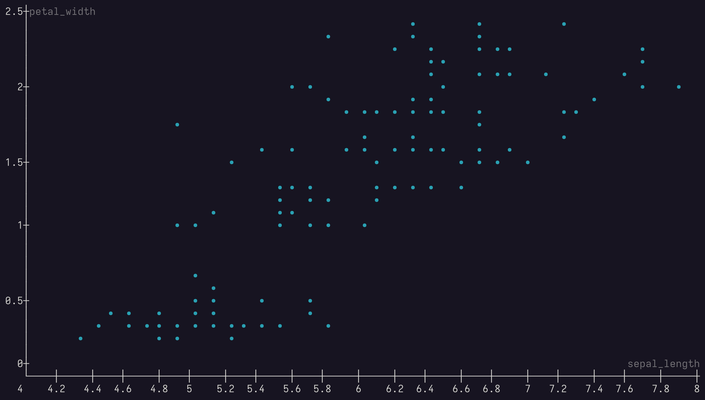
</p>

You can draw a grid aligned with x & y axis ticks if needed using the `-G/--grid` flag:

```bash
xan plot sepal_length petal_width --marker dot -G iris.csv
```

<p align="center">
    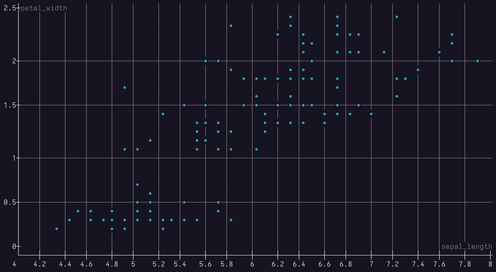
</p>

Then you don't have to limit yourself to a single series. `xan plot` can only take a single column as its x-axis, but it is able to take multiple ones for the y-axis, so you can draw multiple series at once:

```bash
xan plot sepal_length sepal_width,petal_length,petal_width --marker dot iris.csv
```

<p align="center">
    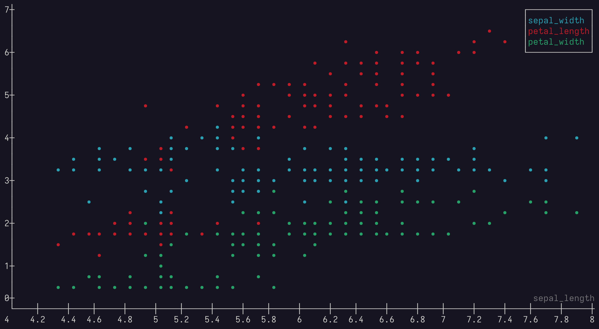
</p>

Instead of having multiple columns for the y-axis, you can also decide to use a column as a "category", in which case the command will draw one series per distinct value in given column. Here is an example where we draw a distinct series per iris species:

```bash
xan plot sepal_length petal_width -c species --marker dot iris.csv
```

<p align="center">
    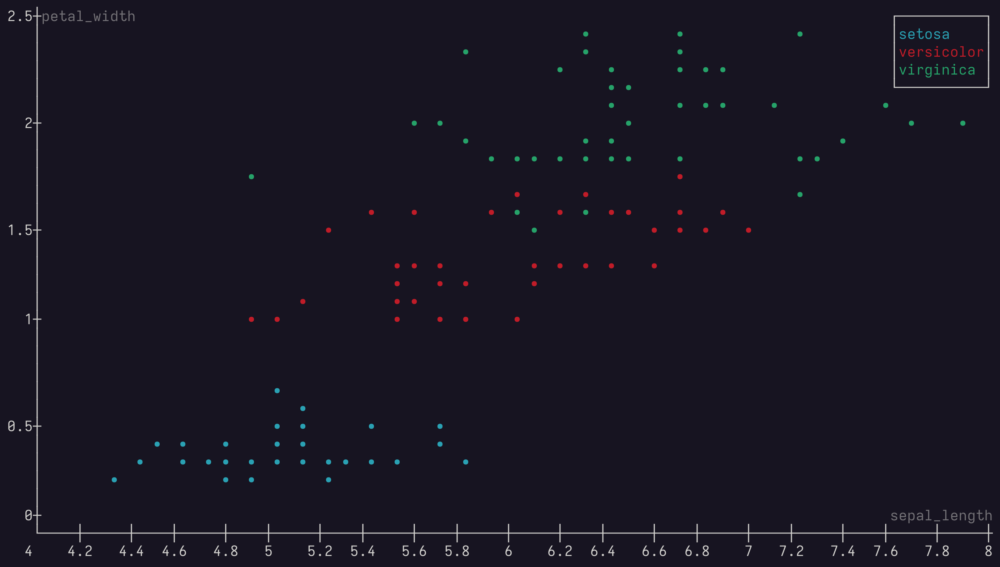
</p>

Finally, you can choose to draw one plot per series, instead of drawing them all in the same plot. This practice is sometimes called "small multiples" or "facet grids".

To do so, you need to give a maximum number of plots you want to draw on a single row of the resulting plot grid to the `-S/--small-multiples` flag.

Here is an example where we arrange all iris species horizontally:

```bash
# With a grid (-G)
xan plot sepal_length petal_width -c species --marker dot -G -S 3 iris.csv
```

<p align="center">
    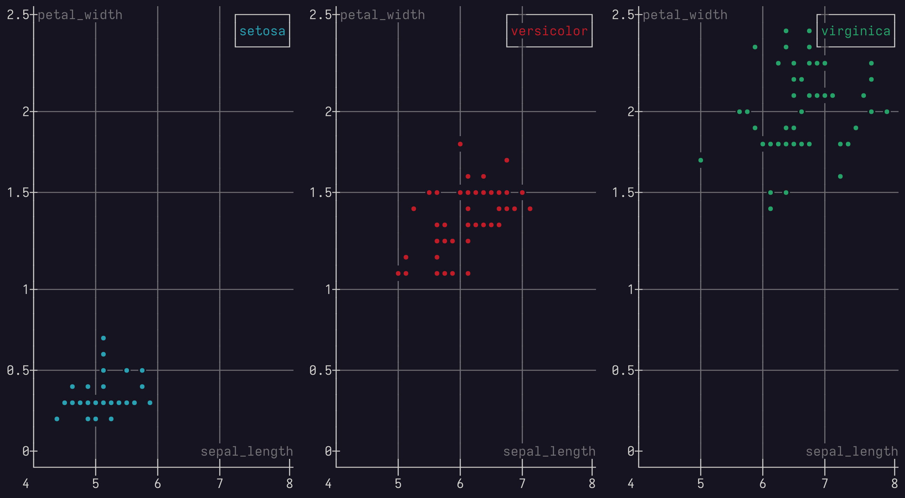
</p>

Here is another example where we arrange the same species vertically:

```bash
# Without grid
xan plot sepal_length petal_width -c species --marker dot -S 1 iris.csv
```

<p align="center">
    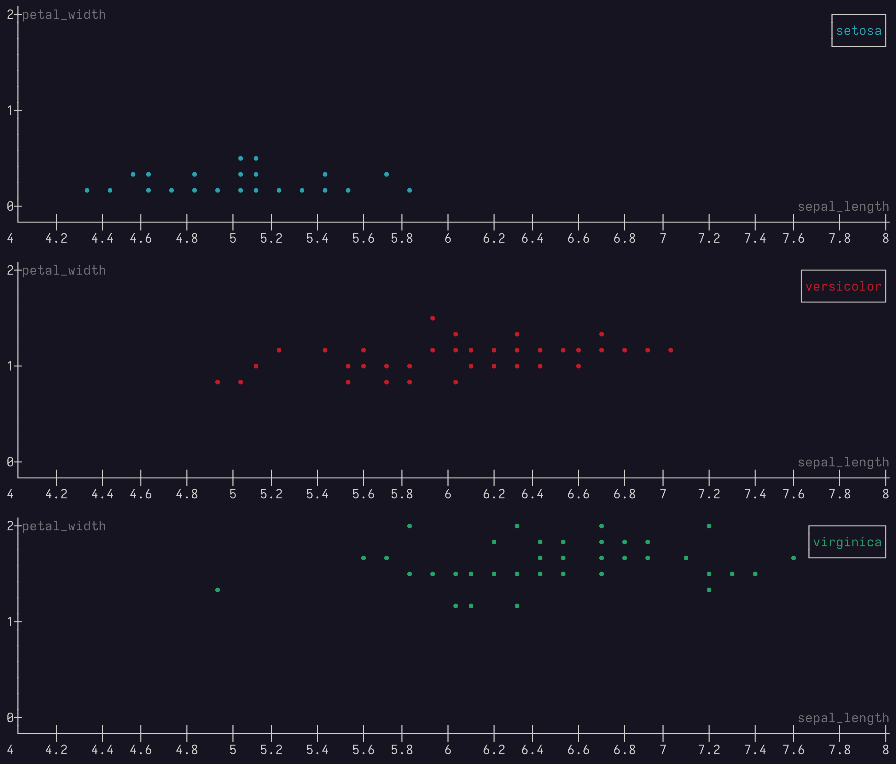
</p>

Notice that, by default, all plots will share the same x & y axis to ease comparisons. But you can very well disable this behaviour with `--share-x-scale=no` & `--share-y-scale=no`:

```bash
# -S 2, this time ;)
xan plot sepal_length petal_width -c species --marker dot -S 2 --share-x-scale no --share-y-scale no iris.csv
```

<p align="center">
    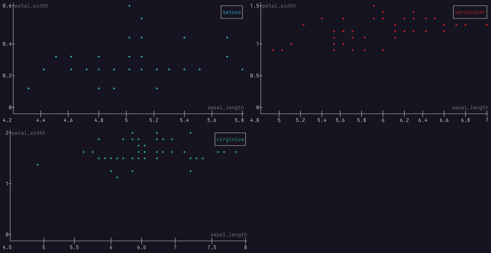
</p>

### Line plots & time series

Scatter plots are nice, but sometimes you might want to join your points by a line. And a popular application of this is generally to draw time series.

To this end, `xan plot` has a `-L/--line` that can be used for line plots, and a `-T/--time` flag, telling the command to interpret the x-axis values as temporal, rather than numerical.

The command knows how to deal with a large variety of temporal values such as dates, datetimes, timestamps etc.

```bash
# No values for the y axis? No problem.
# Just use --count instead to tally rows per time unit
xan plot -LT date --count series.csv
```

<p align="center">
    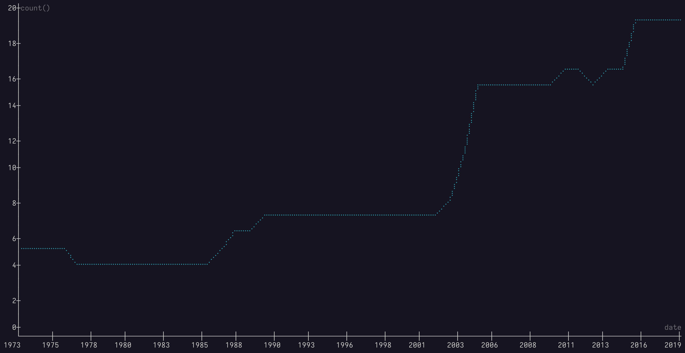
</p>

See how the command chose to represent a plot by year automagically while our data contains full dates:

```bash
xan select date series.csv | xan slice -l 5
```

```txt
date
1973-01-01
1974-01-01
1975-01-01
1976-01-01
1977-01-01
```

The command is usually right but you can always force it to use the granularity you want using the `-g/--granularity` flag if required.

Now let's see an example where we map a numerical column onto the y axis:

```bash
xan plot -LT date revenues series.csv
```

<p align="center">
    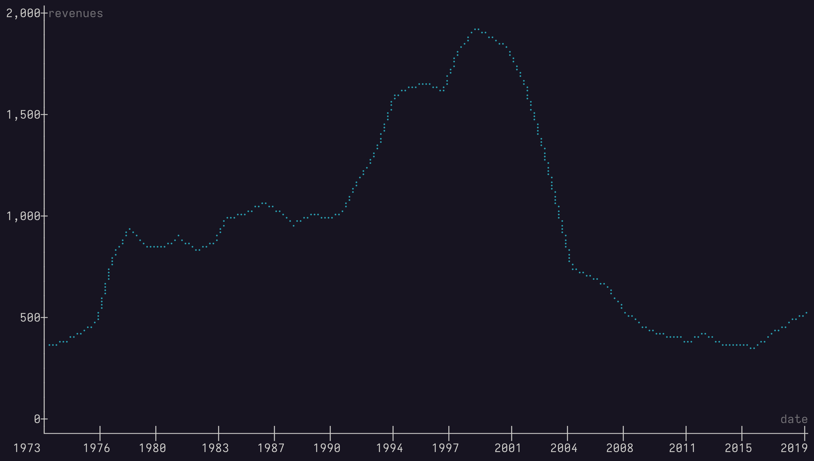
</p>

This tells a different picture.

And like with scatter plots, you can very well draw multiples series. Here is an example where we draw one time series per category:

```bash
xan plot -LT date revenues -c category series.csv
```

<p align="center">
    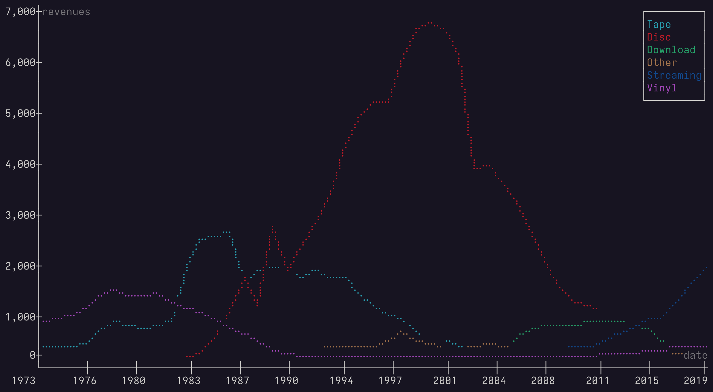
</p>

The same but using "small multiples" (or "facet grid", if you prefer):

```bash
xan plot -LT date revenues -c category -S 3 -G series.csv
```

<p align="center">
    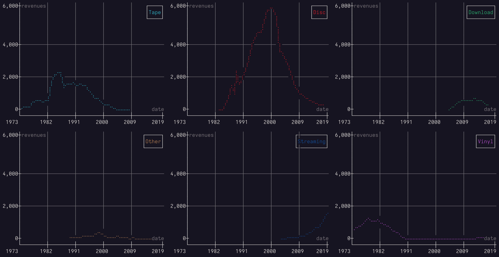
</p>

### Scales

If you try to observe the relation between the number of occurrences of words in a text and their frequency rank, you will observe what is called a [Zipf's law](https://en.wikipedia.org/wiki/Zipf%27s_law).

This result is often shown in a plot like this one, using log scales on both axis:

<p align="center">
    
</p>

Fortunately, `xan plot` lets you choose from a variety of non-linear scales for both axis through the `--x-scale` & `--y-scale` flags.

Let's see if we can produce the same result with our State-of-the-union speeches dataset:

```bash
# We split text into words
xan tokenize words transcript -k word sotu.csv | \
# We compute token-level, i.e. word-level, statistics
xan vocab token | \
# We sort by descending global frequency
xan sort -s gf -RN | \
# We create a rank column
xan enum -c rank -S 1 | \
# We plot the result with a log10 scale for both axis
xan plot rank gf --y-scale log10 --x-scale log10
```

<p align="center">
    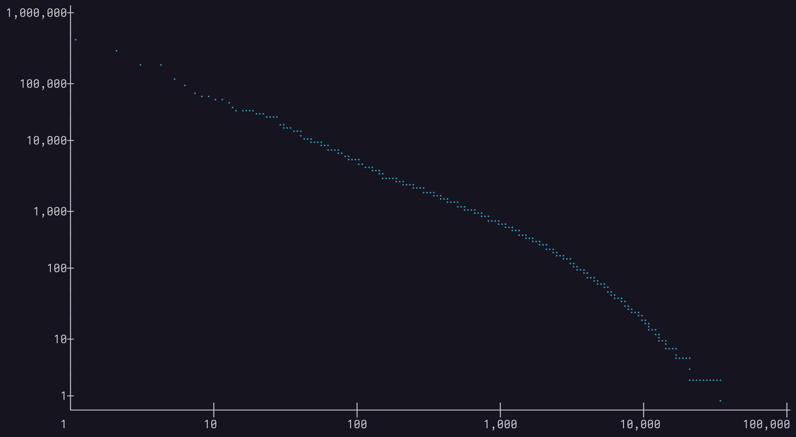
</p>

### Regression line

Sometimes it can be good to be able to draw a regression line to see how x & y are correlated. `xan plot` lets you do so through the `-R/--regression-line` flag.

Let's see how the `revenues` and `adjusted_revenues` columns of the `series.csv` file correlate:

```bash
xan plot -R revenues adjusted_revenues series.csv
```

<p align="center">
    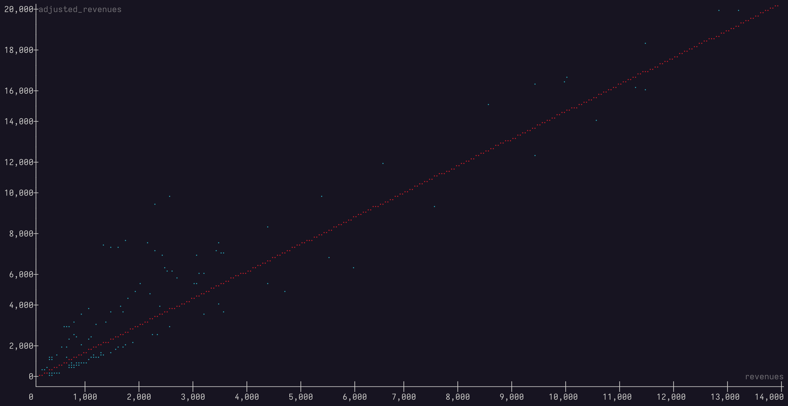
</p>

### Custom 2D plots & density gradients

2D plots can be useful for more than scatter plots and line plots.

For instance I personally use `xan plot` to draw simplified node-link diagrams of very large graphs in the terminal.

The `layout.csv` file (as described [here](#downloading-the-datasets-used-in-this-guide)) contains a sample of the x & y positions assigned to each page of a now defunct French social network by the [ForceAtlas2](https://journals.plos.org/plosone/article?id=10.1371/journal.pone.0098679) layout algorithm.

People usually rely on [Gephi](https://gephi.org/) or [sigma.js](sigmajs.org/) to interactively explore this kind of graphs.

But what if your graph is very large (tens of millions of nodes), and you just want a quick glance to make sure everything is where it should be?

For small graphs, `xan plot` is useless, since you cannot draw edges nor labels, even at that scale, to have a proper node-link diagram. But when you have million of nodes, you are less interested in the specificities of each node's position than in the overall geography of the network.

In this context, it can be good to know that `xan plot` has the following flags:

- `-Q/--square` tries to keep the aspect ratio of the plot as square as possible
- `--hide-x-axis` & `--hide-y-axis` can be used to hide axis and their respective ticks, which are useless when representing an isotropic space such as the one created by a force-directed layout. What's more, axis are usually smoothed so that displayed ticks are more human-friendly and can widen the represented space a bit, thus reducing available space for our points. If we hide them, we make sure to use most of the available space of the terminal.

Now let's print our graph:

```bash
# --hide-all is a shorthand for --hide-x-axis & --hide-y-axis
xan plot x y -Q --hide-all layout.csv
```

<p align="center">
    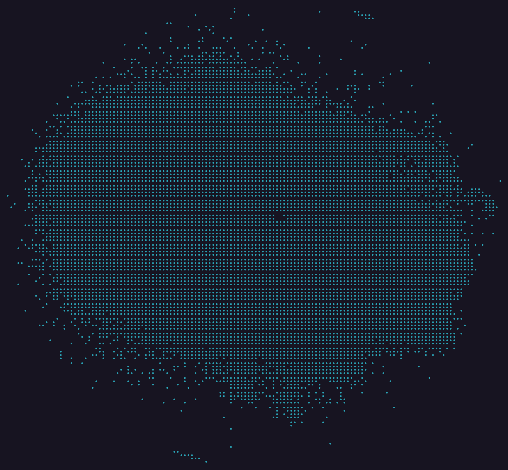
</p>

Here is another example using the similar `clusters.csv` file that contains a graph with 5 distinct & well-connected communities:

```bash
xan plot x y -Q --hide-all clusters.csv
```

<p align="center">
    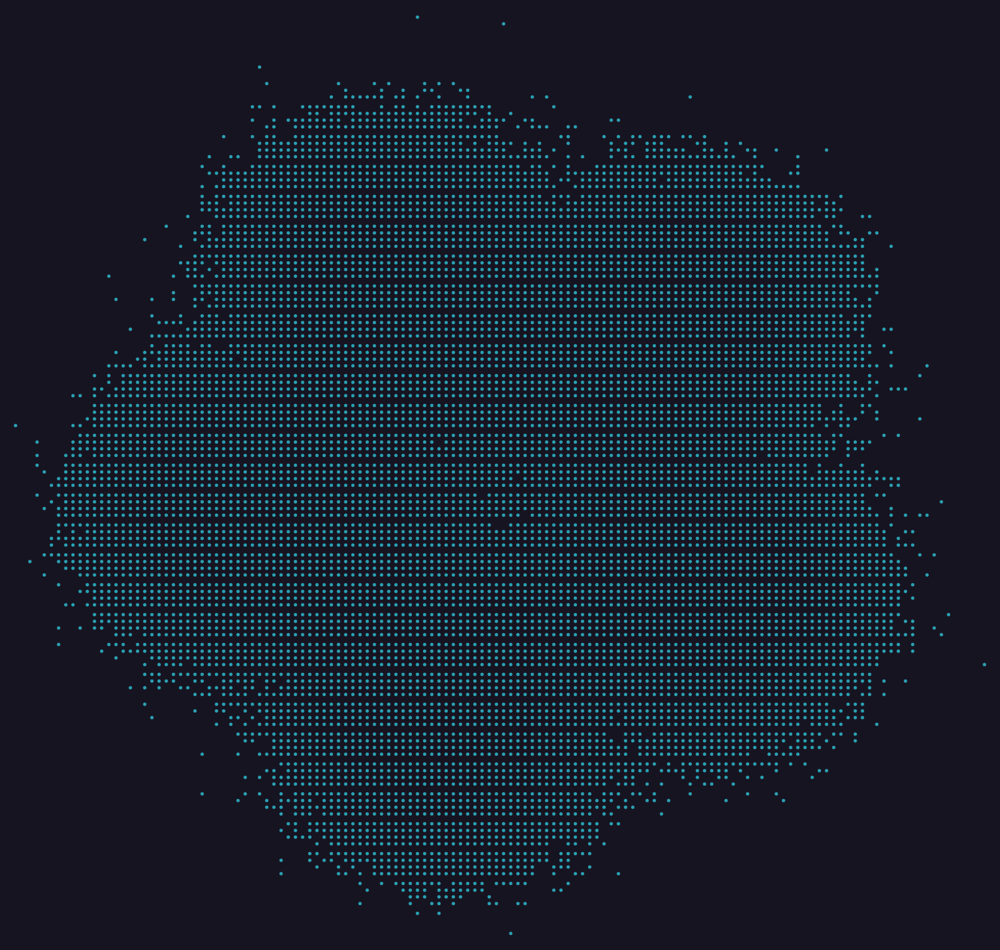
</p>

With both graphs we can start distinguishing a geography. But admittedly this remains hard to read and we should be able to do better by using some color.

For `clusters.csv` this is easy because we have a `cluster` column containing the id of the cluster for each node, so we can pass it to the `-c/--category` flag:

```bash
xan plot x y -c cluster -Q --hide-all clusters.csv
```

<p align="center">
    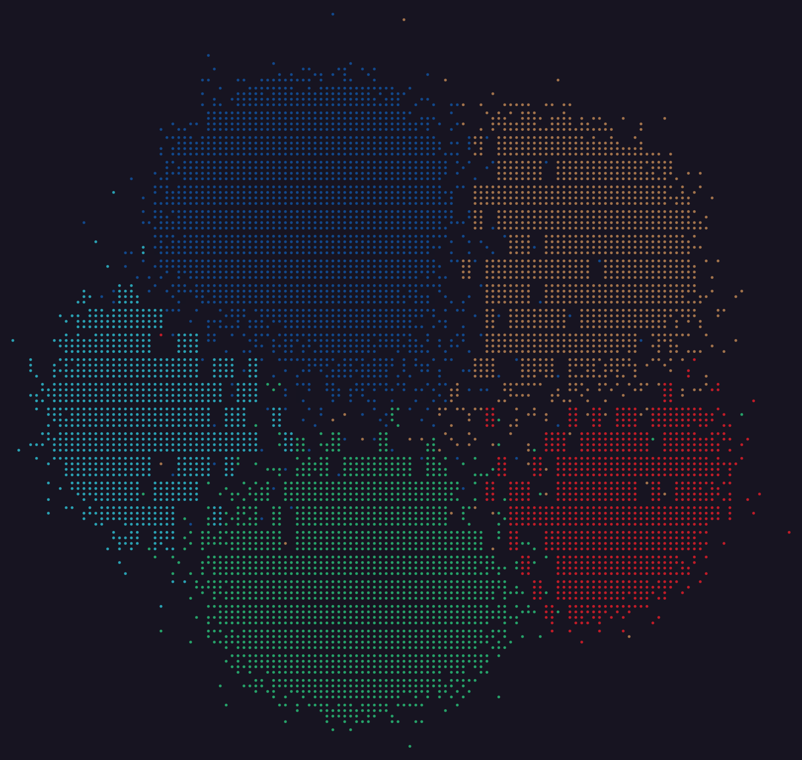
</p>

The colors match the geography of the layout, everything is fine here.

Now for our social network we don't have information about communities nor clusters. What's more we may have too much nodes and colors might get muddled because even if we are using braille characters to increase the "resolution" of our plot, a character can still only have a single color.

But we can try something else: a density gradient. This means we are going to assign a color to each braille character based on the number of points it actually represents.

This can be done through the `-D/--density-gradient` flag that takes a gradient name (you can list them with `xan help gradients`) that will be used to represent density in the resulting plot.

In this example I will use the `or_rd` gradient that will continuously map from orange for low density to red for high density. The default scale used for density is `log`, but you can tweak it with `--density-scale` if required:

```bash
xan plot x y -D or_rd -Q --hide-all layout.csv
```

<p align="center">
    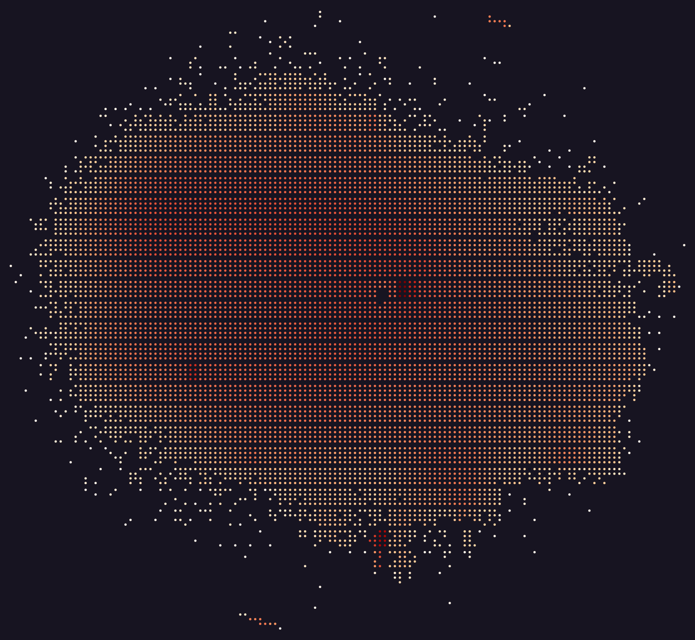
</p>

And now we have a better view of the dense parts of the network.

What's more, there is no rule saying we cannot unzoom our terminal to get a better "resolution" (this is usually done with `Ctrl` + `-`):

<p align="center">
    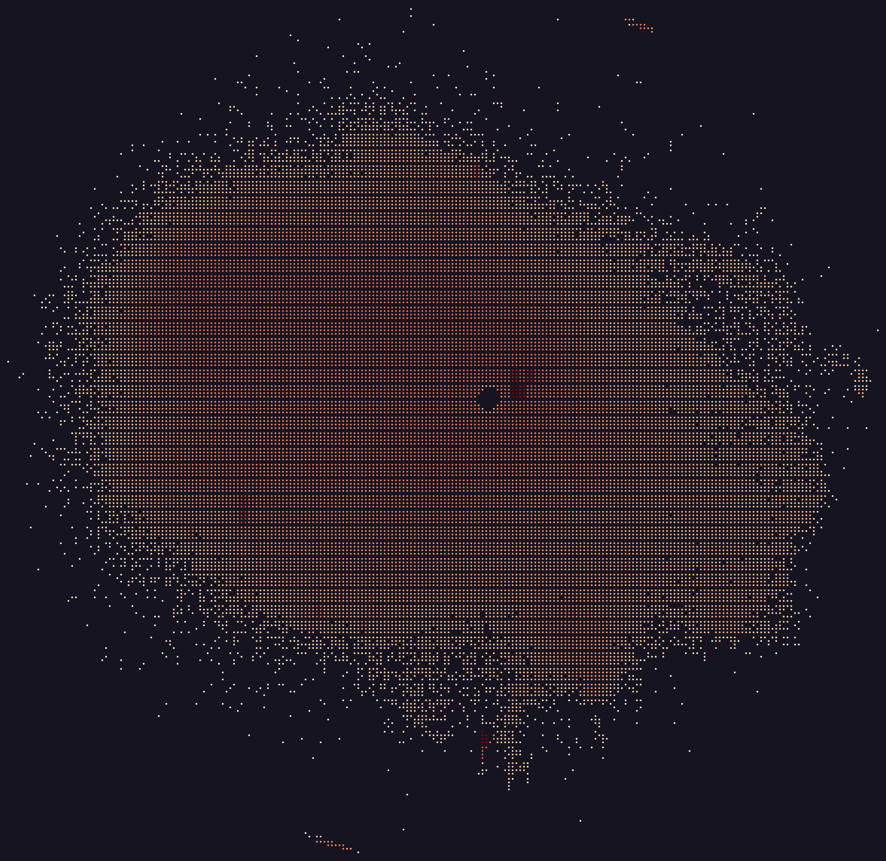
</p>

Finally, note that since layout algorithms are iterative and don't have a well-defined stop condition, people like to see them as an animation of node positions to make sure everything is working correctly.

When I ran the layout algorithm on my network (I ran something like ~20k iterations), I was careful to dump node positions every 100 iterations in a `dump` folder.

This means that you can very well use `xan plot` in a loop to get a coarse animation of the layout algorithm running, like so:

```bash
ls dump/*.csv | sort | while read positions;
do
    xan plot x y -Q --hide-all -D or_rd $positions
done
```

<p align="center">
    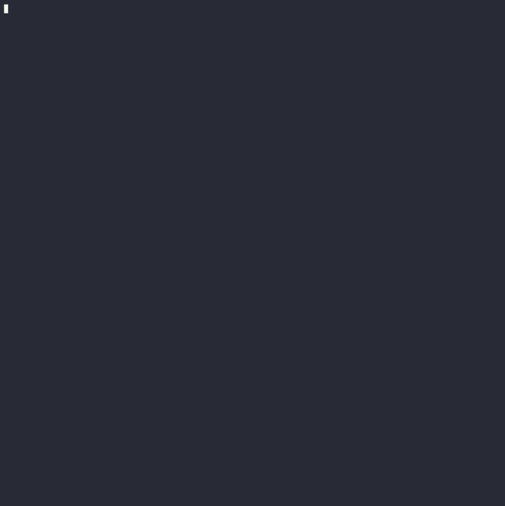
</p>

## `xan heatmap` for heatmaps and conditional formatting

`xan heatmap` is a command representing a CSV file as a 2D heatmap where cells are colored using a gradient (see full list of available gradients using `xan help gradients`) mapped on a numerical value.

By default, this command considers the first column of your file to be labels for the y axis, while all other commands will be used to draw the cells. But this behavior can always be tweaked using the `-l/--label` & `-v/--values` flags, both taking a selection of columns of the input.

### Correlation matrices

A very typical application for heatmaps is to represent correlation matrices.

By chance, `xan matrix corr` can create those matrices for us very easily.

Here is an example using the famour Iris dataset:

```bash
# We compute correlations over the first 4 columns only (:3)
# because last column contains the name of the iris species
xan matrix corr -s :3 iris.csv | \
# --diverging will toggle a suitable gradient
# --unit is a shorthand for --min -1 --max 1 when used with --diverging
xan heatmap --diverging --unit
```

<p align="center">
    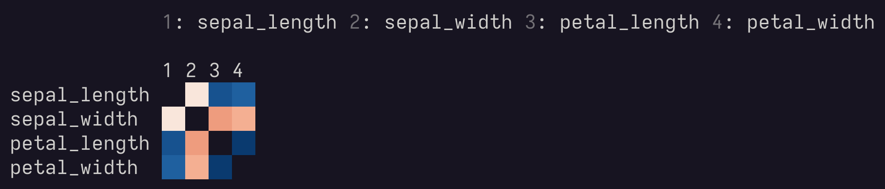
</p>

This is fine, but cells are a bit puny, and we have enough space, to let's increase their size using the `-S/--size` flag:

```bash
xan matrix corr -s :3 iris.csv | \
# -DU is the same as --diverging --unit
xan heatmap -DU --size 3
```

<p align="center">
    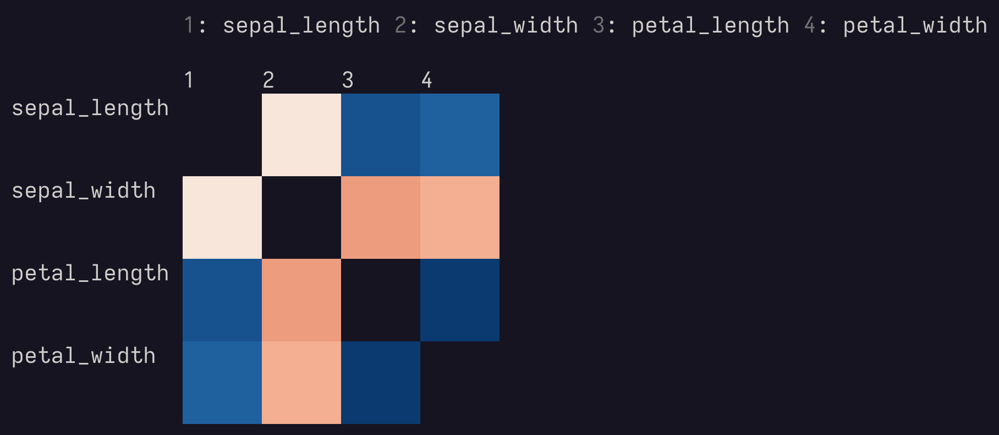
</p>

And since cells are bigger now, we can fit numbers within them, using the `-N/--show-numbers` flag:

```bash
xan matrix corr -s :3 iris.csv | \
xan heatmap -DU -S 3 --show-numbers
```

<p align="center">
    
</p>

Also, notice that since there is not enough space above the cells to display column labels, a legend was written before the plot for you. If you are feeling brash, you can always force the command to "cram" labels above the columns using `--cram always`.

Another strategy is to rename the labels like so:

```bash
xan rename -s :3 sl,sw,pl,pw iris.csv | \
xan matrix corr -s :3 | \
xan heatmap -DU -S 3 --show-numbers
```

<p align="center">
    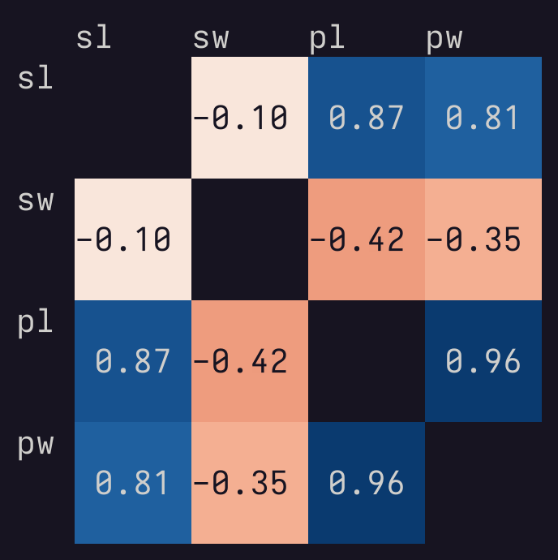
</p>

Now one issue with using color gradient is that your terminal needs to support true colors and you cannot copy-paste the result anymore.

This said, if you are willing to accept not to show the numbers and to have a coarser gradient, you can use the `-A/--ascii` flag like so:

```bash
xan matrix corr -s :3 iris.csv | \
xan heatmap -DU -S 3 -A
```

And here is the result as copy-pasted text:

```txt
             1: sepal_length 2: sepal_width 3: petal_length 4: petal_width

             1     2     3     4
sepal_length       ▒▒▒▒▒▒████████████
                   ▒▒▒▒▒▒████████████
                   ▒▒▒▒▒▒████████████
sepal_width  ▒▒▒▒▒▒      ▒▒▒▒▒▒▒▒▒▒▒▒
             ▒▒▒▒▒▒      ▒▒▒▒▒▒▒▒▒▒▒▒
             ▒▒▒▒▒▒      ▒▒▒▒▒▒▒▒▒▒▒▒
petal_length ██████▒▒▒▒▒▒      ██████
             ██████▒▒▒▒▒▒      ██████
             ██████▒▒▒▒▒▒      ██████
petal_width  ██████▒▒▒▒▒▒██████
             ██████▒▒▒▒▒▒██████
             ██████▒▒▒▒▒▒██████
```

### Count & adjacency matrices

`xan heatmap` can also be used to represent count matrix, where we count the number of times values from a first column co-occur with values from a second column.

But first, let's learn about a few more flags:

- the gradient used can be customized through the `-G/--gradient` flag (see `xan help gradients` for the full list)
- cell color is mapped over the normalization of the cell value against the full matrix. But you can use the `--normalize` flag to normalize against a cell's column (`col`) or a cell's row (`row`).
- sometimes, when the resulting heatmap is very sparse, it can be easier on the eye to "fill" empty cells with a pattern using the `-F/--fill` flag

Now here is an example of count matrix tracking co-occurrences, in our media corpus, of the editorialization of a media with its subcategory, using a *Viridis* gradient:

```bash
xan matrix count edito wheel_subcategory medias.csv | \
xan heatmap --gradient viridis -F -S2 -N --normalize col
```

<p align="center">
    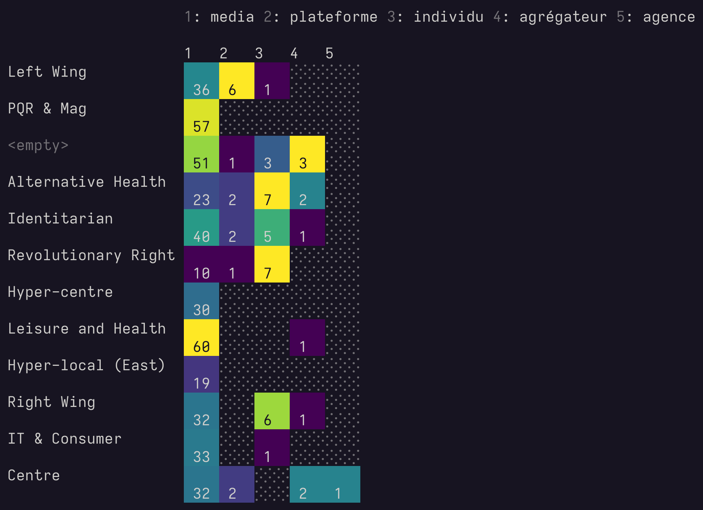
</p>

We can also apply this to adjacency matrix to represent graphs. An adjacency matrix is the same thing as a count matrix but where both axis have homogeneous labels (a count matrix can be though of as a bipartite matrix, also).

```bash
# -U means --undirected because our edges are not directed in this case
# -w means --weight, so we fill matrix cells with a weight, not just 1 or 0
xan matrix adj source target -U -w weight les-miserables.csv | \
xan heatmap -F
```

<p align="center">
    
</p>

Don't forget that you can always unzoom your terminal for better "resolution". Sometimes you can also transpose your data with `xan transpose` to make sure the longest axis is vertical (terminal space is vertically infinite, while horizontal space is limited).

### Arbitrary matrices

We have seen how to work with correlation matrices and count/adjacency matrices, but `xan heatmap` can really work with any abitrary table. And since vertical space is unlimited, you can very well use it to draw heatmap for full tables, or any heatmap-like application.

Here I use `xan heatmap` to represent the dimensions of the Iris dataset:

```bash
xan sample 5 -g species iris.csv | \
xan heatmap -l species --normalize col
```

<p align="center">
    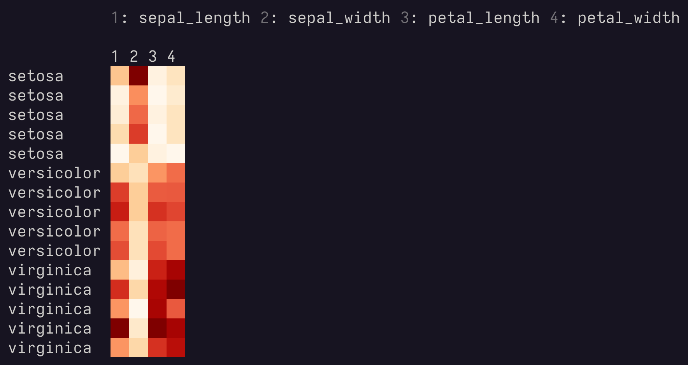
</p>

Do you see what distinguishes the Setosa species from the other ones?

And here is an example where I use `xan heatmap` for crude temporal representation:

```bash
xan map 'date.year().round(10) as decade' series.csv | \
xan matrix count decade category | \
xan heatmap -F -G viridis -S3 -N
```

<p align="center">
    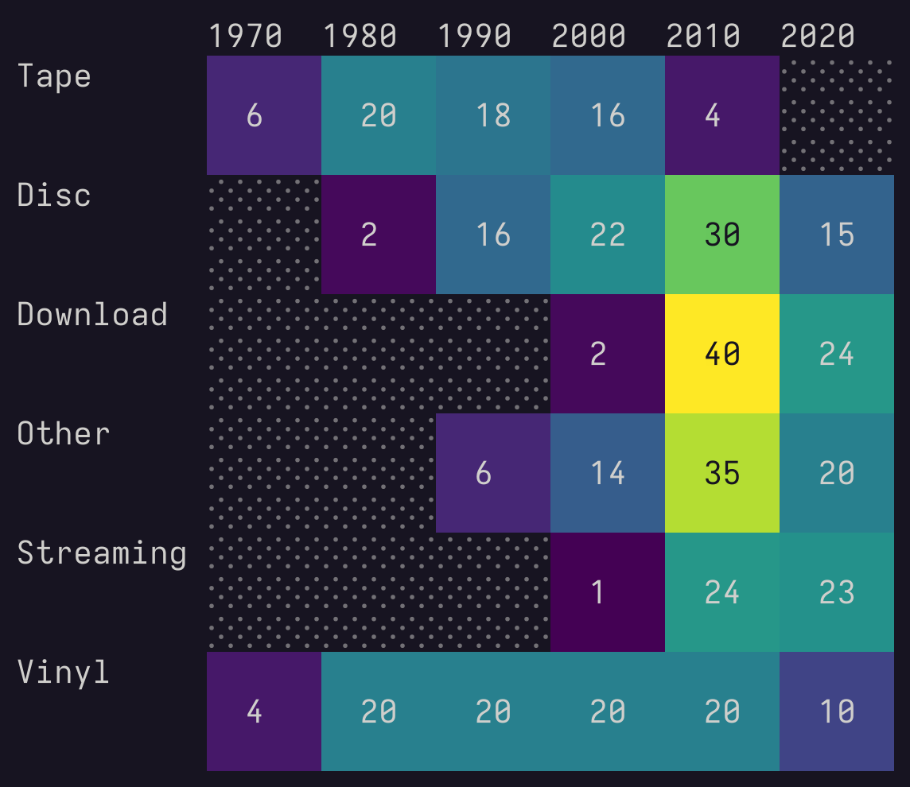
</p>

### Conditional formatting

Finally, `xan heatmap` can be used to perform what is usually called "conditional formatting" in spreadsheet software. That is to say you are going to color cells of the tabular representation based on the value they contain.

By default `xan heatmap` attempts to draw cells as squares, whose size you can tweak using the `-S/--size` flag. But in the case of conditional formatting, you don't really need your cells to be square. As a matter of fact, you even need them to be as wide as possible so you can show the numbers inside. This can be achieved with the `-W/--width` flag.

You can also use the `-a/--align` flag to tweak how values will be printed within cells.

```bash
# Displaying only the rows related to CDs
xan search -s category Disc series.csv | \
# Using 17 characters as width for the cells, and aligning values on the right
xan heatmap -l date -v revenues,adjusted_revenues -W 17 -N --align right -G yl_gn_bu --normalize col
```

<p align="center">
    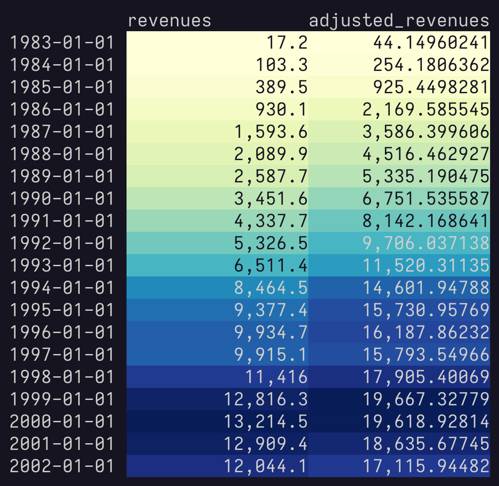
</p>

## `xan spark` for sparklines and aggregated bar plots

`xan spark` is a command able to draw horizontal "sparklines", which can be thought of as coarse line plots or bar plots.

### Column-wise minimaps

At its heart, `xan spark` wants to draw one or multiple "series". Those series can be collected using different methods and can be reinterpreted in many ways: as time series, as distributions etc.

But, by default, `xan spark` will work by representing one or more numerical columns from its input, as-is, in the order of the data.

The result can be thought of as a column-wise "minimap" of sorts, and can be useful to detect patterns in the way the data itself is arranged.

Here is the simplest way to call `xan spark` on some columns:

```bash
xan spark <y-columns> input.csv
```

And here is an example where I print one sparkline over a column of `series.csv`, and another sparkline after having sorted the same column:

```bash
xan spark revenues series.csv && \
printf "\noriginal order ↑ --- sorted ↓" && \
xan sort -s revenues -RN series.csv | \
xan spark revenues
```

<p align="center">
    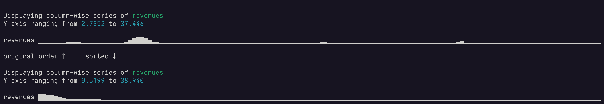
</p>

The y-axis min,max discrepancy across both sparkline happens because of the way both series are discretized to fit in the horizontal space of the terminal.

Now `xan spark`, like `xan plot`, has a `-c/--category` flag that can be used to map a color palette to each value taken by the given column.

You can use this to see how categories are distributed in a file.

Here is an example where I print a categorical sparkline over the x & y columns of `clusters.csv` and another one after having shuffled the file:

```bash
# I use --hide-legend here because the ids of the clusters are irrelevant
xan spark x,y -c cluster clusters.csv --hide-legend && \
printf "\noriginal order ↑ --- shuffled ↓\n\n" && \
xan shuffle clusters.csv | \
xan spark x,y -c cluster --hide-legend
```

<p align="center">
    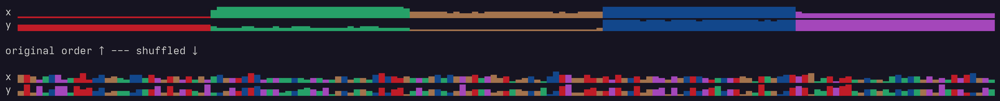
</p>

See how the original file is clearly sorted on clusters (we can also see, at a glance, that they occupy different quadrants of the 2d space represented by x & y columns)?

### Time series

But of course `xan spark` can be used for more typical applications such as representing time series. It is quite similar in this regard to `xan plot`, but is more suited for displaying large amount of series as small multiples.

To show a time series with `xan spark`, you need to feed a temporal column to its `-T/--time` flag. They you are free to provide a numerical column as y, or you can use the `--count` flag to count rows per time unit instead:

```bash
xan spark -T date revenues series.csv
```

<p align="center">
    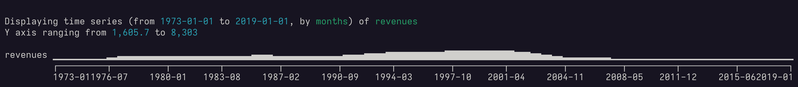
</p>

This is well and good, but in this case we might be able to use more vertical space, so let's indicate it with the `-H/--height` flag. It is able to take a number of terminal rows, or a ratio/percentage of available terminal screen like `0.5` or `60%`.

And since we are at it, let's dim the color of alternating bars of the sparkline so it is easier on the eye, using the `-z/--striped` flag:

```bash
xan spark -T date revenues -H 50% -z series.csv
```

<p align="center">
    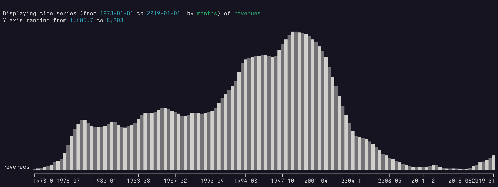
</p>

Isn't this better?

Now `xan spark` really shines when you want to display multiple series at once.

To print multiple series, you can pass multiple columns for the y axis. I will also use the `-R/--rainbow` flag to give alternating color to the series to better distinguish them:

```bash
xan spark -T date revenues,adjusted_revenues -H 2 -Rz series.csv
```

<p align="center">
    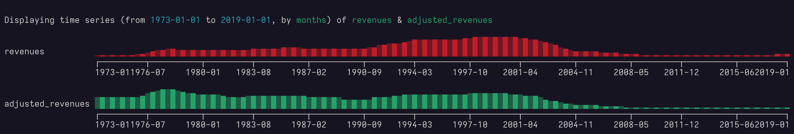
</p>

You can also draw one series per distinct value found in the column given to the `-g/--groupby` flag:

```bash
# Here I am using --repeat-x-axis no to show years only once at the bottom
xan spark -T date revenues -g category -H 2 -Rz --repeat-x-axis no series.csv
```

<p align="center">
    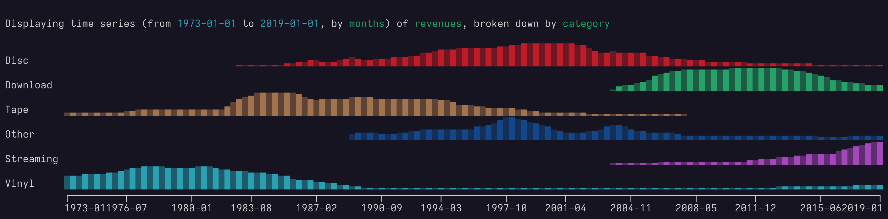
</p>

And like with `xan plot`, you can choose to arrange your series in small multiples, or facet grid, using the `-S/--small-multiples` flag:

```bash
xan spark -T date revenues -g category -H 2 -Rz -S 2 no series.csv
```

<p align="center">
    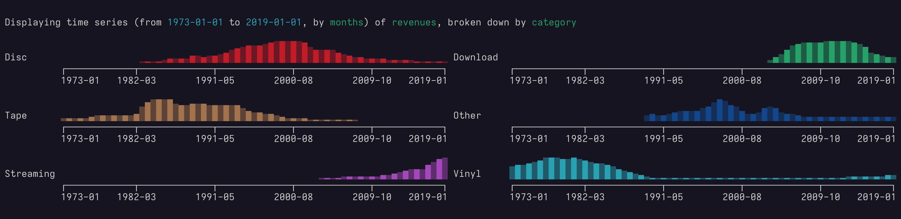
</p>

### Distributions

Using the `-D/--distribution` scale, `xan spark` is also able to display the distribution of your series instead, along with useful information such as the mean, the median etc.

Like other commands, it also knows how to change the scale used to represent the values. Here I am going to use the `--log` flag, which is a shorthand for `--scale log`, to display the distribution of two columns from the `series.csv` file:

```bash
xan spark -D revenues,adjusted_revenues -H 5 -z --log series.csv
```

<p align="center">
    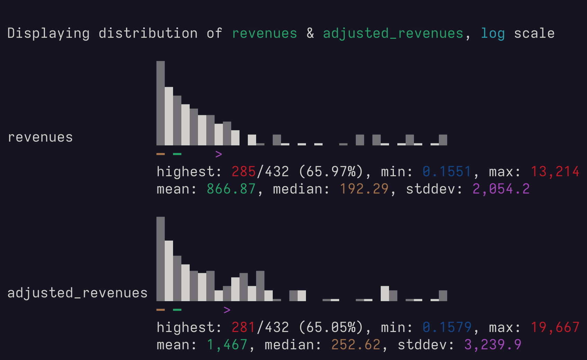
</p>

And you can of course do so per value of some column using the `-g/--groupby` flag:

```bash
xan spark -D revenues -g category -H 5 -z --log series.csv
```

<p align="center">
    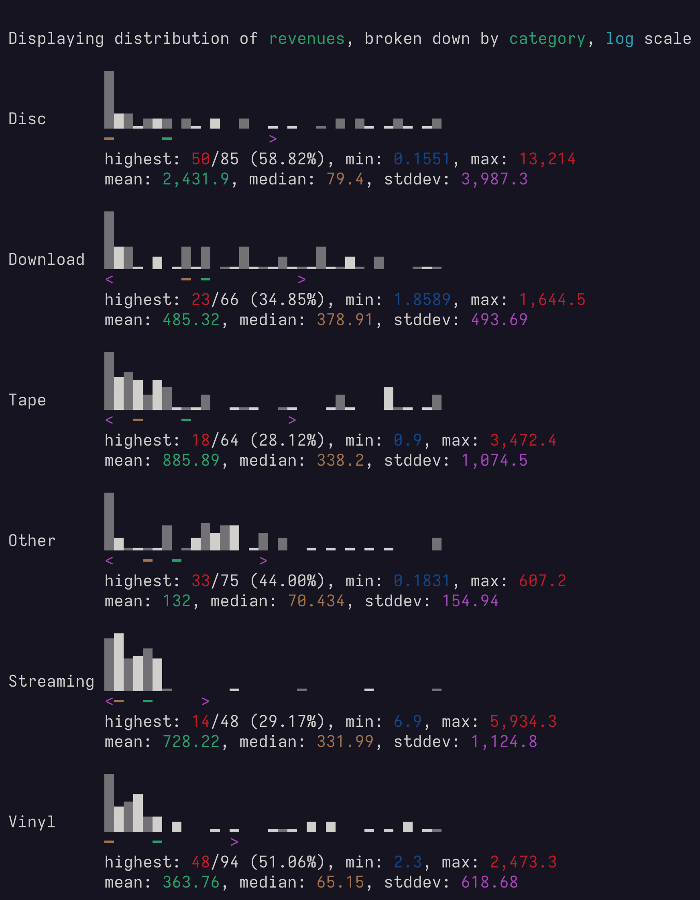
</p>

### Vertical bar plots

Through the `-c/--category` flag of `xan spark` you can achieve what the `xan hist` command never could: vertical bar plots.

```bash
xan freq -s category series.csv | \
# -P means we want to show the share of a bar as a percentage
# -N means we want to display the value of a bar
xan spark -c value count -H .6 -W 10 -PN --min 0 --hide-names
```

<p align="center">
    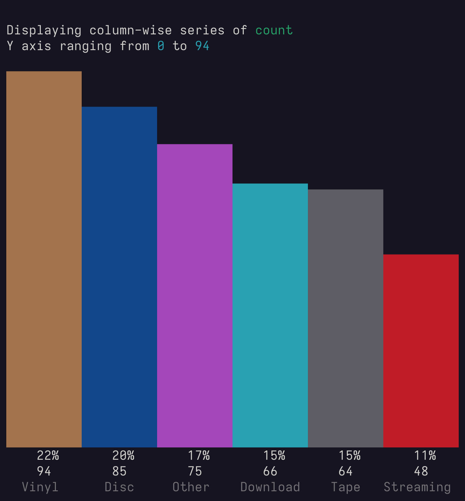
</p>

And of course `-c/--category` works perfectly fine with multiple series.

In this example I show one bar plot per lustrum (a span of 5 years, half a decade if you will) of `series.csv`:

```bash
xan map 'date.year().round(5) as lustrum' series.csv | \
xan groupby lustrum,category 'sum(revenues) as total' | \
xan sort -s lustrum | \
xan spark total -c category -g lustrum -H 2 -W 4
```

<p align="center">
    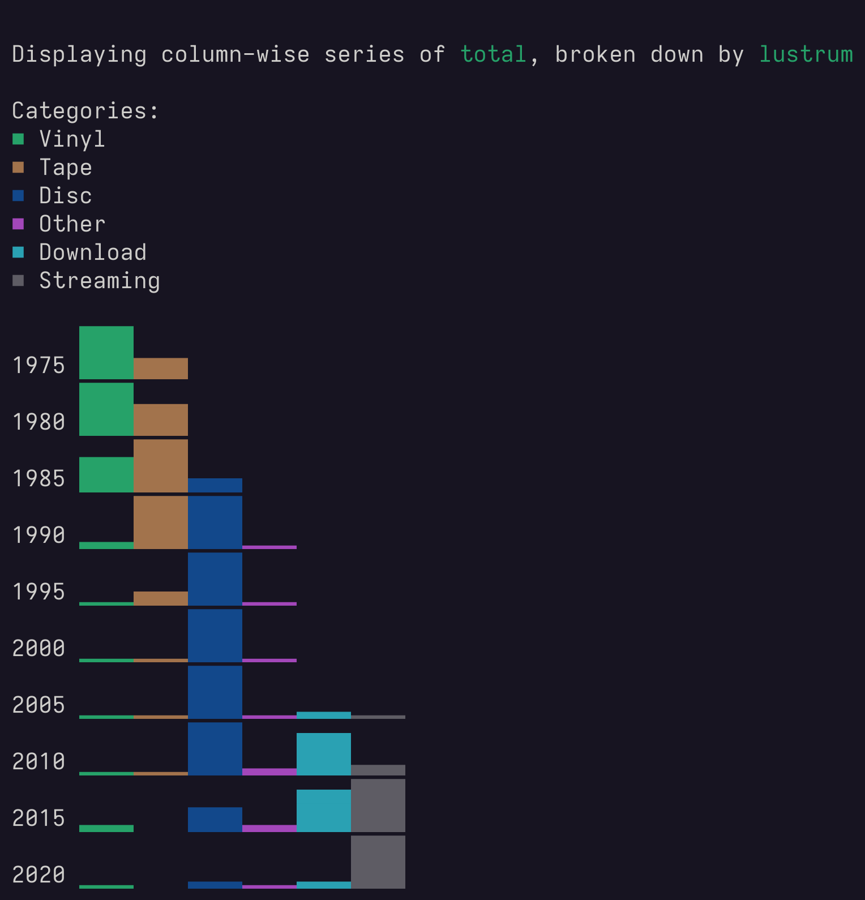
</p>

### Synthwave plots

Now that we know how to use `xan spark` productively, let's go wild with color and make art.

We know how to make rainbows using the `-R/--raibow` flag, but what about using all the gradients supported by `xan heatmap` to draw fancy charts?

First of all, the `-G/--gradient` will take such a gradient (see full list with `xan help gradients`) and map the color of the bar on its height:

```bash
xan spark -T date revenues -g category series.csv -H5 --repeat-x-axis no -G plasma
```

<p align="center">
    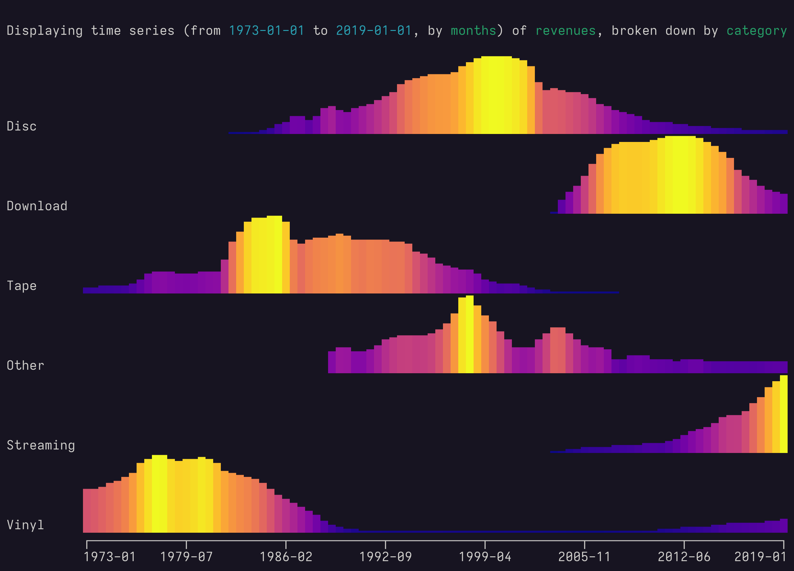
</p>

Or you can use the `-B/--background-gradient` flag to forego drawing a bar altogether and color the space it used to be with the gradient. This produces a kind of heatmap:

```bash
xan spark -T date revenues -g format series.csv --repeat-x-axis no -B magma
```

<p align="center">
    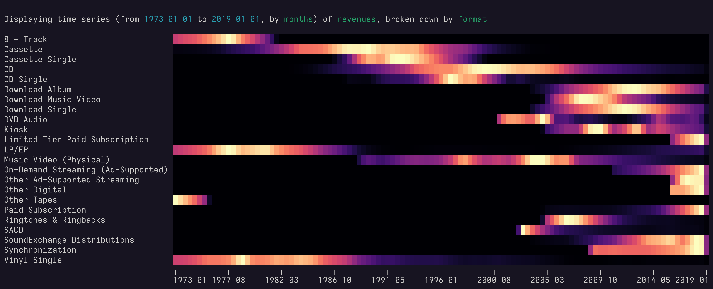
</p>

Finally, you can use the `-V/--vertical-gradient` flag to paint the bars with the gradient spanning from the bottom to the top of the bar. This will only work if `--height` is more than 1. Else you will just have a solid color.

```bash
xan spark -T date revenues,adjusted_revenues series.csv -V plasma -H 10
```

<p align="center">
    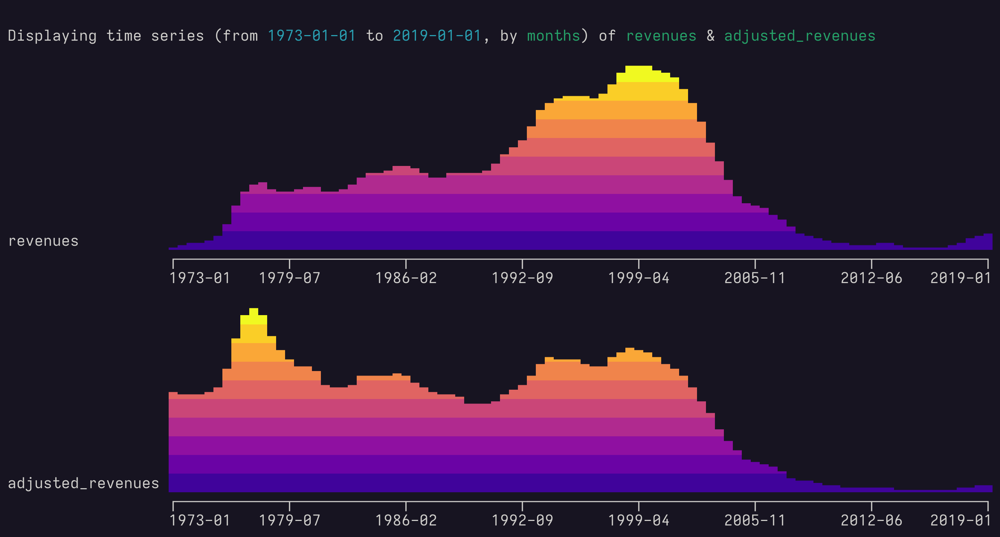
</p>

### Joy division plots

The "Unknown Pleasures" album of the band Joy Division is important to the dataviz community because it reminds us of the existence of a kind of plot that used to be called a "ridge plot" and that is now called, cheekily, the "joy division plot".

Here is the very famous cover of this album

<p align="center">
    
</p>

The plot was not drawn for the cover, but comes from a paper in astronomy studying pulsars, published in 1970 in:

> Radio Observations of the Pulse Profiles and Dispersion Measures of Twelve Pulsars by Harold D. Carft, Jr. 1970

<p align="center">
    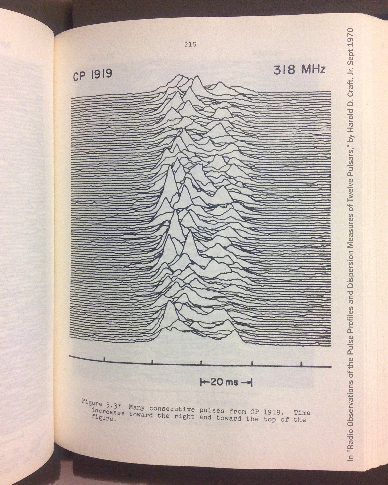
</p>

The data used to draw the plot originally can be found [online](https://gist.githubusercontent.com/borgar/31c1e476b8e92a11d7e9/raw/0fae97dab6830ecee185a63c1cee0008f6778ff6/pulsar.csv) (or see the [downloading](#downloading-the-datasets-used-in-this-guide) section of this guide and search for `pulsars.csv`).

Fortunately, `xan spark` also knows how to draw one series per row in your input. You just need to give a selection of columns to display per row using the `--along-rows` flag:

```bash
# I am using --hide-all to hamper the less-artistic endeavors of the command
# --along-rows '*' means we are going to consider all columns of the file
xan spark --along-rows '*' pulsar.csv --hide-all
```

<p align="center">
    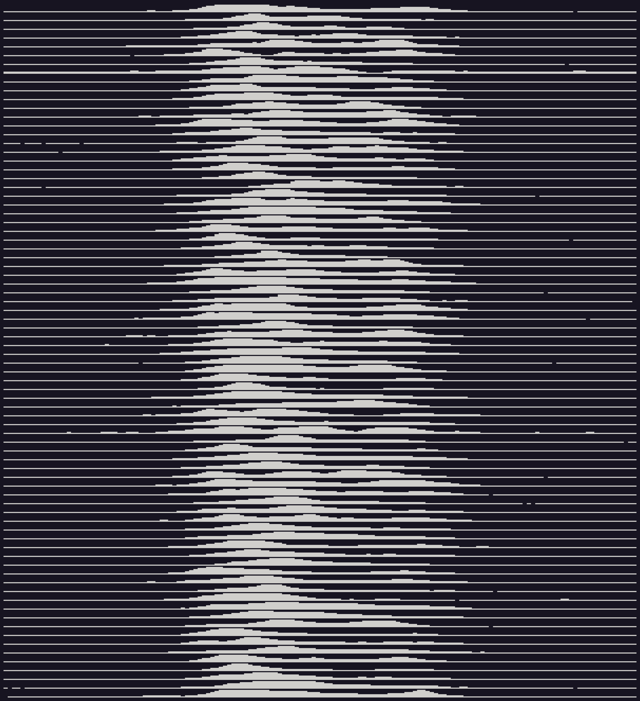
</p>

Unzoom your terminal and squint a little for better effect.

Now admittedly this example is a bit of a joke, but you could nevertheless use `--along-rows` more productively. It can be very useful to check embeddings, to make sure they look fine and don't exhibit concerning patterns, such as sorted or low-variance dimensions. Check out `xan from -f npy` to load numpy embedding for this very purpose.

<!-- TODO: test embedding tartans -->

## `xan progress` for progress bars

When performing heavy processing, it can be nice to have a progress bar. This is what `xan progress` proposes to do. It reads a CSV stream, prints a progress bar in stderr, and forward CSV data to stdout so you can pipe it into something else. This means it can be placed anywhere in a pipeline (even if it is usually better to place it at the beginning, rather than at the end), and works thanks to the magic of unix pipes backpressure.

For instance, let's say you need to read files whose paths are contained in a CSV file, to make sure they contain the occurrence of some keyword. This might take a while, so first wrap beforementioned CSV file using `xan progress` like so:

```bash
xan progress paths.csv | \
xan filter '"authenticated" not in read(path)' > errors.csv
```

Here is how it could look like:

<p align="center">
    
</p>

You can add a title to the progress bar using the `--title` flag:

```bash
xan progress --title "Processing tweets" tweets.csv
```

<p align="center">
    
</p>


Now, unless the input file is very small, `xan progress` cannot know its number of rows beforehand because it would either need to read the file twice or buffer it in memory which is against the philosophy of a stream-oriented tool.

This said, if you happen to know the total number of rows beforehand (you can always use `xan count` for this, by the way), you can give it to the command using the `--total` flag and have a more helpful progress bar:

```bash
xan progress --total 1000000 tweets.csv
```

<p align="center">
    
</p>

Another solution is also to have the progress bar work on the number of parallel read from input file instead of CSV rows, using the `-B/--bytes`. What's more, it is usually faster because we don't have to parse CSV rows to do so:


```bash
xan progress -B tweets.csv
```

<p align="center">
    
</p>

Finally, know that some other commands might expose a `--progress` flag when they need to print more granular information than what the `xan progress` command is able to provide.

This is for instance the case of the `xan parallel` command, working on multiple files of file chunks in parallel:

```bash
xan parallel count data/**/ocr.csv.gz --progress
```

<p align="center">
    
</p>

## Troubleshooting

### Color gradients are not rendered properly

Some commands, notably `xan heatmaps` and some modes of `xan spark` & `xan plot` require a terminal with true color support (24bits).

But sometimes, even if your terminal supports them, you might be using something tampering with true color support detection. This detection usually works by reading the `COLORTERM` env variable that must be set to `truecolor` or `24bit`.

So if you stumble upon something like this:

<p align="center">
    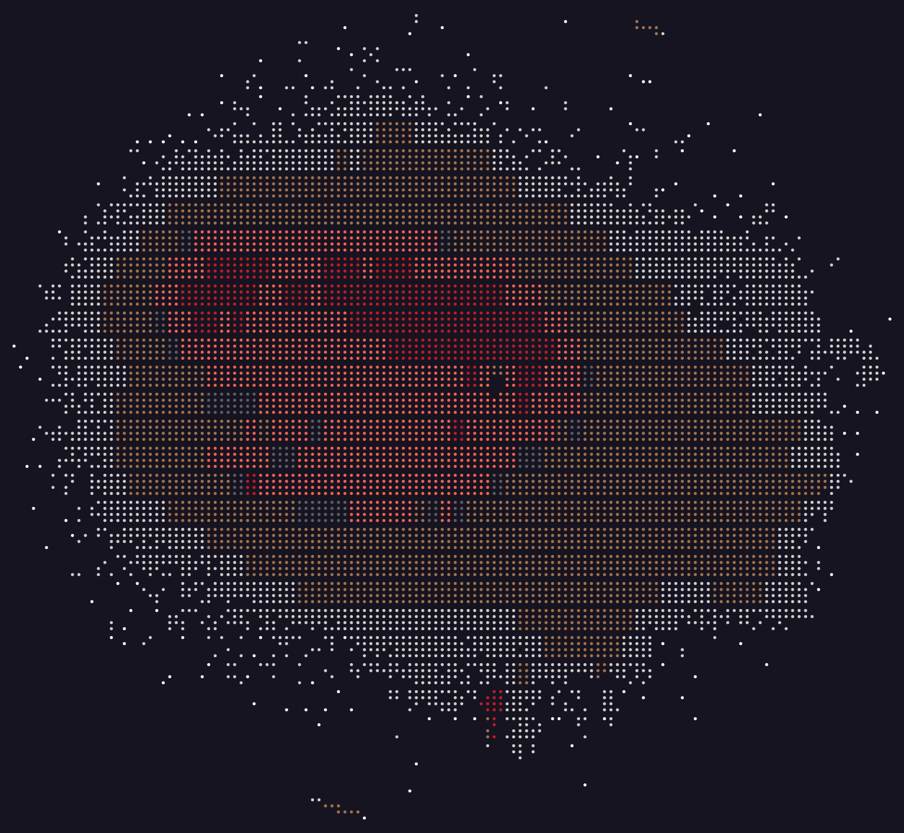
</p>

Just set your `COLORTERM` env variable to match the capabilities of your terminal.

This usually happens over `ssh` or when using `screen` or `tmux`.

## How to save the visualizations

*Copying them as text*

The visualizations produced by `xan` remain drawn using characters. This means you can very well copy them as text and paste them elsewhere.

Just keep in mind that they must be displayed with a monospace font (else the layout will be garbage), and that some characters, notably those used by `xan spark` (`▁▂▃▄▅▆▇`), might not render correctly everywhere. It really depends on the font used to draw them (macOS builtin terminal's default font is notoriously bad at this, for instance).

You will also need to forfeit colors since only terminals usually know how to render ANSI escape codes. This means that some commands have a less portable output. `xan heatmap` relies heavily on background color, for instance, as well as some modes of `xan spark` & `xan plot`.

*Manual screenshots*

Doing manual screenshots of your terminal is a valid solution. It might not work very well however if the dataviz is higher than a single screen. In which case you should really check out the next solution.

*ansi2png-rs*

I maintain a [fork](https://github.com/Yomguithereal/ansi2png-rs) of a nifty CLI tool made by [@AlexanderThaller](https://github.com/AlexanderThaller) and named [`ansi2png-rs`](https://github.com/AlexanderThaller/ansi2png-rs).

You can install it likewise for the time being:

```bash
cargo install --git https://github.com/yomguithereal/ansi2png-rs --locked --branch more
```

I used it to render most of this guide's screenshots (you can read my script over [there](./img/dataviz/generate-screenshots.sh)). You can use it thusly:

```bash
xan plot x y layout.csv --color=always | ansi2png-rs -o screen.png
```

Don't forget to use `--color=always` to force the output to have ANSI colors (they are usually disabled when piping, by default), or to use the relevant env variables like `CLICOLOR_FORCE=1`. More details about this can be found [here](https://github.com/medialab/xan#regarding-color).

*The future*

I might add a builtin way to save produced datavisualizations as PNG rasters, in `xan` itself, using the library powering my fork of `ansi2png-rs`, but it might add too much cruft to the binary already weighing ~20MB (Rust executables are not easy to keep light as of yet, lol).

I might also add SVG outputs to most of the commands.

So stay tuned.

---

That's it for now :).

Congrats for reaching the end!

Signed: [xan](https://github.com/medialab/xan#readme), the CSV magician
