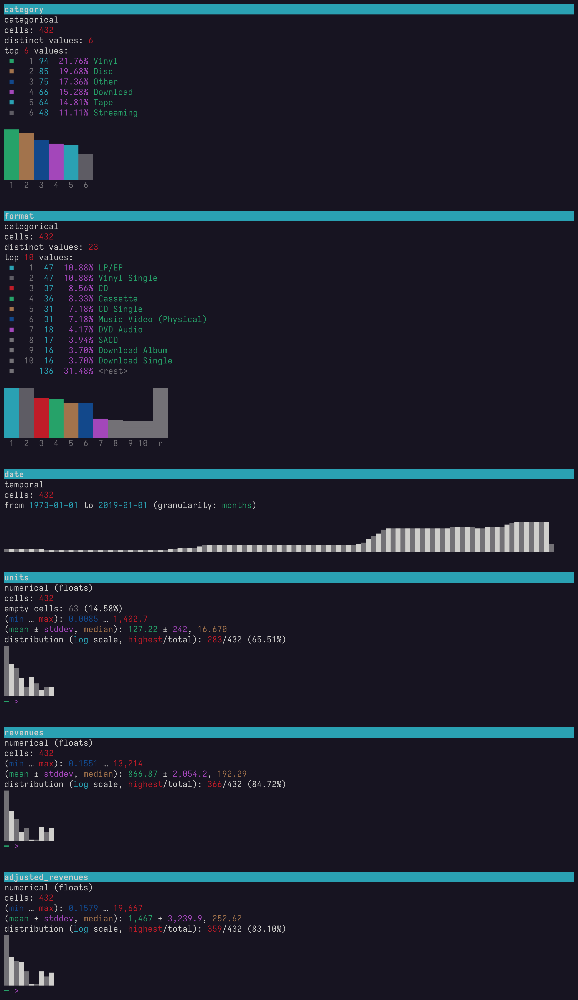

# Dataviz from the comfort of your terminal

<p align="center">
    
</p>

This document is a showcase & guide to data visualisation in the terminal using the [`xan`](https://github.com/medialab/xan) command line tool.

It is often overlooked because `xan` is first and foremost a very performant tabular data processing tool, but it can also render a large variety of typical data visualizations directly in your terminal. This ultimately means you never have to leave it to explore the data you mangle.

I say "comfort" and I mean it ;). `xan` will have processed and rendered your data in the terminal long before you are able to spin up your Jupyter instance and import `pandas` & `matplotlib`. No cruft. No distraction. Just raw insights. Like it's still 1970 and all you have is ASCII art, but with ✨colors✨ and Unicode ([braille](https://en.wikipedia.org/wiki/Braille_ASCII) characters are a godsend).

<!-- TODO: how to save -->
<!-- TODO: finish gif -->
<!-- TODO: layout gif -->
<!-- TODO: mention you can always zoom out -->

## Summary

- [Downloading the datasets used in this guide](#downloading-the-datasets-used-in-this-guide)
- [`xan view` to display tables](#xan-view-to-display-tables)
    - [Fitting the screen](#fitting-the-screen)
    - [Dealing with emojis](#dealing-with-emojis)
    - [Grouping rows](#grouping-rows)
    - [Customizing the view](#customizing-the-view)
- [`xan flatten` for close reading](#xan-flatten-for-close-reading)
    - [Customizing the flattening](#customizing-the-flattening)
    - [Highlighting](#highlighting)
    - [Splitting multivalued cells](#splitting-multivalued-cells)
- [`xan stats -R/--report` for automatic statistical reports](#xan-stats--r--report-for-automatic-statistical-reports)
- [`xan hist` for detailed bar plots](#xan-hist-for-detailed-bar-plots) (TODO)
    - [Frequency tables](#frequency-tables)
    - [Distributions](#distributions)
    - [Categorical bar plots](#categorical-bar-plots)
    - [Working with arbitrary inputs](#working-with-arbitrary-inputs)
    - [Working with dates](#working-with-dates)
- [`xan plot` for scatter plots, line plots and time series](#xan-plot-for-scatter-plots-line-plots-and-time-series) (TODO)
    - [Scatter plots](#scatter-plots)
    - [Line plots & time series](#line-plots--time-series)
    - [Density gradients](#density-gradients)
- [`xan heatmap` for heatmaps and conditional formatting](#xan-heatmap-for-heatmaps-and-conditional-formatting) (TODO)
- [`xan spark` for sparklines and aggregated bar plots](#xan-spark-for-sparklines-and-aggregated-bar-plots) (TODO)
- [`xan progress` for progress bars](#xan-progress-for-progress-bars)
- [How to save the visualizations](#how-to-save-the-visualizations)

## Downloading the datasets used in this guide

*series.csv*

Time series related from RIAA about music distribution formats in time and their associated gross revenues.

```bash
curl -LO https://github.com/medialab/xan/raw/refs/heads/master/docs/cookbook/resources/series.csv
```

*sotu.csv*

Retranscription of U.S. state of the union speeches across time (1790 to 2018):

```bash
curl -L https://github.com/BrianWeinstein/state-of-the-union/raw/refs/heads/master/transcripts.csv > sotu.csv
```

*medias.csv*

A curated corpus of French medias online.

```bash
curl -LO https://github.com/medialab/corpora/raw/master/polarisation/medias.csv
```

*iris.csv*

The fampus "Iris" dataset, used in a lot of machine learning examples.

```bash
curl -LO https://github.com/medialab/xan/raw/refs/heads/master/docs/cookbook/resources/iris.csv
```

*pulsar.csv*

Data from the pulsar plot of the following article:

> Radio Observations of the Pulse Profiles and Dispersion Measures of Twelve Pulsars by Harold D. Carft, Jr. 1970

famously used on the cover of Joy Division's "Unknown Pleasures" album.

```bash
curl -LO https://gist.githubusercontent.com/borgar/31c1e476b8e92a11d7e9/raw/0fae97dab6830ecee185a63c1cee0008f6778ff6/pulsar.csv
```

*layout.csv.gz*

x and y positions of a sample of accounts from a French defunct social network, as inferred by the ForceAltas2 layout algorithm.

```bash
curl -LO https://github.com/medialab/xan/raw/refs/heads/master/docs/cookbook/resources/layout.csv.gz
```

## `xan view` to display tables

[`xan view`](../cmd/view.md) is usually one of the first learned and most used commands of `xan` since it lets you take a glance at your CSV files directly in the terminal, using the very familiar tabular representation. You can thus forego using `LibreOffice` or (god forbids!) `Excel` and never ever have to leave the terminal again!

Here is how to use it:

```bash
xan view series.csv
```

<p align="center">
    
</p>

See how different data types are colored differently, like in a code editor, to help you figure things out? `xan view` knows how to recognize numbers, strings, time-related information, urls, null values and booleans.

If you fancy rainbows and are not much of a data type kind of person you can also use the `-R/--rainbow` flag to use alternating color per column instead:

```bash
xan view --rainbow series.csv
```

<p align="center">
    
</p>

### Fitting the screen

In `series.csv`, the data is quite concise, so it is easy to print all columns losslessly in the terminal. But see what happens when we use the command, in a small terminal, on `sotu.csv`, containing urls and full text for whole speeches:

```bash
xan view sotu.csv
```

<p align="center">
    
</p>

First, see how some values get truncated to fit on screen?

Then the command tells you we could only display 3 out of 5 columns, which is why there is a dummy column in the middle full of ellipsis `…` characters, lest we forget it. When space is tight, the `view` command will always try to print a mix of columns from the beginning and from the end.

Then, see how the first cell of the `transcript` column contains a highlighted leading newline character? The `view` command will highlight a lot of those patterns to easily spot irregularities about your data, such as empty cells (displayed as a greyed out `<empty>`), leading/trailing whitespace etc.

Finally, see how last row is also a dummy one full of ellipsis `…` characters? That's because `xan view`, like most `xan` commands, follow a streaming approach and only displays the first rows of your data by default (my screenshots use 10, but the command's default is 100).

The command works thusly because you usually don't need to consume all rows of a file to be able to preview it efficiently and because, as a human, you won't be able to read more than some hundreds of rows by yourself anyway ;).

What's more `xan view` is usually the last step of a complex `xan pipeline` yielding a stream you should not need to consume entirely to make sure it spits out the required data, which is the reason why you used `xan view` in the first place instead of piping the result to a file.

*Printing more rows*

If you want more or less rows on screen, you can always use the `-l/--limit` flag. Or you can also use the `-A/--all` flag to print everything if you feel like you can take it.

*Printing more columns*

However this only takes care of the rows not being printed, not the columns. For this particular problem, people usually rely on pagers such as `less` or `more`:

```bash
xan view --expand --color=always file.csv | less -SR
```

But the above command is quite a mouthful and (if you are not on legacy Windows shell) you can also use the `-p/--pager` flag that will do the same:

```bash
xan view -p file.csv
```

### Dealing with emojis

Funnily enough, there is no way to predict, even when using a monospace font (which is customary in a terminal), the width an emoji will take on screen once rendered.

This is unfortunate because terminal rendering is character-based and layout computations work by knowing what width a character will have on screen (yes some characters can span 2 columns or sometimes do not appear on screen at all).

So if you spot this kind of artifacts when using `xan view`:

<p align="center">
    
</p>

Just use the `-E/--sanitize-emojis` flag to print their shortcodes instead:

```bash
xan view -E data-with-emojis.csv
```

<p align="center">
    
</p>

### Grouping rows

Sometimes, you might want to group rows visually based on the value of some of their columns. You can do so with `xan v -g/--groupby` thusly:

```bash
xan sample 3 -g category series.csv | \
xan view -A -g category
```

<p align="center">
    
</p>

### Customizing the view

If you call `xan view --help` you will see that the command offers a lot of customization options (some of which you can set as default through the `XAN_VIEW_ARGS` env variable).

For instance, let's hide headers, the index colum, the info text, and force numbers to be formatted using a maximum of 5 significant numbers:

```bash
xan view -S 5 --hide-index --hide-headers --hide-info series.csv
```

<p align="center">
    
</p>

The command even offers a variety of different "themes" that can be used to stylize the table:

```bash
# -M stands for --hide-info & -I for --hide-index
xan view -MI --theme borderless series.csv
```

<p align="center">
    
</p>

Or even:

```bash
xan view -MI --theme striped series.csv
```

<p align="center">
    
</p>

Now, the tabular view is a staple for a reason, but it becomes somewhat limited when your file has many columns or if cell values are very long, for instance if they contain full text.

Fortunately `xan` has another command catering to those use-cases, so you can easily read the full contents of a CSV row: `flatten`.

## `xan flatten` for close reading

`xan flatten` is a command that lets you read full row data more comfortably than `xan view` by "flattening" the representation. That is to say we will let each column take at least one line so the full content of their cells can be read:

```
xan flatten series.csv
```

<p align="center">
    
</p>

Notice how values are colored by type like when using `xan view`.

You can also pick one color per column instead, using the `-R/--rainbow` flag. This can make it easier to scan values of a same columns across rows sometimes.

```
xan flatten -R series.csv
```

<p align="center">
    
</p>

### Customizing the flattening

Now this is fine when your cell don't contain too much information, but sometimes they might contain long texts.

Consider this example where we attempt to display sentences from president Obama speeches contained in `sotu.csv` (we are going to use `xan tokenize` to break the speeches into sentences):

```bash
xan search -s president Obama sotu.csv | \
xan tokenize sentences transcript | \
xan flatten
```

<p align="center">
    
</p>

This is fine, but you might want to tidy the way long texts are printed.

The first thing you can do is to truncate any text longer than what your terminal can fit in a single line, using the `-c/--condense` flag:

```bash
xan search -s president Obama sotu.csv | \
xan tokenize sentences transcript | \
xan flatten -c
```

<p align="center">
    
</p>

Another thing you can do is to wrap long lines so that they keep to the right of the column nice harmoniously using the `-w/--wrap` flag:

```bash
xan search -s president Obama sotu.csv | \
xan tokenize sentences transcript | \
xan flatten -w
```

<p align="center">
    
</p>

Note that you will lose the ability to easily copy text such as long urls etc. when using the `-w/--wrap` flag, though.

Finally, you can flatten the representation even more and have the column name take one line and the value subsquent lines after it with the `-F/--flatter` flag:

```bash
xan search -s president Obama sotu.csv | \
xan tokenize sentences transcript | \
xan flatten -F
```

<p align="center">
    
</p>

### Splitting multivalued cells

If you check the `medias.csv` file, you will quickly notice that some columns contain multiple values, separated by a pipe (`|`) character, like `prefixes` or `start_pages`. This is a very common thing to do, and here is an example of what you might find in the `prefixes` column:

```txt
https://kulturegeek.fr/|http://kulturegeek.fr/|https://www.kulturegeek.fr/|http://www.kulturegeek.fr/|https://www.facebook.com/KultureGeek.fr|https://kulturegeek.fr|https://www.instagram.com/degeekageeks/
```

Now you might want to read a list of those values more comfortably and `xan flatten` offers a `-S/--split` flag taking a selection of columns to "split" further:

```bash
# I use `xan flatten -N/--non-empty` to avoid displaying empty columns
xan flatten -N --split prefixes medias.csv
```

<p align="center">
    
</p>

By default, the command will split multivalued cells by `|` but you can always provide a custom separator to the `--sep` flag instead.

### Highlighting

Sometimes, it can be nice to highlight substrings matching some pattern. `xan flatten` lets you do so through a regex given to the `-H/--highlight` flag. Matches can also be case-insensitive if you give the `-i/--ignore-case` flag.

Let's search for sentences containing the "conspicuous" word in our speeches:

```bash
xan tokenize sentences transcript sotu.csv | \
xan search -s sentence -i conspicuous | \
xan flatten -F -iH conspicuous
```

<p align="center">
    
</p>

## `xan stats -R/--report` for automatic statistical reports

`xan` has a `stats` command that can easily compute descriptive statistics about all or a selection of columns of your CSV file.

The result of the command is another CSV file, so people would usually feed to `xan flatten` for better readability:

```bash
# Some columns in the output correspond to numerical vs. text columns
# so people use the -N/--non-empty flag of flatten to hide irrelevant information
xan stats series.csv | xan flatten -N --row-separator " "
```

<p align="center">
    
</p>

But since this was a prominent use-case and since it would be nice to have inline dataviz such as bar charts, time series and distributions, the command gained a `-R/--report` flag to do just that:

```bash
xan stats -R series.csv
```

<p align="center">
    
</p>

## `xan hist` for detailed bar plots

`xan hist` is a command able to print "detailed" bar plots. I say "detailed" as opposed to [`xan spark`](#xan-spark-for-sparklines-and-aggregated-bar-plots), that can print less detailed bar plots, but more suitable for facet grids & small multiples.

One other difference is that `xan hist` prints horizontal bar plots while `xan spark` prints vertical ones.

### Frequency tables

The first use-case of `xan hist` people usually learn is to pretty-print the result of a `xan freq` call.

Indeed, being a CSV table itself, the output of `xan freq` is not very readable as-is:

```bash
xan freq -s category series.csv
```

```txt
field,value,count
category,Vinyl,94
category,Disc,85
category,Other,75
category,Download,66
category,Tape,64
category,Streaming,48
```

You can always pipe it to `xan view` to read it, but there is a better way:

```bash
xan freq -s category series.csv | xan hist
```

<p align="center">
    
</p>

You can choose to have larger and more precise bars using the `-B/--bar-size` flag, but they will be less readable without color support (when copy pasting, for instance):

```bash
xan freq -s category series.csv | xan hist -B large
```

<p align="center">
    
</p>

And as always, you can use the `-R/--rainbow` flag to add some welcome color to your bars:

```bash
xan freq -s category series.csv | xan hist -R
```

<p align="center">
    
</p>

Finally, `xan hist` is perfectly able to print multiple bar plots at once. This is fortunate because `xan freq` can output multiple frequency tables in one pass like so:

```bash
xan freq -s category,format series.csv | xan hist
```

<p align="center">
    
</p>

### Distributions

<!-- TODO: bins, --scale, mention xan spark -D & xan stats -R -->

### Categorical bar plots

`xan hist` is also able to print "categorical" bar plots using the `-c/--category` flag. Here is an example where I print a bar plot of the frequency of values found in the "wheel_category" column of the `medias.csv` file, broken down by the values of the "edito" column:

```bash
xan freq -N -g edito -s wheel_category medias.csv | \
xan hist -c edito
```

<p align="center">
    
</p>

A color was picked for each value of the "edito" column so we can color the related bars accordingly.

You can also sort the output of `xan freq` differently to reorder the bars on screen:

```bash
xan freq -N -g edito -s wheel_category medias.csv | \
xan sort -s value | \
xan hist -c edito
```

<p align="center">
    
</p>

See how consecutive bars with a same label were reduced to a single label for better readability.

### Working with arbitrary inputs

<!-- TODO -->

### Working with dates

Sometimes you might want to print a temporal bar plot, aligned on dates. For instance, given the `medias.csv` file that has a `foundation_year` column, you could use the `-D/--dates` flag so that the command automatically sort the values chronologically and completes the data by adding missing years:

```bash
# -A to output all values, not just top 10, and -N to avoid counting empty cells
xan freq -AN -s foundation_year medias.csv | xan hist -D
```

<p align="center">
    
</p>

See here how the 1983 year was added even so it is never found in the original data?

Also, note that the fact that the `-D/--dates` flag will complete missing values for you might introduce a number of large gaps in the representation. If you want to avoid scrolling too much, you can also ask the command to compress gaps as soon as they span a number of bars given to the `-G/--compress-gaps` flag:

```bash
xan freq -AN -s foundation_year medias.csv | xan hist -D -G 2
```

<p align="center">
    
</p>

Note that both my screenshots show a filtered version of the data so I can get my point across. You will have different results if you run the commands as-is.

This is it for `xan hist`. Now if you want to have vertical bar plots, you have 2 solutions:

1. rotate your screen ;)
2. check out the section about [`xan spark`](#xan-spark-for-sparklines-and-aggregated-bar-plots)

## `xan plot` for scatter plots, line plots and time series

`xan plot` can be used for detailed 2 dimensional plotting: scatter plots, line plots & time series.

### Scatter plots

To display a scatter plot, you just need to pass two numerical columns as `<x>` and `<y>` to the command.

```bash
# Here I am using the dot marker instead of default braille because
# we have enough terminal real estate in this case
xan plot sepal_length petal_width --marker dot iris.csv
```

<p align="center">
    
</p>

You can draw a grid aligned with x & y axis ticks if needed using the `-G/--grid` flag:

```bash
xan plot sepal_length petal_width --marker dot -G iris.csv
```

<p align="center">
    
</p>


<!-- TODO: ys, -c, small multiples, correlation and -R with tokenize -->

### Line plots & time series

<!-- TODO: --count, small multiples, different arrangements -->

### Density gradients

<!-- TODO -->

## `xan heatmap` for heatmaps and conditional formatting

## `xan spark` for sparklines and aggregated bar plots

<!-- TODO: joydiv -->

## `xan progress` for progress bars

When performing heavy processing, it can be nice to have a progress bar. Fortunately this is what `xan progress` proposes. It reads a CSV stream, prints a progress bar in stderr, and forward CSV data to stdout so you can pipe it into something else. This means it can be placed anywhere in a pipeline (even if it is usually better to place it at the beginning, rather than at the end), and works thanks to the magic of unix pipes backpressure.

For instance, let's say you need to read files whose paths are contained in a CSV file, to make sure they contain the occurrence of some keyword. This might take a while, so first wrap beforementioed CSV file using `xan progress` like so:

```bash
xan progress paths.csv | \
xan filter '"authenticated" not in read(path)' > errors.csv
```

Here is how it could look like:

<p align="center">
    
</p>

You can add a title to the progress bar using the `--title` flag:

```bash
xan progress --title "Processing tweets" tweets.csv
```

<p align="center">
    
</p>


Now, unless the input file is very small, `xan progress` cannot know its number of rows beforehand because it would either need to read the file twice or buffer it in memory which is against the philosophy of a stream-oriented tool.

This said, if you happen to know the total number of rows beforehand (you can always use `xan count` for this, by the way), you can give it to the command using the `--total` flag and have a more helpful progress bar:

```bash
xan progress --total 1000000 tweets.csv
```

<p align="center">
    
</p>

Another solution is also to have the progress bar work on the number of parallel read from input file instead of CSV rows, using the `-B/--bytes`. What's more, it is usually faster because we don't have to parse CSV rows to do so:


```bash
xan progress -B tweets.csv
```

<p align="center">
    
</p>

Finally, know that some other commands might expose a `--progress` flag when they need to print more granular information than what the `xan progress` command is able to provide.

This is for instance the case of the `xan parallel` command, working on multiple files of file chunks in parallel:

```bash
xan parallel count data/**/ocr.csv.gz --progress
```

<p align="center">
    
</p>

<!-- TODO: troubleshooting with COLORTERM -->

## How to save the visualizations

*Copying them*

The dataviz produced by `xan` remain drawn using characters. This means you can very well copy them as text and paste them elsewhere.

Just keep in mind that they must be displayed somewhere with a monospace font (else the layout will be garbage), and that some characters, notably those used by `xan spark` (`▁▂▃▄▅▆▇`), might not render correctly everywhere. It really depends on the font used to draw them.

You will also need to forfeit colors, of course, since only the terminal usually knows how to render ANSI escape codes. This means that some commands have a less portable output. `xan heatmap` relies heavily on background color, for instance, as well as some modes of `xan spark` & `xan plot`.

*Manual screenshots*

Doing manual screenshots of your terminal is a valid solution. It might not work very well however if the dataviz is higher than a single screen. In which case you should really check out the next solution.

*ansi2png-rs*

<!-- example of usage To pro

https://github.com/Yomguithereal/ansi2png-rs

--color=always or CLICOLOR_FORCE=1

https://github.com/medialab/xan#regarding-color -->

*The future*

I might add a builtin way to save produced datavisualizations as PNG rasters in `xan` itself, using the library powering my fork of `ansi2png-rs`, but it might add too much cruft to the binary already weighing ~20MB (Rust executables are not easy to keep light as of yet, lol).

---

That's it for now :).

Congrats for reaching the end!

Signed: [xan](https://github.com/medialab/xan#readme), the CSV magician
