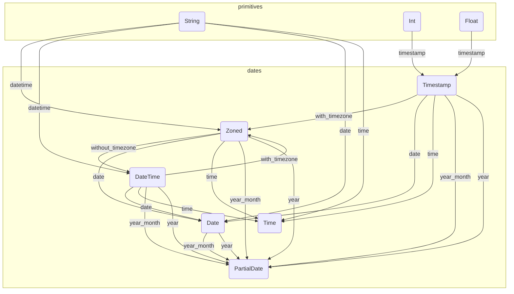

# Dates Overhaul

*Related discussion*

* [Issue #479](https://github.com/medialab/xan/issues/479)
* [PR #893](https://github.com/medialab/xan/pull/893)

## Splitting `DynamicValue::DateTime` into multiple types

* `Zoned`: a fully-fledged datetime along with its timezone information (`jiff` counterpart: [`Zoned`](https://docs.rs/jiff/latest/jiff/struct.Zoned.html))
* `DateTime`: a datetime without timezone information (`jiff` counterpart: [`civil::DateTime`](https://docs.rs/jiff/latest/jiff/civil/struct.DateTime.html))
* `Timestamp` (maybe): a timestamp type, probably for performance & memory usage because we could also rely on a UTC `Zoned` directly instead (`jiff` counterpart: [`Timestamp`](https://docs.rs/jiff/latest/jiff/struct.Timestamp.html))
* `Date`: a simple date (`jiff` counterpart: [`civil::Date`](https://docs.rs/jiff/latest/jiff/civil/struct.Date.html))
* `Time` (maybe): just a simple time. Good to have (see [#868](https://github.com/medialab/xan/issues/868)), but not high-priority (`jiff` counterpart: [`civil::Time`](https://docs.rs/jiff/latest/jiff/civil/struct.Time.html))
* `PartialDate`: a date without day, or just a year. Could be useful but not high-priority neither (has no `jiff` counterpart but a basic implementation already exists [here](https://github.com/medialab/xan/blob/master/src/dates.rs#L10) and is used by `xan complete` and `xan hist -D`)
* `Span`: a fully-fledge span type that can be used for date arithmetics etc. (`jiff` counterpart: [`Span`](https://docs.rs/jiff/latest/jiff/struct.Span.html)). We probably need a `DynamicValue` variant here to make sure we don't pay the cost of parsing each row. We could also forego this issue using static evaluation instead and hide it to users (the same could be done with timezones). Do we need a `SignedDuration` also?

*A non-exhaustive flowchart*



## Design decisions

We should keep some things implicit not to bother users too much and avoid friction. For instance, the `datetime` function will actually return a `Zoned` or a `DateTime` based on what is actually encountered. But expressions will yell at you if you mix both types or if called function is not consistent with a given type. This should be okay because people usually don't have columns containing mixed types of datetime granularity (zoned or not), and if they do we want to make sure they don't footgun themselves. This also means parsing "civil" datetime columns will not end up being serialized as fully-fledged "zoned" datetimes, which was a nuisance.

## Parsing/creating

* `datetime(string, format?)`: attempts to parse given string either as a `Zoned` or a `DateTime`. An optional strptime format can be given to parse unconventional formats. (Using `jiff` we need to attempt to parse as a `Zoned`, then a `civil::DateTime`, unless an integrated method exists to perform this in a single parsing pass: see [`DateTimeParser`](https://docs.rs/jiff/latest/jiff/fmt/temporal/struct.DateTimeParser.html)).
* `local_datetime(string, format?)`: same as above but if value is `DateTime`, will lift it as `Zoned` in local timezone. If value is `Zoned`, will convert it to local timezone.
* `date(string, format?)`: attempts to parse given string as a `Date`. An optional strptime format can be given to parse unconventional formats.
* `date(zoned_or_datetime)`: polymorphism allowing to convert a `Zoned` or a `DateTime` into a `Date`.
* `time(string, format?)`: attempts to parse given string as a `Time`. An optional strptime format can be given to parse unconventional formats.
* `time(zoned_or_datetime)`: polymorphism allowing to convert a `Zoned` or a `DateTime` into a `Time`.
* `now()`: returns current `DateTime` (not zoned!).
* `local_now()`: returns current `Zoned` (using local timezone).
* `today()`: returns current `Date`.
*  `current_time`: returns current `Time`.

## Timestamps

Timestamps can be considered as an optimized version of a `Zoned` where it is implied that the timezone is `UTC`.

* `timestamp(number)`: parse a seconds-int or seconds-float timestamp with relevant precision.
* `timestamp_ms(number)`: parse a milliseconds-int timestamp.

## Timezone conversion

* `without_timezone()`: converts a `Zoned` into a `DateTime`. No-op if given a `DateTime` to allow dealing with mixed types in a column easily.
* `with_timezone(timezone)`: if given a `Zoned`, will convert to the desired timezone. If given a `DateTime`, it will lift the datetime as a `Zoned` with given timezone.
* `with_local_timezone()`: same as above but using the user's local timezone.

## Serialization & formatting

*Serialization*

* `Zoned` => `2024-11-03T01:30:00-04:00[America/New_York]`
* `DateTime` => `2024-11-03T01:30:00-04:00`
* `Date` => `2024-11-03`
* `PartialDate` => `2024-11`
* `Time` => `01:30:00`
* `Span` => `P5DT8H1M`
* `Timestamp` => `1774271535` or `1774271535.073453` depending on the precision of the timestamp (as an int or float)

*Functions*

* `year_month()`: converts any relevant target into a month `PartialDate`
* `year()`: converts any relevant target into a year `PartialDate`
* `strftime(format)`: formats any relevant target using given format
* `month_day()`: this cannot produce a relevant `PartialDate` so it will be a shorthand for formatting.

## Decisions to make

* Should `local_datetime` convert the timezone of a `Zoned` or yell instead?
* Should `without_timezone` be a no-op with `DateTime`?
* Usage of `with` seems to enable `without` and make clear that it can be used with both `Zoned` & `DateTime` but sometimes it feels `to` or `into` would be clearer? I dunno... We can also split into `with_timezone` to indicate `DateTime` to `Zoned` and `to_timezone` to convert from `Zoned` to `Zoned`. Might be tedious to understand? Might also avoid the footgun of implicitly assigning a timezone to your `DateTime`?

## Examples

```js
// Serializing a timestamp as a datetime
column.timestamp().datetime()
```

*Some examples from the cookbook, updated*

```bash
# Formatting as year_month (does not change)
xan map 'local_time.ym() as formatted_time' dates.csv | xan view

# Frequency of days (ymd, would actually become a alias to `date`)
xan map 'local_time.ymd() as year_month_day' dates.csv | xan freq -s year_month_day | xan view

# Parsing unconventional format (does not change, but output would remain
# as "civil" datetime instead of gaining local timezone)
xan map 'initial_date.datetime("%d/%m/%y") as parsed_date' strange_dates.csv | xan v

# strftime example does not change
xan map 'initial_date.datetime("%d/%m/%y").strftime("%A") as day_of_week' strange_dates.csv | xan v

# The timezone conversion example changes
xan transform local_time 'local_time.datetime().with_timezone("Europe/Paris")' --rename paris_time july_data.csv | xan v

# `to_local_timezone` disappears
# Here is the example if we need to indicate that parsed "civil" datetime are
# actually to be considered from "Europe/Paris" then converted to our local
# timezone
xan transform local_time 'local_time.datetime().with_timezone("Europe/Paris").with_local_timezone()' --rename mexico_time july_data.csv | xan v
```