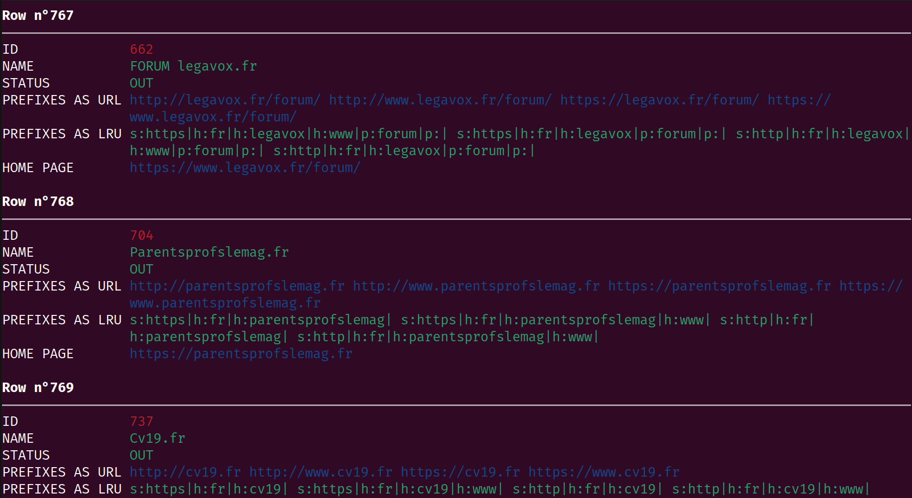

# Xan Gazette: February 2024 Edition

<p align="center">
  
</p>

First things first: our fork of `xsv` is now officially named `xan` and is published on [crates.io](https://crates.io/) as a fully-fledged `rust` crate.

This means installing our fork is now as simple as:

```bash
cargo install xan
```

This also mean we will need to rewire our muscle memory to type `xan` or add a fancy bash alias.

Also, the expression language used by the CLI has also changed name from `xan` to `moonblade` which is Xan's fire sword from Baldur's Gate. So emo!


The tagline of `xan` will be a dorky `Xan, the CSV magician` and will be described as:

> The most overengineered piece of code ever written to process CSV data.

## Summary

* [Sleeker flatten command](#sleeker-flatten-command)
* [Using pest to define moonblade grammar](#using-pest-to-define-moonblade-grammar)
* [Changing moonblade semantics regarding column indexing](#changing-moonblade-semantics-regarding-column-indexing)
* [Zero-based selection](#zero-based-selection)
* [No more trimming](#no-more-trimming)
* [Infix operators for moonblade](#infix-operators-for-moonblade)
* [The agg and groupby commands](#the-agg-and-groupby-commands)
* [First class moonblade literal expression](#first-class-moonblade-literal-expression)
* [New moonblade functions](#new-moonblade-functions)
* [Variadic moonblade functions](#variadic-moonblade-functions)
* [cat row --input](#cat---input)
* [search --input](#search---input)
* [join --regex](#join---regex)
* [The rename command](#the-rename-command)
* [Swapping transform arguments](#swapping-transform-arguments)
* [Various fixes & improvements](#various-fixes--improvements)
* [Dropped commands](#dropped-commands)
* [Parallelization flags harmonization](#parallelization-flags-harmonization)

### Sleeker flatten command

The `flatten` command has been redesigned to match the visuals of the `view` command:



### Using pest to define moonblade grammar

Before this `xan` release, `moonblade` expressions were parsed using the [`nom`](https://docs.rs/nom/latest/nom/) rust library.

It was fine and was a good way to learn about parser combinators, but I found easier to switch to [`pest`](https://pest.rs/) (a [PEG](https://en.wikipedia.org/wiki/Parsing_expression_grammar)-based library) to implement [infix operators](#infix-operators-for-moonblade).

The `moonblade` expression language now has a fully-fledged grammar that anyone can read [here](https://github.com/medialab/xan/blob/master/src/moonblade/grammar.pest).

It will also be easier to extend if we want to add fancy stuff later on (I am looking at you, marvelous F# pipe operator goodness), or if @bmaz wants to add `datetime` literals, who knows?

### Changing moonblade semantics regarding column indexing

Unescaped column identifiers cannot use spaces anymore. It was putting too much pressure on the implementation and was preventing `moonblade` from going forward. This means you cannot write `trim(NOM DU CANDIDAT)` anymore.

But somehow, this is karmic justice at work here, as you should not use spaces in identifiers that will be used in programming-adjacent endeavors (👀: looking at you, Hyphe CSV export).

What's more, there is no more `row["name", 1]` clunky parser exception. Now column indexing for names that must be escaped, or for zero-based access, or for duplicate column access must use the `col` function likewise:

```js
// Simple identifier
trim(name)

// Zero-based access
col(3)

// Name that must be escaped
col("NOM DU CANDIDAT")

// Duplicate headers
col("name", 2)
```

*Implementation details*

When the arguments of the `col` function are statically analyzable (e.g. when they are string literals or integer literals), the function "disappear" when the expression is parsed and are immediately replaced by the index of the corresponding column as per a CSV file's headers.

This also mean that column indexing **can** be dynamic if needed, e.g. if the name of the column to access is to be given by another column's value:

```js
col(column_containing_relevant_count) * 10
```

But this looks crazy. Who would do that? Huh?

### Zero-based selection

The selection DSL has been updated to accept 0-based indices instead of 1-based ones, so that we remain consistent across the tool.

```bash
# Used to select the first column:
xsv select 1
# Now you must do:
xsv select 0
```

This also means the `headers` command will now report column indices in 0-based fashion.

### No more trimming

This was not entirely documented but `xsv` used to trim cell values when using the `join` or `frequency` command. This can be useful sometimes but:

1. it has a slight performance cost,
2. it can be devious when dealing with messy data and you want to investigate clerical errors.

From now on, no trimming will ever be done implicitly for you. What's more, you can always trim values explicitly using `transform` or `map` anyway:

```bash
xsv transform name trim file.csv
```

### Infix operators for moonblade

I blame @robindemourat & @boogheta for this (they don't seem to like [Polish notation](https://en.wikipedia.org/wiki/Polish_notation)).

This means the `moonblade` expression language now has infix operators.

```js
add(A, B)
// becomes
A + B
// wow. incredible.
(A + B) / ((C && D || (1 + C)) ** 2 / 4)
// no, no, make it stop.
```

Infix operators are well known and this should make `moonblade` expressions more familiar and easier to read & write.

I just did not do it at the time because it is actually hard to do, who could have guessed (everything touched by humans is cursed and should be avoided IMO)? Parsing Polish notation is very easy in comparison.

I therefore had to implement an [operator-precedence parser](https://en.wikipedia.org/wiki/Operator-precedence_parser) and this was a nightmarish endeavor (for the record, `moonblade` currently uses what is called "Pratt parsing" to solve operator precedence and infix notation so that they can be converted back to Polish notation). Then `moonblade` uses a typical tree-walking interpreter to evaluate expressions given by users.

Here is the list of operators currently implemented:

```md
### Unary operators

    !x - boolean negation
    -x - numerical negation,

### Numerical comparison

Warning: those operators will always consider operands as numbers and will
try to cast them around as such. For string/sequence comparison, use the
operators in the next section.

    x == y - numerical equality
    x != y - numerical inequality
    x <  y - numerical less than
    x <= y - numerical less than or equal
    x >  y - numerical greater than
    x >= y - numerical greater than or equal

### String/sequence comparison

Warning: those operators will always consider operands as strings or
sequences and will try to cast them around as such. For numerical comparison,
use the operators in the previous section.

    x eq y - string equality
    x ne y - string inequality
    x lt y - string less than
    x le y - string less than or equal
    x gt y - string greater than
    x ge y - string greater than or equal

### Arithmetic operators

    x + y  - numerical addition
    x - y  - numerical subtraction
    x * y  - numerical multiplication
    x / y  - numerical division
    x % y  - numerical remainder

    x // y - numerical integer division
    x ** y - numerical exponentiation

## String operators

    x . y - string concatenation

## Logical operators

    x &&  y - logical and
    x and y
    x ||  y - logical or
    x or  y

    x in y
    x not in y
```

*Some design notes*

Since CSV values are represented as strings (before you parse them, because you might want them as numbers, for instance) I chose to design `moonblade` operators to distinguish between numerical values and strings.

Else you would need to force users to explicitly parse values into numbers before being able to do anything with them and this felt tedious.

```js
// This means you can do:
x == y
// Instead of:
int(x) == int(y)
// But this also mean you need to do:
x eq y
// if you want to compare strings
```

`moonblade` operator design is therefore very close to `perl`, in that you have two distinct operators for equality (`==` for numbers and `eq` for strings/sequences), for instance.

You also have two different operators for addition (`+`) and string concatenation (`.`).

### The `agg` and `groupby` commands

After `map`, `filter`, `flatmap` & `transform`, `xan` introduces 2 new commands relying on `moonblade` expressions:

1. the `agg` command, able to run an aggregation over a whole CSV file
2. the `groupby` command, able to run similar aggregations over groups of rows of a CSV files, defined by having a same value in a specific column.

In a sense, `agg` is a generic version of the `stats` command, whereas `groupby` is a generic version of the `frequency` command.

They both rely on evaluating aggregation expressions very reminiscent of SQL `GROUP BY` clauses and aggregation functions.

You can, for instance, compute the sum of a column:

```bash
xan agg 'sum(retweet_count)' file.csv
```

You can use dynamic expressions to mangle the data before aggregating it:

```bash
xan agg 'sum(retweet_count + replies_count)' file.csv
```

You can perform multiple aggregations at once:

```bash
xan agg 'sum(retweet_count), mean(retweet_count), max(replies_count)' file.csv
```

You can rename the output columns using the 'as' syntax:

```bash
xan agg 'sum(n) as sum, max(replies_count) as "Max Replies"' file.csv
```

And then using the `groupby` command is just a matter of indicating a column that will be used to group rows:

```bash
xan groupby thread_id 'count() as tweets_per_thread' file.csv
```

Here is the list of currently supported aggregation functions:

* `all`
* `any`
* `cardinality`
* `count`
* `first`
* `last`
* `lex_first`
* `lex_last`
* `max`
* `min`
* `mean` (`avg`)
* `median`
* `median_high`
* `median_low`
* `mode`
* `stddev` (`stddev_pop`)
* `stddev_sample`
* `sum`
* `var` (`var_pop`)
* `var_sample`

*Design notes*

Once again, since CSV values are represented as strings (before you parse them, because you might want them as numbers, for instance), I had to make some design choices that are different from the ones SQL implementation usually make.

What I mean is that in SQL databases, we know the type of the variables stored by the columns, which means you don't have to have distinct aggregation function for the min & max of numerical columns or string columns.

But with CSV data, what do you mean when you ask for the minimum of a column that can contain numbers and/or strings? Do you want the minimum numerical value? Do you want to fallback to the first string in lexicographic order as soon as we encounter some value that cannot be parsed as a number?

I chose to be explicit, which is why you get both a `min/max` function and a `lex_first/lex_last` which both encompass a choice about the way you want to consider processed values.

*About groupby optimizations*

I took great lengths to make sure the `groupby` command can be as fast as possible:

First of all, aggregations are batched by expression key. This means that:

```js
min(count + age) as min, sum(count + age) as sum
```

will never need to evaluate the `count + age` part more than once since we can guarantee it will produce the same result.

Then, for instance, asking for both variance and mean will never cost more than just asking for just one of them since their requirements in terms of memory and computations are the same.

Finally know that the command has a `-S/--sorted` flag that requires only constant memory (as opposed to linear in the number of groups), if you know the file is already sorted on the group column.

### First class moonblade literal expression

Before, it was not possible for a `moonblade` expression to return a literal or an identifier.

This is now a thing of the past.

```js
// Examples of invalid expressions of the past:
col_name
true
45
67.8

// They had to be wrapped in the `val` function:
val(col_name)
val(true)
val(45)
val(67.8)
```

This means that copying a column is now as easy as:

```bash
xan map name name_copy file.csv
# Instead of the arcane:
xan map 'val(name)' name_copy file.csv
```

### New moonblade functions

*`count` now accepts regex patterns*

```js
count(text, /mr\.\b/i)
```

*`filesize` gives you the size of a file at some path in bytes*

```js
filesize(path)
```

*`neg` gives you numerical negation*

```js
neg(x) == -x
// Same as:
-x
```

*`fmt` lets you format strings easily*

```js
fmt("{} {}, age: {}", name, surname, age)
```

*`log` gives you natural logarithms*

```js
log(occurrences)
```

*`pow` gives you exponentiation*

```js
pow(count, 2)
// Same as:
count ** 2
```

*`mod` gives you remainder*

```js
mod(count, 2)
// Same as:
count % 2
```

*`escape_regex` lets you escape strings for regex*

```js
escape_regex("N.A.T.O.")
```

This is very useful to compose regex patterns using the `map` or `transform` command before feeding them to [`search --input`](#search---input) or [`join --regex`](#join---regex).

*`md5` lets you hash arbitrary strings*

```js
md5(read(path))
```

This can be used to pseudonymize a column, e.g.:

```bash
xsv transform name 'md5' file.csv > pseudonimyzed.csv
```

### Variadic moonblade functions

Some fitting `moonblade` functions have been made variadic. This means they will accept any number of arguments. This is the case for `add`, `and` , `or` etc.

This means you can now do:

```js
add(count1, count2, count3)
and(test1, test2, test3)
```

### `cat --input`

The `cat` command is variadic and accepts as many CSV files as you want. But in practice, people are sometimes more *meta*. That is to say they have a CSV file containing a list of paths to other CSV files that they want to concatenate.

This is now possible using the `--input` flag likewise:

```bash
xan cat rows file_path --input files.csv > rows.csv
```

*Dedicated to @robindemourat & @diegantobass*

### `search --input`

Sometimes you want to filter a file if the text of a column matches not one but multiples queries. Wouldn't it be convenient if you could provide a CSV file containing all the queries that could match to the `search` command directly?

You can now do exactly this using the `--input` flag.

Let's say we have this `people.csv` file:

| name    | Age |
|---------|-----|
| John    | 34  |
| Lisa    | 45  |
| Rupert  | 22  |
| Gwladys | 56  |

And we want to match lines where the name is either Lisa or Rupert.

You can then create the following file of queries aptly named `queries.csv`:

| query  |
|--------|
| lisa   |
| rupert |

And use the `search` command likewise:

```bash
# NOTE: we are using the -e flag because we want exact matches
# NOTE: we are using the -i flag because we don't care about case
xan search -ei query --input queries.csv -s name people.csv
```

Of course I know that, in this particular case, you could do so with a single regex but you see the point, don't you?

```bash
xan search -s name 'lisa|rupert' -i people.csv
```

*Efficient regex implementation*

When performing exact searches, this command of course uses hashmaps to find a match in constant time.

But things are more complex if you want to match a large bunch of regexes. So to be sure we don't have to linearly test every given regex pattern, we rely on [RegexSet](https://docs.rs/regex/latest/regex/struct.RegexSet.html) dark magic to be as fast as possible.

*Similarity to join*

In a sense `search --input` a specialization of an inner `join` command. But in this case, you are not interested in any column attached to your query file and you want to make sure the query file will be indexed and not the other way around.

*Dedicated to @bmaz*

### join --regex

This is a bit of a crazy idea but sometimes you might want to perform a variant of fuzzy matching referred to as a "regex join".

Basically you have a file whose columns must match a list of regex patterns contained in another file, along with some metadata.

For instance, consider this `tweets.csv` file:

| tweet_id | text                       |
|----------|----------------------------|
| 1        | Elisabeth mange des choux. |
| 2        | Wow incredible!            |
| 2        | What should I do Diego?    |
| 3        | ça fout les shoggoths      |

And this other `dnd.csv` file, containing some names and their preference regarding DnD editions (if you prefer 4th, there is something wrong with you I am sorry, I don't make the rules):

| name      | favorite_dnd |
|-----------|--------------|
| elisabeth | 4            |
| diego     | 3.5          |

Now let's say we want to join both files if some `name` from `dnd.csv` can be found in the `tweets.csv` `text` column.

This is what the `join --regex` command will let you achieve.

What's more, it **will** be more efficient than linearly testing all the patterns for each row of `tweets.csv` since we rely internally on [RegexSet](https://docs.rs/regex/latest/regex/struct.RegexSet.html) dark magic.

This is how it works:

```bash
# NOTE: using -i because the match is case-insensitive
xan join -i --regex text tweets.csv name dnd.csv
```

And you shall get the following result:

| tweet_id | text                       | name      | favorite_dnd |
|----------|----------------------------|-----------|--------------|
| 1        | Elisabeth mange des choux. | elisabeth | 4            |
| 2        | What should I do Diego?    | diego     | 3.5          |

You can even perform a left join thusly:

```bash
xan join -i --regex-left text tweets.csv name dnd.csv
```

And you will get:

| tweet_id | text                       | name      | favorite_dnd |
|----------|----------------------------|-----------|--------------|
| 1        | Elisabeth mange des choux. | elisabeth | 4            |
| 2        | Wow incredible!            |           |              |
| 2        | What should I do Diego?    | diego     | 3.5          |
| 3        | ça fout les shoggoths      |           |              |

*Dedicated to @AnnaCharles*

### The `rename` command

`xan` now has a command to rename the columns of a CSV file easily. You can rename everything, prefix everything, rename only selected columns and even add column names to a headless file.

Fun-fact: the renamed column must be passed in CSV format. This is sooooo meta. Lovin' it.

Renaming all columns:

```bash
xan rename NAME,SURNAME,AGE file.csv
```

Renaming a selection of columns:

```bash
xan rename NAME,SURNAME -s name,surname file.csv
xan rename NAME,SURNAME -s '0-1' file.csv
```

Adding a header to a headless file:

```bash
xan rename -n name,surname file.csv
```

Prefixing column names:

```bash
xan rename --prefix university_ file.csv
```

Column names with characters that need escaping:

```bash
xan rename 'NAME OF PERSON,"AGE, ""OF"" PERSON"' file.csv
```

### Swapping transform arguments

Initially, `transform` arguments were given in the same order as the `map` command:

```bash
xan transform 'slice(year, 0, 4)' year file.csv
```

But it does not fit the same affordances. With `map` you evaluate something to create a new column. With `transform` the first logical target is a column on which you apply an expression.

So now, you should write it thusly:

```bash
xan transform year 'slice(year, 0, 4)' file.csv
```

*Protip*

The expression evaluated by the `transform` command starts with the implicit value of the target column:

```bash
xan transform name 'lower(name)' file.csv
# Can be simplified to:
xan transform name lower file.csv
```

### Various fixes & improvements

* The [Freedman-Diaconis](https://en.wikipedia.org/wiki/Freedman%E2%80%93Diaconis_rule) rule, used to automatically choose the number of bins by the `bins` command, has been fixed.
* Some `moonblade` functions have been optimized. Won't say much about this but basically when we keep ownership of the processed values we are able to mutate them to avoid further allocation.
* The `and` & `or` `moonblade` function will now correctly short-circuit to avoid running unnecessary computations.
* `moonblade` function arity is now checked when "compiling" the expression. This makes things more efficient across the board. This also mean users will be notified if they messed up function arities before even needing to evaluate the expression.
* The `headers` command will now highlight in red duplicate column names.
* The `filter` command now has a `-v/--invert-match` similar to the `search` command.
* The `-m/--domain-max` flag of the `hist` command now accepts numbers. This can be useful if you need to make sure histograms drawn with different commands can be represented on the same scale.
* `join` command `--no-case` flag has been harmonized to `-i/--ignore-case` to match the `search` command.

### Dropped commands

The `lang` command has been dropped because of the heavy [lingua-rs](https://github.com/pemistahl/lingua-rs) dependency, for the time being.

The `replace` command has been dropped because it was never used and you can now trivially replace stuff using the `transform` or `map` command:

```bash
xan transform name 'replace(_, /\.xls$/, ".csv")' file.csv
```

The `pseudo` command has been dropped. It was never really used and you can now use the `md5` function to perform something similar and without requiring `O(n)` memory:

```bash
xan transform name md5 file.csv
```

### Parallelization flags harmonization

Parallelization flags have been harmonized across commands. Their rationale is now this:

* if you want to parallelize but don't know how many threads to use and want to use a sensible default, use the `-p/--parallel` flag.
* if you know how many threads you want to dedicate to the task, use the `-t/--threads <count>` flag instead.