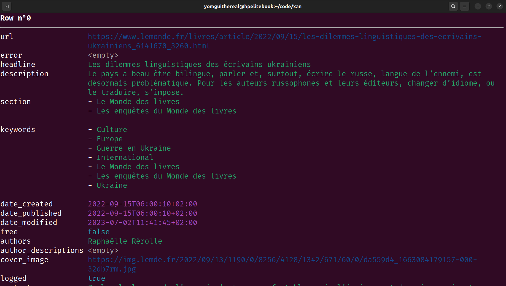

# Xan zine: February 2024 Edition

As usual, upgrade to the latest version (at least 0.45.0) using:

```bash
cargo install xan
```

## Summary

* [`xan matrix`](#xan-matrix)
* [`xan heatmap`](#xan-heatmap)
* [`xan network`](#xan-network)
* [`xan select --append`](#xan-select---append)
* [Selection language improvements](#selection-language-improvements)
* [Byte offset flags in `slice` and `enum`](#byte-offset-flags-in-slice-and-enum)
* [`xan join` revamp](#xan-join-revamp)
* [`xan search` improvements](#xan-search-improvements)
* [`xan dedup --choose`](#xan-dedup---choose)
* [`xan groupby --keep`](#xan-groupby---keep)
* [`xan flatten --split`](#xan-flatten---split)
* [Scales overhaul](#scales-overhaul)

### `xan matrix`

A new command, tasked with creating typical matrices in CSV format, has been added to the tool.

It only deals with correlation matrices right now, but will be adapted to support adjacency matrices soon (typically to aggregate adjacency matrices at category level).

```bash
xan matrix corr -s 'sepal_*,petal_*' iris.csv > matrix.csv
```

It can of course be easily piped into the new [`xan heatmap`](#xan-heatmap) command that was also added recently.

### `xan heatmap`

A new command has been added to display colored heatmaps directly within the terminal:


*Result of piping `xan matrix corr` into `xan heatmap`*

Since it relies so much on color, it cannot really be written to a text file unfortunately, even if we can find a way to display shades using character dithering (like the one we use on our wonderful [website](https://medialab.sciencespo.fr/)).

Like `xan hist`, this command is very transparent regarding the expected data format, in that each cell of the file will be rendered as a cell of the heatmap (except for the headers on top and left of the file that will be used as labels).

This means this command can be used creatively to display any kind of heatmap really, like this one showing tweet metrics:


And of course don't forget to visit the `xan heatmap --green-hills` from time to time!

### `xan network`

Basically the `xan` version of our web tool [`table2net`](http://medialab.github.io/table2net/).

The command is currently able to output either a grapology JSON file or a GEXF file.

It only handles edge lists and bipartite graphs for now, but more options will of course follow, as usual.

The command is also able to drop all but the largest connected component using the `-L/--largest-component` flag. The command can also print some useful stats about the graph to stderr using the `--stats` flag, which is very useful when prototyping without needing to validate the results using some GUI tool like Gephi etc.

```bash
xan network edgelist source_col target_col -f gexf -L --stats > graph.gexf
```

I recommend the [net-to-img](https://github.com/jacomyal/net-to-img) CLI tool to render the result in a static raster if needed.

### `xan select --append`

Sometimes we want to perform multiple `xan map` at once by adding multiple columns. You can do it by piping `map` commands into one another but it feels tedious. So you can now use the `-A/--append` flag of `xan select` to do so:

```bash
xan select --append -e 'a + b as c, a / b as d' file.csv > result.csv
```

It also works to add copies of some columns:

```bash
xan select -A name,surname file.csv
# same as:
xan select '*,name,surname' file.csv
```

### Selection language improvements

The selection language used throughout the tool, as documented in `xan select -h` and used by `-s/--select` flags, has been improved with the following features:

*Changing the range separator*

The hyphen (`-`) used to denote a column range in the selection language, i.e. selecting `name-age` used to mean "select every column between the ones named `name` and `age`.

But it seems a lot of people tend to use the hyphen `-` in their column names, which makes selecting them quite hard to do because of the complex escaping rules of the selection language (the escaping is not that difficult but juggling between bash escape rules AND the selection language ones can be tricky).

So it was decided to now use the colon `:` to denote ranges now, like in Python. Colons are less frequently used in column names (except in some rare variants of CSV where they separate the column name and its type), and are already used in popular languages as range separators.

This means the `name-age` selection must now be written as `name:age`.

*Negative indexing*

It was already possible to select column using 0-based indexing, e.g. selection the third column:

```bash
xan select 2 file.csv
```

So it was only natural to add negative indexing, e.g. selecting the first and last column:

```bash
xan select 0,-1 file.csv
```

Negative indexing also work with ranges and duplicate header selection:

```bash
# selecting last two columns (the -- is necessary because bash)
xan select -- -2: iris.csv
# selecting last column named "age"
xan select 'age[-1]' file.csv
```

*Prefix and suffix name selection*

It is now possible to select all columns starting with some prefix or all columns finishing with some suffix:

```bash
# selecting all columns starting with w2v_
xan select 'w2v_*' embeddings.csv
# selecting all columns finishing by _count
xan select '*_count' stats.csv
```

### Byte offset flags in `slice` and `enum`

`xan enum` now offers a `-B/--byte-offset` flag that reports the byte offset of the current row in the input file.

`xan slice` also offers a `-B/--byte-offset` flag that is able to seek to the given offset in constant time in target file.

### `xan join` revamp

The `join` command has been completely rewritten and is now as efficient as possible wrt streaming the input files and storing into memory only what's actually required. It should be faster and uses less memory.

What's more, the `--regex` and `--regex-left` flags have been ditched and the regex join features have been moved to another dedicated `regex-join` command instead.

### `xan search` improvements

It is now possible to search for rows having empty columns more easily using the `-E/--empty` flag:

```bash
xan search --empty file.csv
```

It is also possible to ask the command to keep rows only if ALL selected columns match the pattern, instead of ANY using the `-a/--all` flag.

Finally, the `--flag` command was ditched in favor of the `-c/--count` flag that reports the number of matches each row had in a new column.

### `xan dedup --choose`

It is now possible to evaluate a moonblade expression to decide which row to choose when two or more are found to have the same identity, using the `--choose` flag.

The expression must return whether to keep a newly seen row, when compared with the currently kept one. Column names in the expression will be prefixed with `new_` and `current_` respectively.

For instance, let's say we want to keep the event maximizing the `count` column:

```bash
xan dedup -s id --choose 'new_count > current_count' events.csv > deduped.csv
```

We also tried to add a `--merge` flag, but it proved to be a design nightmare looking a lot like what we considered already when designing the abandoned `xan reduce` command and went for `xan agg` instead.

So if you need to aggregate stuff from various columns when merging rows, you should probably use `xan groupby` instead.

### `xan groupby --keep`

Sometimes what you want is to dedupe a CSV file by merging some columns and keeping the first value seen from other columns, usually because you can guarantee they are the same or because their value is not relevant downstream. This is not easy to do with the `dedup` command. But this can actually be done with the `groupby` command.

Let's say you have the following CSV edgelist:

```txt
source,target,count,category
A,B,2,likes
A,B,5,likes
B,C,1,retweets
...
```

And you want to "collapse" multiple edges into one with a summed `total_count` but you can also guarantee the `category` column is basically constant for each source,target pair. Here is what you can now do:

```bash
xan groubpy source,target --keep category 'sum(count) as total_count' > result.csv
```

And you will get:

```txt
source,target,category,total_count
A,B,likes,7
B,C,retweets,1
...
```

### `xan flatten --split`

It is now possible to split a selection of column using a pipe `|` separator or any custom char passed to the `--sep` flag using the `--split` flag.

It produces results like this:



It can be useful to regroup things such as tokenized sentences for instance:


### Scales overhaul

Scales (numerical scales, time scales, log scales etc.) have been overhauled across commands to 1. fix erroneous stuff and 2. be generally nicer.

A lot of inspiration was took from [`d3-scale`](https://d3js.org/d3-scale) in this regard, especially the parts of it able to produce pleasing scales with intuitive axis ticks etc.

Those changes can be seen in the `plot`, `bins`, `hist` and `heatmap` commands.

It was also the occasion to add quality of life improvements to the `bins` command by fixing its quirks related to the Freedman-Diaconis heuristic and adding a `--label` and `--nice` flag.

Visualizing a distribution is now a tad cleaner:

```bash
xan bins --nice -s sepal_width iris.csv | xan hist
```
